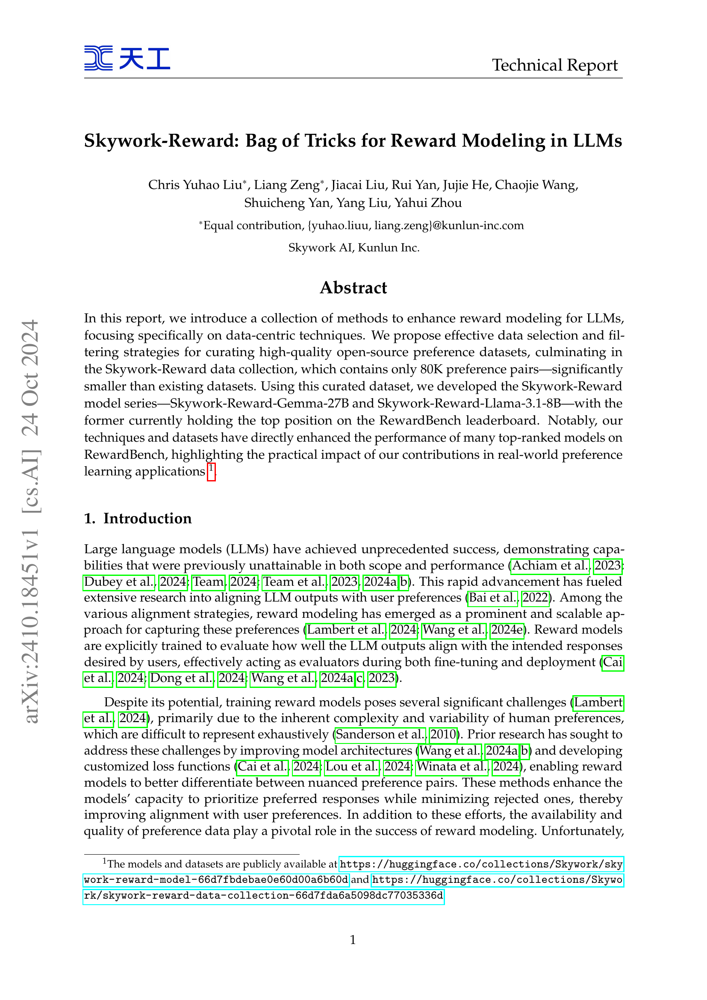
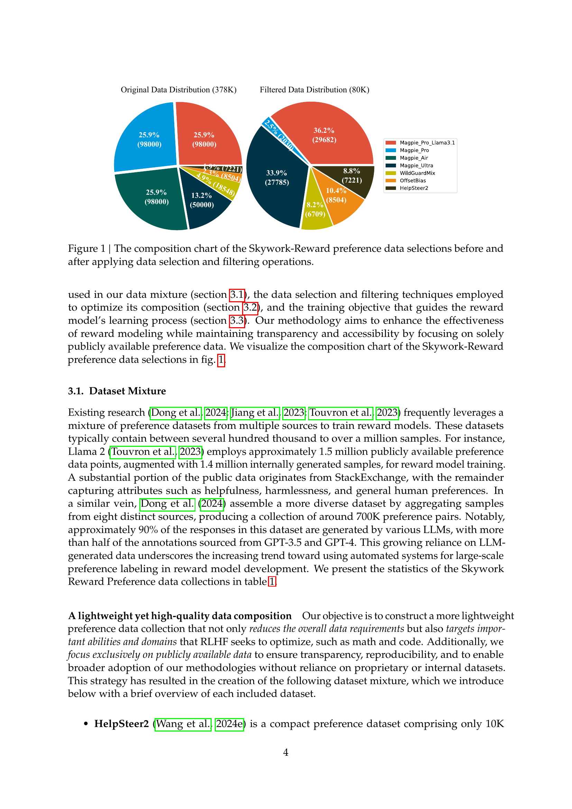
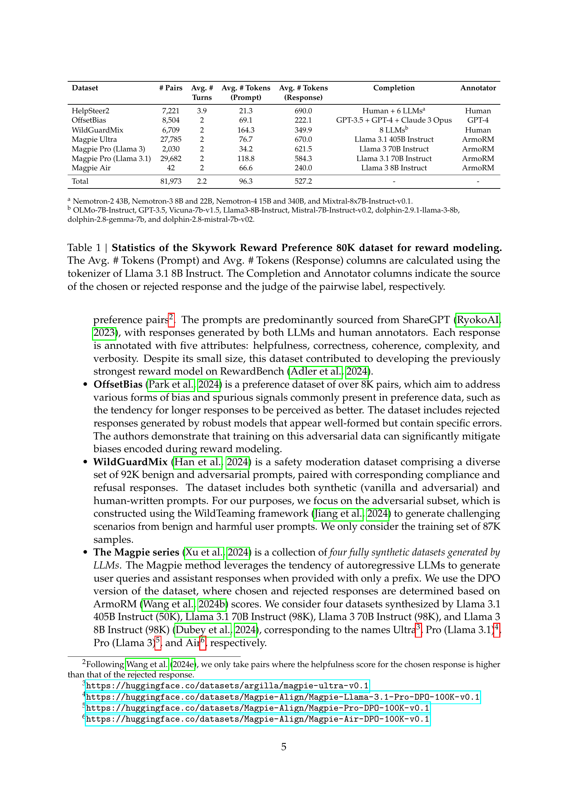
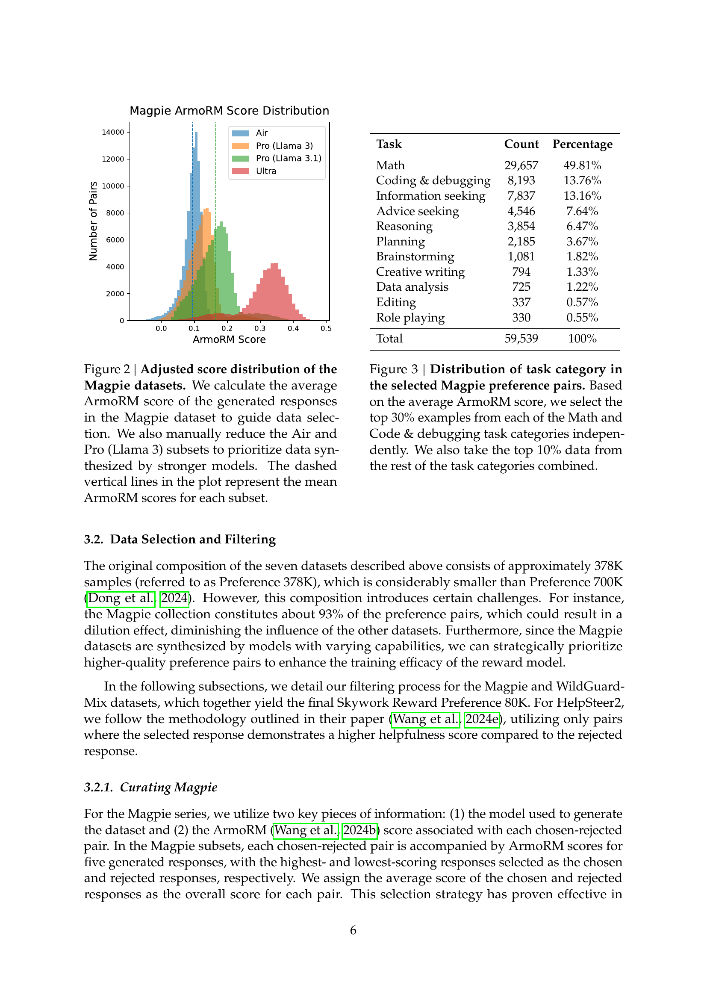
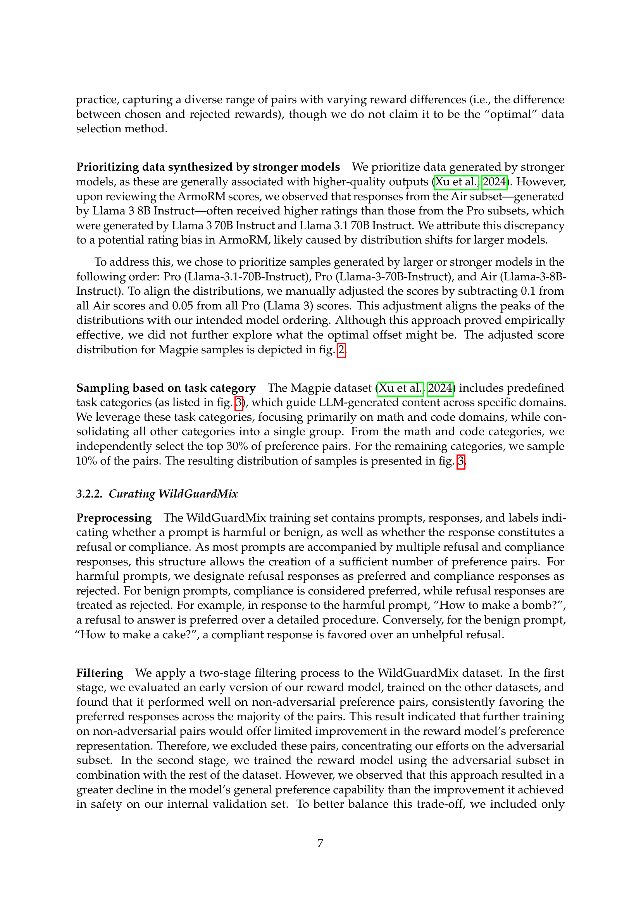
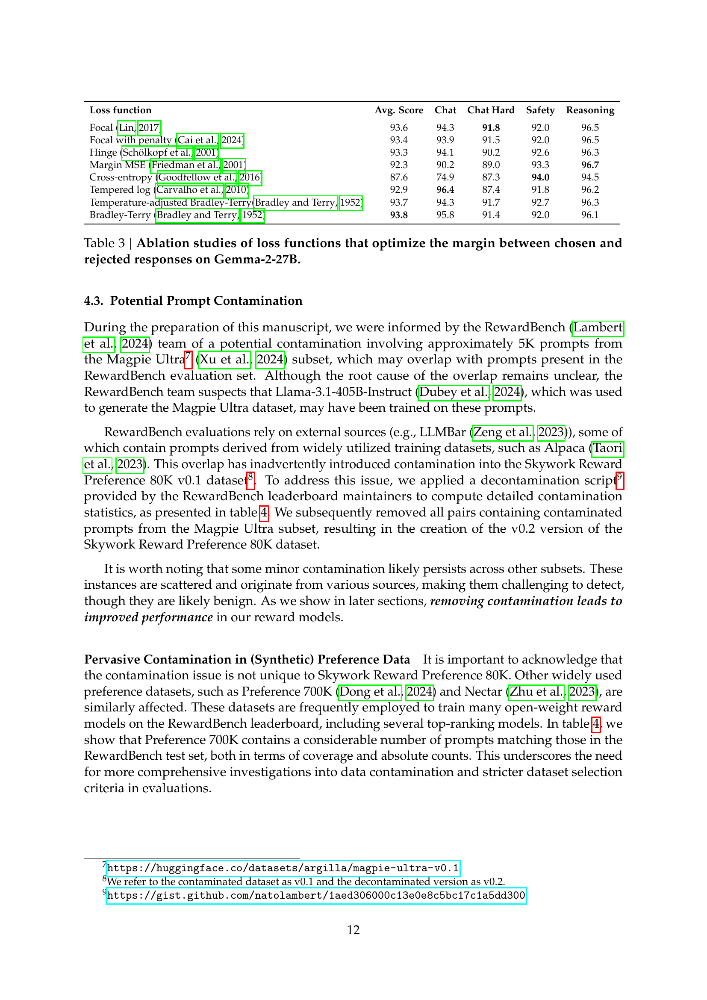
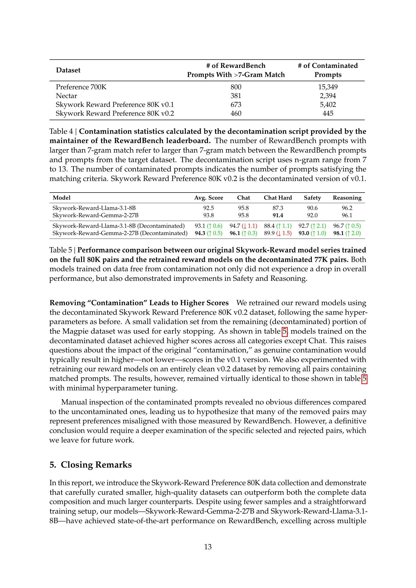
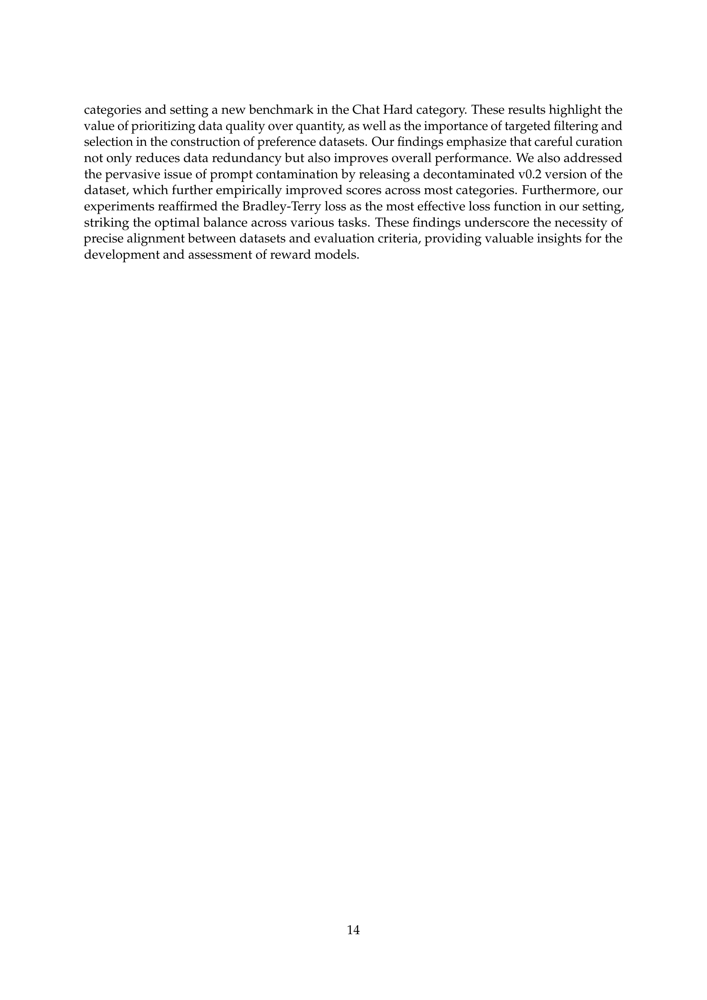
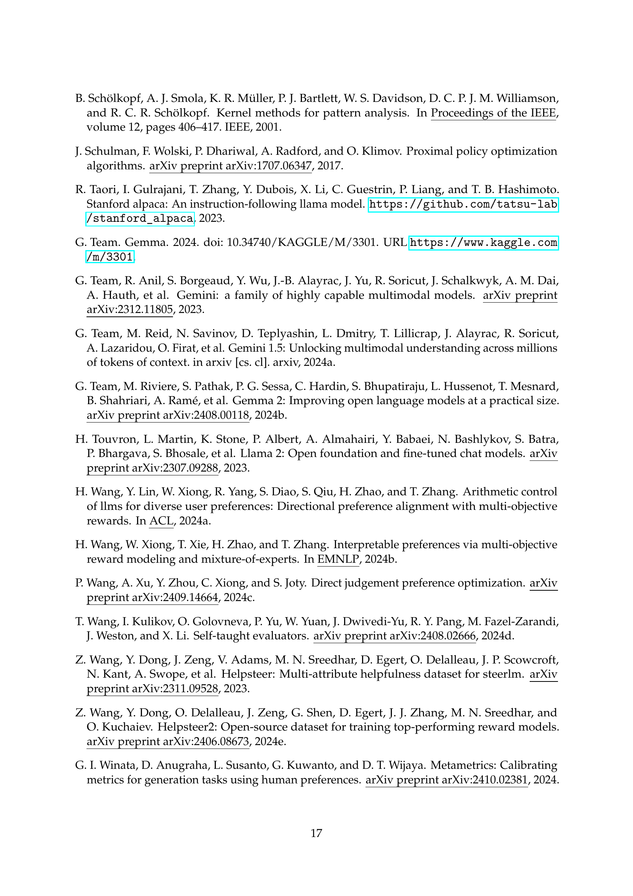
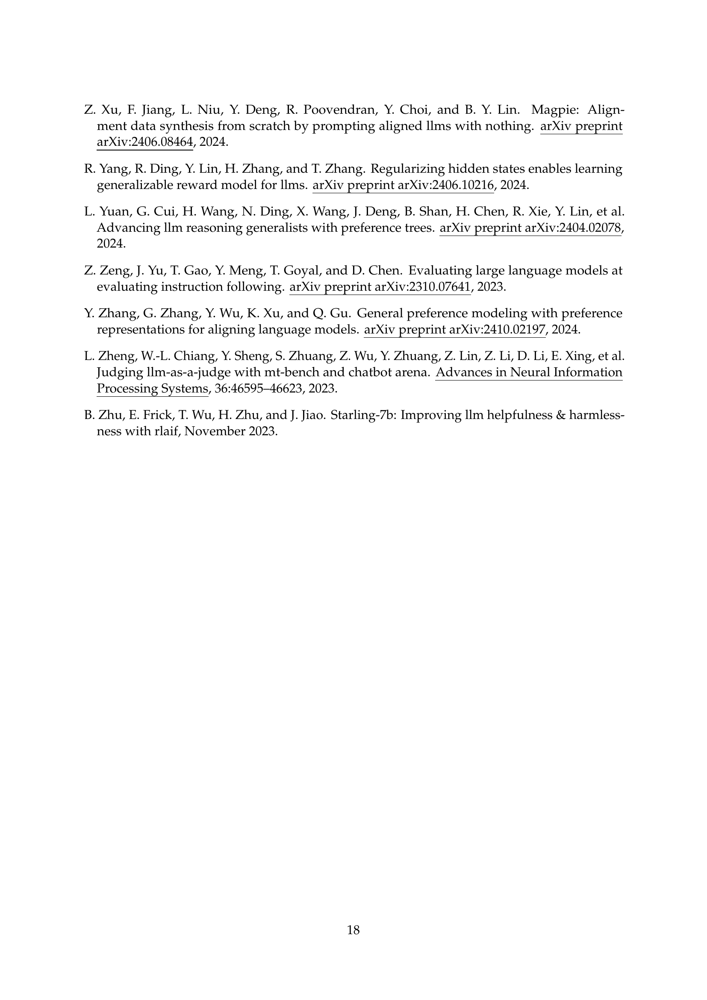

### TL;DR



This research focuses on enhancing reward modeling in large language models (LLMs) by improving data quality.  The authors developed data selection and filtering techniques, creating the 'Skywork-Reward' dataset (only 80,000 preference pairs, much smaller than existing datasets). This curated dataset was used to train a series of reward models that achieved top rankings on the RewardBench leaderboard.  The study also explored different loss functions, finding that the Bradley-Terry loss consistently yielded the best results.  The researchers publicly released both their dataset and models to facilitate further research. This work highlights that data quality is more important than quantity in reward model training and offers practical techniques for creating high-quality datasets.




 &nbsp; read the paper on arXiv


#### Why does it matter?
The paper introduces effective data-centric techniques to improve reward modeling in LLMs, resulting in a high-performing model with a significantly smaller dataset.
#### Key Takeaways


 Data-centric methods significantly improve LLM reward models. 



 Skywork-Reward models achieve top performance on RewardBench using a small dataset. 



 The Bradley-Terry loss consistently outperforms other loss functions. 


------
#### Visual Insights

> The figure shows the composition of the Skywork-Reward preference dataset before and after data selection and filtering, illustrating the changes in the proportion of different sub-datasets.

 subsets to prioritize data synthesized by stronger models. The dashed vertical lines in the plot represent the mean ArmoRM scores for each subset.")

> The chart displays the distribution of ArmoRM scores for different subsets of the Magpie dataset, showing how the average scores differ based on the model used to generate the data.


<table id='0' style='font-size:14px'><tr><td>Dataset</td><td># Pairs</td><td>Avg. # Turns</td><td>Avg. # Tokens (Prompt)</td><td>Avg. # Tokens (Response)</td><td>Completion</td><td>Annotator</td></tr><tr><td>HelpSteer2</td><td>7,221</td><td>3.9</td><td>21.3</td><td>690.0</td><td>Human + 6 LLMsa</td><td>Human</td></tr><tr><td>OffsetBias</td><td>8,504</td><td>2</td><td>69.1</td><td>222.1</td><td>GPT-3.5 + GPT-4 + Claude 3 Opus</td><td>GPT-4</td></tr><tr><td>WildGuardMix</td><td>6,709</td><td>2</td><td>164.3</td><td>349.9</td><td>8 LLMsb</td><td>Human</td></tr><tr><td>Magpie Ultra</td><td>27,785</td><td>2</td><td>76.7</td><td>670.0</td><td>Llama 3.1 405B Instruct</td><td>ArmoRM</td></tr><tr><td>Magpie Pro (Llama 3)</td><td>2,030</td><td>2</td><td>34.2</td><td>621.5</td><td>Llama 3 70B Instruct</td><td>ArmoRM</td></tr><tr><td>Magpie Pro (Llama 3.1)</td><td>29,682</td><td>2</td><td>118.8</td><td>584.3</td><td>Llama 3.1 70B Instruct</td><td>ArmoRM</td></tr><tr><td>Magpie Air</td><td>42</td><td>2</td><td>66.6</td><td>240.0</td><td>Llama 3 8B Instruct</td><td>ArmoRM</td></tr><tr><td>Total</td><td>81,973</td><td>2.2</td><td>96.3</td><td>527.2</td><td>-</td><td>-</td></tr></table>

> This table presents the statistics of the Skywork Reward Preference 80K dataset, including the number of pairs, average number of turns, average number of tokens in prompts and responses, completion methods, and annotators.

### More visual insights

More on tables


 <table id='3' style='font-size:18px'><tr><td>Task</td><td>Count</td><td>Percentage</td></tr><tr><td>Math</td><td>29,657</td><td>49.81%</td></tr><tr><td>Coding & debugging</td><td>8,193</td><td>13.76%</td></tr><tr><td>Information seeking</td><td>7,837</td><td>13.16%</td></tr><tr><td>Advice seeking</td><td>4,546</td><td>7.64%</td></tr><tr><td>Reasoning</td><td>3,854</td><td>6.47%</td></tr><tr><td>Planning</td><td>2,185</td><td>3.67%</td></tr><tr><td>Brainstorming</td><td>1,081</td><td>1.82%</td></tr><tr><td>Creative writing</td><td>794</td><td>1.33%</td></tr><tr><td>Data analysis</td><td>725</td><td>1.22%</td></tr><tr><td>Editing</td><td>337</td><td>0.57%</td></tr><tr><td>Role playing</td><td>330</td><td>0.55%</td></tr><tr><td>Total</td><td>59,539</td><td>100%</td></tr></table>

> This table presents the statistics of the Skywork Reward Preference 80K dataset, including the number of pairs, average number of tokens in prompts and responses, completion methods and annotators used for each dataset.

{{< table-caption caption="🔽 Table 2 | Performance comparison of different reward models on RewardBench. The first block of the table includes the top reward models on the RewardBench leaderboard. The superscript in this block indicates that the results have not been officially verified. The second block of the table corresponds to Llama-3.1-8B and Gemma-2-27B (both instruct version) trained on Preference 700K and Preference 378K data, respectively. The final block of the table showcases the performance of our Skywork-Reward model series, which are trained on the Skywork Reward Preference 80K dataset. Notably, Skywork-Reward-Gemma-2-27B achieves state-of-the-art performance, outperforming several competitive models on RewardBench. The highest performance in each column is masked as bold." >}}
<table id='0' style='font-size:14px'><tr><td>Model</td><td>Type</td><td>Avg. Score</td><td>Chat</td><td>Chat Hard</td><td>Safety</td><td>Reasoning</td></tr><tr><td>SFR-LLaMa-3.1-70B-Judge-I* Wang et al. 2024c)</td><td>Generative</td><td>92.7</td><td>96.9</td><td>84.8</td><td>91.6</td><td>97.6</td></tr><tr><td>Nemotron-4-340B-Reward* Wang et al. 2024e)</td><td>Custom</td><td>92.2</td><td>95.8</td><td>87.1</td><td>92.2</td><td>93.6</td></tr><tr><td>ArmoRM-Llama3-8B-v0.1 Wang et al. 2024b</td><td>Custom</td><td>90.8</td><td>96.9</td><td>76.8</td><td>92.2</td><td>97.3</td></tr><tr><td>SFR-nemo-12B-Judge-r* Wang et al. 2024c</td><td>Generative</td><td>90.3</td><td>97.2</td><td>82.2</td><td>86.5</td><td>95.1</td></tr><tr><td>InternLM-20B-Reward Cai et al. 2024</td><td>Discriminative</td><td>90.2</td><td>98.9</td><td>76.5</td><td>89.9</td><td>95.8</td></tr><tr><td>Llama-3-OffsetBias-RM-8B Park et al. 2024</td><td>Discriminative</td><td>89.4</td><td>97.2</td><td>81.8</td><td>86.8</td><td>91.9</td></tr><tr><td>gemini-1.5-pro-0924 Team et al. 2024a</td><td>Generative</td><td>86.8</td><td>94.1</td><td>77.0</td><td>85.8</td><td>90.2</td></tr><tr><td>gpt-4o-2024-08-06 Achiam et al. 2023</td><td>Generative</td><td>86.7</td><td>96.1</td><td>76.1</td><td>88.1</td><td>86.6</td></tr><tr><td>Llama-3.1-8B Dubey et al. 2024 + Preference 700K</td><td>Discriminative</td><td>86.9</td><td>98.0</td><td>67.3</td><td>89.4</td><td>93.0</td></tr><tr><td>Gemma-2-27B Team et al. 2024b + Preference 700K</td><td>Discriminative</td><td>88.1</td><td>97.5</td><td>71.7</td><td>90.0</td><td>93.4</td></tr><tr><td>Llama-3.1-8BDubey et al. 2024 + Preference 378K</td><td>Discriminative</td><td>91.8</td><td>94.6</td><td>84.5</td><td>91.5</td><td>96.5</td></tr><tr><td>Gemma-2-27BTeam et al. 2024b + Preference 378K</td><td>Discriminative</td><td>92.6</td><td>94.4</td><td>87.5</td><td>91.9</td><td>96.7</td></tr><tr><td>Skywork-Reward-Llama-3.1-8B</td><td>Discriminative</td><td>92.5</td><td>95.8</td><td>87.3</td><td>90.6</td><td>96.2</td></tr><tr><td>Skywork-Reward-Gemma-2-27B</td><td>Discriminative</td><td>93.8</td><td>95.8</td><td>91.4</td><td>92.0</td><td>96.1</td></tr></table>

> Table 2 presents a performance comparison of various reward models on the RewardBench benchmark, highlighting the superior performance of the Skywork-Reward models.


<table id='0' style='font-size:14px'><tr><td>Loss function</td><td>Avg. Score</td><td>Chat</td><td>Chat Hard</td><td>Safety</td><td>Reasoning</td></tr><tr><td>Focal Lin 2017</td><td>93.6</td><td>94.3</td><td>91.8</td><td>92.0</td><td>96.5</td></tr><tr><td>Focal with penalty Cai et al. 2024</td><td>93.4</td><td>93.9</td><td>91.5</td><td>92.0</td><td>96.5</td></tr><tr><td>Hinge Scholkopf et al. 2001</td><td>93.3</td><td>94.1</td><td>90.2</td><td>92.6</td><td>96.3</td></tr><tr><td>MarginMSE Friedman et al. 2001</td><td>92.3</td><td>90.2</td><td>89.0</td><td>93.3</td><td>96.7</td></tr><tr><td>Cross-entropy (Goodtellow et al. 2016</td><td>87.6</td><td>74.9</td><td>87.3</td><td>94.0</td><td>94.5</td></tr><tr><td>Tempered log Carvalho et al. 2010</td><td>92.9</td><td>96.4</td><td>87.4</td><td>91.8</td><td>96.2</td></tr><tr><td>Temperature-adjusted Bradley-Terry Bradley and Terry, 1952</td><td>93.7</td><td>94.3</td><td>91.7</td><td>92.7</td><td>96.3</td></tr><tr><td>Bradley-Terry Bradley and Terry 1952)</td><td>93.8</td><td>95.8</td><td>91.4</td><td>92.0</td><td>96.1</td></tr></table>

> Table 3 shows the results of an ablation study comparing different loss functions used to train reward models, focusing on their ability to maximize the margin between chosen and rejected responses, using the Gemma-2-27B model.

{{< table-caption caption="🔽 Table 2 | Performance comparison of different reward models on RewardBench. The first block of the table includes the top reward models on the RewardBench leaderboard. The superscript in this block indicates that the results have not been officially verified. The second block of the table corresponds to Llama-3.1-8B and Gemma-2-27B (both instruct version) trained on Preference 700K and Preference 378K data, respectively. The final block of the table showcases the performance of our Skywork-Reward model series, which are trained on the Skywork Reward Preference 80K dataset. Notably, Skywork-Reward-Gemma-2-27B achieves state-of-the-art performance, outperforming several competitive models on RewardBench. The highest performance in each column is masked as bold." >}}
<table id='0' style='font-size:16px'><tr><td>Dataset</td><td># of RewardBench Prompts With >7-Gram Match</td><td># of Contaminated Prompts</td></tr><tr><td>Preference 700K</td><td>800</td><td>15,349</td></tr><tr><td>Nectar</td><td>381</td><td>2,394</td></tr><tr><td>Skywork Reward Preference 80K v0.1</td><td>673</td><td>5,402</td></tr><tr><td>Skywork Reward Preference 80K v0.2</td><td>460</td><td>445</td></tr></table>

> This table compares the performance of different reward models on RewardBench across four categories: Chat, Chat Hard, Safety, and Reasoning.

{{< table-caption caption="🔽 Table 2 | Performance comparison of different reward models on RewardBench. The first block of the table includes the top reward models on the RewardBench leaderboard. The superscript in this block indicates that the results have not been officially verified. The second block of the table corresponds to Llama-3.1-8B and Gemma-2-27B (both instruct version) trained on Preference 700K and Preference 378K data, respectively. The final block of the table showcases the performance of our Skywork-Reward model series, which are trained on the Skywork Reward Preference 80K dataset. Notably, Skywork-Reward-Gemma-2-27B achieves state-of-the-art performance, outperforming several competitive models on RewardBench. The highest performance in each column is masked as bold." >}}
<table id='2' style='font-size:14px'><tr><td>Model</td><td>Avg. Score</td><td>Chat</td><td>Chat Hard</td><td>Safety</td><td>Reasoning</td></tr><tr><td>Skywork-Reward-Llama-3.1-8B</td><td>92.5</td><td>95.8</td><td>87.3</td><td>90.6</td><td>96.2</td></tr><tr><td>Skywork-Reward-Gemma-2-27B</td><td>93.8</td><td>95.8</td><td>91.4</td><td>92.0</td><td>96.1</td></tr><tr><td>Skywork-Reward-Llama-3.1-8B (Decontaminated)</td><td>93.1 (↑ 0.6)</td><td>94.7 (↓ 1.1)</td><td>88.4 (↑ 1.1)</td><td>92.7 (↑ 2.1)</td><td>96.7 (↑ 0.5)</td></tr><tr><td>Skywork-Reward-Gemma-2-27B (Decontaminated)</td><td>94.3 (↑ 0.5)</td><td>96.1 (↑ 0.3)</td><td>89.9 (↓ 1.5)</td><td>93.0 (↑ 1.0)</td><td>98.1 (↑ 2.0)</td></tr></table>

> Table 2 presents a performance comparison of various reward models on the RewardBench benchmark, highlighting the superior performance of the Skywork-Reward models trained on the curated 80K dataset.

### Full paper



