### TL;DR



The paper introduces SMITE, a new video segmentation method.  Unlike traditional methods that require extensive manual annotation of each video frame, SMITE leverages a pre-trained text-to-image diffusion model and a small set of reference images (one or a few) to segment unseen videos. This significantly reduces the need for manual labeling.  The method incorporates a tracking mechanism and low-frequency regularization to ensure that the segmentations are temporally consistent and don't flicker.  Experiments on a new dataset, SMITE-50, and existing benchmarks demonstrate that SMITE outperforms state-of-the-art alternatives in terms of both accuracy and temporal consistency, handling pose changes, occlusions, and variations in color. User studies confirmed its effectiveness.  SMITE offers a flexible solution for videos needing consistent segmentation across frames (e.g., VFX) without requiring extensive frame-by-frame labeling for every video.




 &nbsp; read the paper on arXiv


#### Why does it matter?
Summarizing the provided research paper on SMITE: SEGMENT ME IN TIME.
#### Key Takeaways


 SMITE achieves high-quality video segmentation using only a few reference images, eliminating the need for extensive video annotation. 



 The method employs a tracking mechanism and low-frequency regularization to ensure temporal consistency and reduce flickering. 



 SMITE outperforms state-of-the-art methods on benchmark datasets and demonstrates robustness to challenges such as occlusions and variations in object appearance. 


------
#### Visual Insights

, our method learns to segment different unseen videos respecting the segmentation references.")

> The figure illustrates the SMITE method, showing how a few annotated images are used to train a model that can then segment different unseen videos while maintaining consistency with the original annotations.


<table id='4' style='font-size:14px'><tr><td rowspan="2">Methods</td><td colspan="2">Faces</td><td colspan="2">Horses</td><td colspan="2">Cars</td><td colspan="2">Non-Text</td></tr><tr><td>F meas.</td><td>mIOU</td><td>F meas.</td><td>mIOU</td><td>F meas.</td><td>mIOU</td><td>F meas.</td><td>mIOU</td></tr><tr><td>Baseline-I</td><td>0.81</td><td>72.95</td><td>0.64</td><td>65.48</td><td>0.57</td><td>61.38</td><td>0.67</td><td>66.69</td></tr><tr><td>GSAM2</td><td>0.73</td><td>63.28</td><td>0.76</td><td>72.76</td><td>0.64</td><td>63.56</td><td>-</td><td>-</td></tr><tr><td>Ours</td><td>0.89</td><td>77.28</td><td>0.79</td><td>75.09</td><td>0.82</td><td>75.10</td><td>0.77</td><td>73.08</td></tr></table>

> Table 1 presents a quantitative comparison of three methods (Baseline-I, GSAM2, and Ours) on the SMITE-50 dataset across four categories, evaluating their performance using F-measure and mIOU metrics.

### More visual insights

More on figures

, we invert a given video into a noisy latent by iteratively adding noise. We then use an inflated U-Net denoiser (b) along with the trained text embedding as input to denoise the segments. A tracking module ensures that the generated segments are spatially and temporally consistent via spatio-temporal guidance. The video latent zt is updated by a tracking energy Etrack (c) that makes the segments temporally consistent and also a low-frequency regularizer (d) Ereg which guides the model towards better spatial consistency.")

> The figure illustrates the SMITE pipeline, detailing the process of video segmentation using an inflated U-Net, tracking modules, and a low-frequency regularizer to ensure temporal and spatial consistency.

 and then finds point correspondence of this segment (denoted by blue dots) across timesteps. When the tracked point is of a different class (e.g,. face) then it is recovered by using temporal voting. The misclassified pixel is then replaced by the average of the neighbouring pixels of adjacent frames. This results are temporally consistent segments without visible flickers.")

> The figure illustrates how the segment tracking module maintains temporal consistency by tracking segments across frames and using temporal voting to correct misclassified pixels.

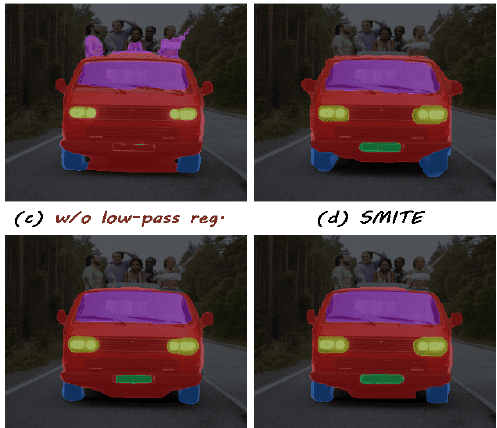

> The figure compares the video segmentation results using frame-by-frame processing, without tracking and low-pass regularization, and with SMITE's proposed approach.

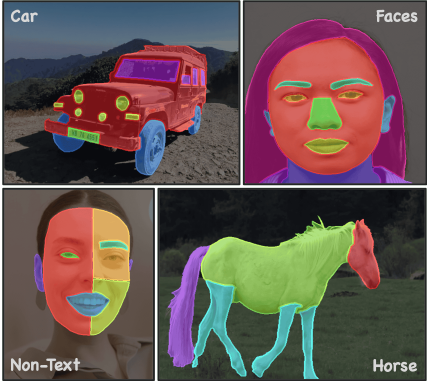

> The figure shows sample images from the SMITE-50 dataset, showcasing different object categories (horses, faces, cars, and non-text) with varying levels of segmentation granularity.

, whereas our method yields more precise results. Additionally, both alternative techniques create artifacts around the chin (Right), while SMITE produces a cleaner segmentation.")

> Figure 6 presents a visual comparison of video segmentation results between SMITE and other methods, highlighting SMITE’s superior performance in maintaining motion consistency and producing cleaner segmentations.

 in various challenging poses, shape, and even in cut-shapes.")

> Figure 7 shows additional results demonstrating SMITE’s ability to generalize segmentation to unseen videos with objects in various poses and shapes, even when cut.

 or camouflage ('turtle') highlighting the robustness of our segmentation technique.")

> Figure 8 shows examples of SMITE's accurate segmentation results in challenging scenarios with object occlusion and camouflage.

More on tables


 <table id='8' style='font-size:14px'><tr><td colspan="2">but still performs well in one shot setting.</td><td rowspan="2">Methods</td><td colspan="2">Motion Consistency</td></tr><tr><td>Training sample #</td><td>mIOU</td><td>Horse, Car, Face</td><td>Non-Text</td></tr><tr><td>1-shot</td><td>63.03</td><td>Baseline-1</td><td>2.58</td><td>2.37</td></tr><tr><td>5-shot</td><td>71.55</td><td>GSAM2</td><td>2.13</td><td>-</td></tr><tr><td>10-shot</td><td>75.10</td><td>Ours</td><td>1.19</td><td>1.10</td></tr></table>

> Table 1 presents a quantitative evaluation of the SMITE-50 dataset, showing the performance of different methods across various categories with 10 reference images during training.


 <table id='7' style='font-size:14px'><tr><td rowspan="2">Method</td><td colspan="2">Chair</td><td colspan="2">Full face 1</td><td colspan="2">Full Face 2</td><td colspan="2">Half Face 1</td></tr><tr><td>F meas.</td><td>mIOU</td><td>F meas.</td><td>mIOU</td><td>F meas.</td><td>mIOU</td><td>F meas.</td><td>mIOU</td></tr><tr><td>GSAM2</td><td>0.49</td><td>58.82</td><td>0.99</td><td>97.47</td><td>0.94</td><td>94.78</td><td>0.29</td><td>57.66</td></tr><tr><td>Baseline-I</td><td>0.46</td><td>73.15</td><td>0.61</td><td>85.23</td><td>0.7</td><td>86.9</td><td>0.02</td><td>82.83</td></tr><tr><td>XMem++</td><td>0.99</td><td>95.72</td><td>0.71</td><td>90.75</td><td>0.80</td><td>89.92</td><td>0.82</td><td>90.52</td></tr><tr><td>Ours</td><td>0.32</td><td>63.32</td><td>0.98</td><td>96.46</td><td>0.85</td><td>90.38</td><td>0.55</td><td>79.75</td></tr><tr><td rowspan="2">Method</td><td colspan="2">Half Face 2</td><td colspan="2">Long Scene Scale</td><td colspan="2">Vlog</td><td colspan="2">Mean</td></tr><tr><td>F meas.</td><td>mIOU</td><td>F meas.</td><td>mIOU</td><td>Fmeas.</td><td>mIOU</td><td>Fmeas.</td><td>mIOU</td></tr><tr><td>GSAM2</td><td>0.54</td><td>74.78</td><td>0.99</td><td>97.39</td><td>0.16</td><td>42.99</td><td>0.63</td><td>74.84</td></tr><tr><td>Baseline-I</td><td>0.18</td><td>55.78</td><td>0.74</td><td>87.74</td><td>0.73</td><td>78.90</td><td>0.5</td><td>74.91</td></tr><tr><td>XMem++</td><td>0.48</td><td>71.03</td><td>0.87</td><td>95.48</td><td>0.16</td><td>31.11</td><td>0.69</td><td>80.65</td></tr><tr><td>Ours</td><td>0.37</td><td>69.91</td><td>0.98</td><td>96.27</td><td>0.75</td><td>78.91</td><td>0.69</td><td>82.14</td></tr></table>

> Table 1 presents a quantitative comparison of different methods on the SMITE-50 dataset, showing the F-measure and mIOU for each category with 10 reference images used during training.


 <table id='2' style='font-size:14px'><tr><td>Methods</td><td colspan="2">1 frame</td><td colspan="2">5 frames</td><td colspan="2">10 frames</td></tr><tr><td></td><td>F meas.</td><td>mloU</td><td>F meas.</td><td>mloU</td><td>F meas.</td><td>mloU</td></tr><tr><td>Full Face 1 (XMem++)</td><td>0.71</td><td>90.75</td><td>1.0</td><td>98.78</td><td>1.0</td><td>99.01</td></tr><tr><td>Full Face 1 (Ours)</td><td>0.98</td><td>96.46</td><td>0.99</td><td>96.76</td><td>1.0</td><td>96.73</td></tr><tr><td>Full Face 2 (XMem++)</td><td>0.80</td><td>89.92</td><td>0.96</td><td>96.64</td><td>0.97</td><td>97.35</td></tr><tr><td>Full Face 2 (Ours)</td><td>0.85</td><td>90.38</td><td>0.91</td><td>93.10</td><td>0.93</td><td>93.78</td></tr><tr><td>Chair (XMem++)</td><td>0.99</td><td>95.72</td><td>1.0</td><td>96.57</td><td>1.0</td><td>96.65</td></tr><tr><td>Chair (Ours)</td><td>0.32</td><td>63.32</td><td>0.98</td><td>90.62</td><td>0.99</td><td>89.82</td></tr><tr><td>Half Face 1 (XMem++)</td><td>0.82</td><td>90.52</td><td>0.94</td><td>94.54</td><td>0.96</td><td>95.49</td></tr><tr><td>Half Face 1 (Ours)</td><td>0.55</td><td>79.75</td><td>0.92</td><td>90.69</td><td>0.93</td><td>91.37</td></tr><tr><td>Half Face 2 (XMem++)</td><td>0.48</td><td>71.03</td><td>0.77</td><td>87.87</td><td>0.85</td><td>91.41</td></tr><tr><td>Half Face 2 (Ours)</td><td>0.37</td><td>69.91</td><td>0.66</td><td>81.06</td><td>0.83</td><td>87.17</td></tr><tr><td>Long Scene Scale (XMem++)</td><td>0.87</td><td>95.48</td><td>0.99</td><td>98.36</td><td>1.0</td><td>98.91</td></tr><tr><td>Long Scene Scale (Ours)</td><td>0.98</td><td>96.27</td><td>1.0</td><td>96.87</td><td>1.0</td><td>96.79</td></tr><tr><td>Vlog (XMem++)</td><td>0.16</td><td>31.11</td><td>0.55</td><td>62.84</td><td>0.82</td><td>82.52</td></tr><tr><td>Vlog (Ours)</td><td>0.75</td><td>78.91</td><td>0.86</td><td>84.01</td><td>0.90</td><td>85.29</td></tr><tr><td>Mean (XMem++)</td><td>0.69</td><td>80.65</td><td>0.89</td><td>90.80</td><td>0.94</td><td>94.48</td></tr><tr><td>Mean (Ours)</td><td>0.69</td><td>82.14</td><td>0.90</td><td>90.44</td><td>0.94</td><td>91.56</td></tr></table>

> Table 1 presents a quantitative comparison of different methods' performance on the SMITE-50 dataset across four categories, using metrics such as F-measure and mIOU.


 <table id='8' style='font-size:16px'><tr><td>1: Input: X: a pixel at frame t, W: window size</td></tr><tr><td></td></tr><tr><td>2: Xs ← Correspondence of X at frame s (obtained by CoTracker (X, s))</td></tr><tr><td>3: Vis(Xs, s): visibility of Xs (obtained by CoTracker)</td></tr><tr><td>4: Visible_Set ← {i E range (- W ツ) if Vis(Xsi) == 1} 2 ,</td></tr><tr><td>5: P ← Most_Occurrence (S(X:).argmax(dim = O)) where i E Visible_Set</td></tr><tr><td>6: total ← 0, count ← 0</td></tr><tr><td>7: for all p E Visible_Set do</td></tr><tr><td>8: if S(Xi).argmax(dim=0) == P then</td></tr><tr><td>9: total ← total + S(Xi)</td></tr><tr><td>10: count ← count + 1</td></tr><tr><td>11: end if</td></tr><tr><td>12: end for</td></tr><tr><td>total ←</td></tr><tr><td>13: Stracked (X) count</td></tr></table>

> Table 9 presents a quantitative comparison of SMITE's performance against other image segmentation methods on the 'horse' class of the PASCAL-Part dataset, showing superior results for SMITE across various settings.


 <table id='2' style='font-size:16px'><tr><td></td><td>Body</td><td>Light</td><td>Plate</td><td>Wheel</td><td>Window</td><td>Background</td><td>Average</td></tr><tr><td>CNN*</td><td>73.4</td><td>42.2</td><td>41.7</td><td>66.3</td><td>61.0</td><td>67.4</td><td>58.7</td></tr><tr><td>CNN+CRF*</td><td>75.4</td><td>36.1</td><td>35.8</td><td>64.3</td><td>61.8</td><td>68.7</td><td>57.0</td></tr><tr><td>SegGPT Wang et al. 2023 *</td><td>62.7</td><td>18.5</td><td>25.8</td><td>65.8</td><td>69.5</td><td>77.7</td><td>53.3</td></tr><tr><td>OIParts Dai et al. 2024</td><td>77.7</td><td>59.1</td><td>57.2</td><td>66.9</td><td>59.2</td><td>71.1</td><td>65.2</td></tr><tr><td>ReGAN Tritrong et al 2021</td><td>75.5</td><td>29.3</td><td>17.8</td><td>57.2</td><td>62.4</td><td>70.7</td><td>52.15</td></tr><tr><td>SLiMe Khani et al. 2024</td><td>81.5</td><td>56.8</td><td>54.8</td><td>68.3</td><td>70.3</td><td>78.4</td><td>68.3</td></tr><tr><td>Ours</td><td>82.3</td><td>57.5</td><td>55.9</td><td>70.1</td><td>72.6</td><td>80.1</td><td>69.8</td></tr></table>

> Table 8 presents a quantitative comparison of image segmentation performance for the 'car' class, evaluating various methods including SMITE, across different metrics and experimental settings.


 <table id='4' style='font-size:14px'><tr><td></td><td>Head</td><td>Leg</td><td>Neck+Torso</td><td>Tail</td><td>Background</td><td>Average</td></tr><tr><td>Shape+Appereance*</td><td>47.2</td><td>38.2</td><td>66.7</td><td>-</td><td>-</td><td>-</td></tr><tr><td>CNN+CRF*</td><td>55.0</td><td>46.8</td><td>-</td><td>37.2</td><td>76</td><td>-</td></tr><tr><td>SegGPT Wang et al 2023 *</td><td>41.1</td><td>49.8</td><td>58.6</td><td>15.5</td><td>36.4</td><td>40.3</td></tr><tr><td>OIParts Dai et al. 2024</td><td>73.0</td><td>50.7</td><td>72.6</td><td>60.3</td><td>77.7</td><td>66.9</td></tr><tr><td>ReGAN Tritrong et al. 2021</td><td>50.1</td><td>49.6</td><td>70.5</td><td>19.9</td><td>81.6</td><td>54.3</td></tr><tr><td>SegDDPM (Baranchuk et al. 2021</td><td>41.0</td><td>59.1</td><td>69.9</td><td>39.3</td><td>84.3</td><td>58.7</td></tr><tr><td>SLiMe (Khani et al 2024</td><td>63.8</td><td>59.5</td><td>68.1</td><td>45.4</td><td>79.6</td><td>63.3</td></tr><tr><td>Ours</td><td>64.5</td><td>61.9</td><td>73.2</td><td>48.1</td><td>83.5</td><td>66.2</td></tr></table>

> Table 9 presents a quantitative comparison of image segmentation performance on the class 'horse', showing SMITE's superior performance compared to other methods under different training settings.

### Full paper


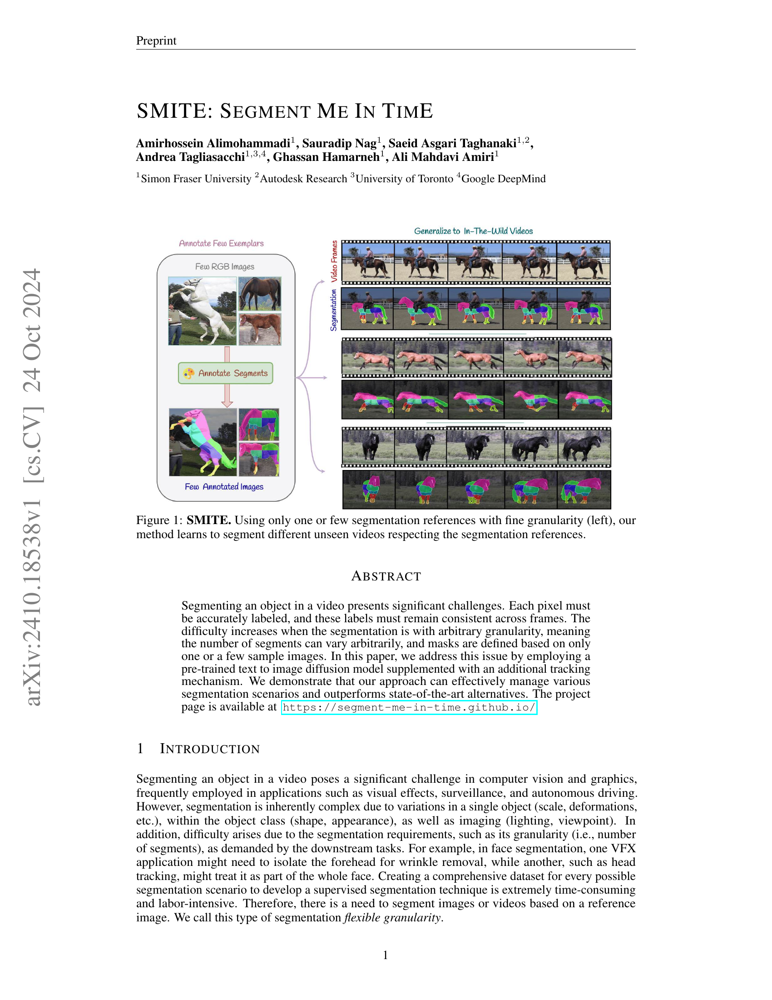
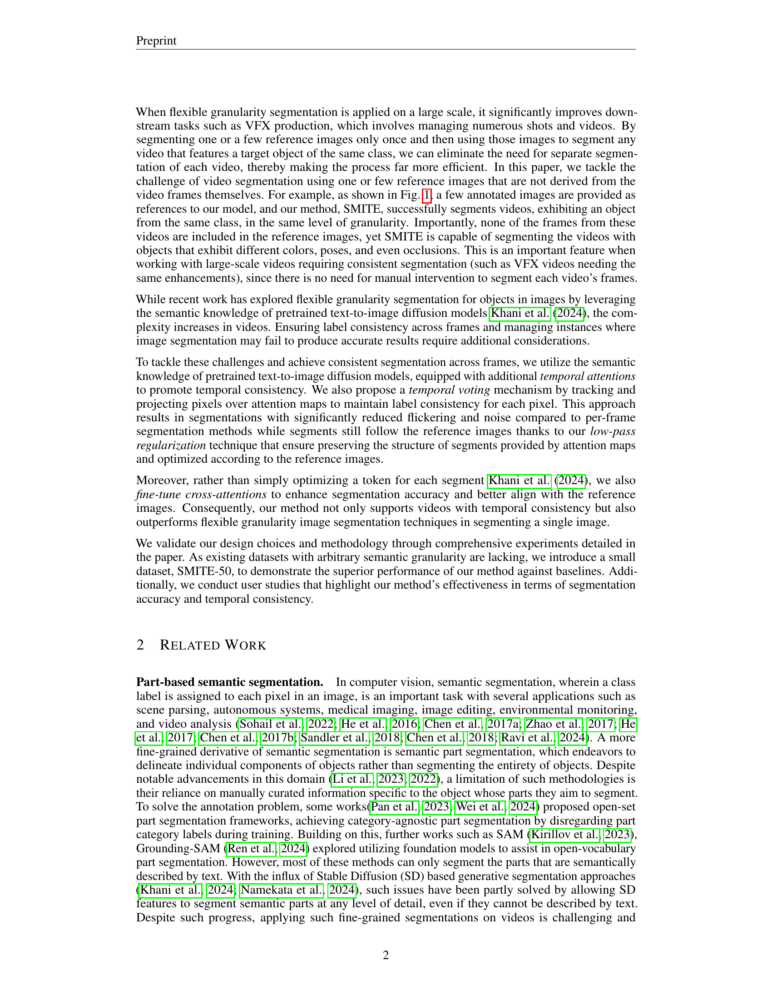
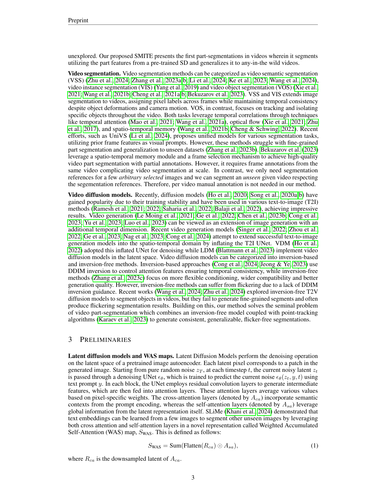

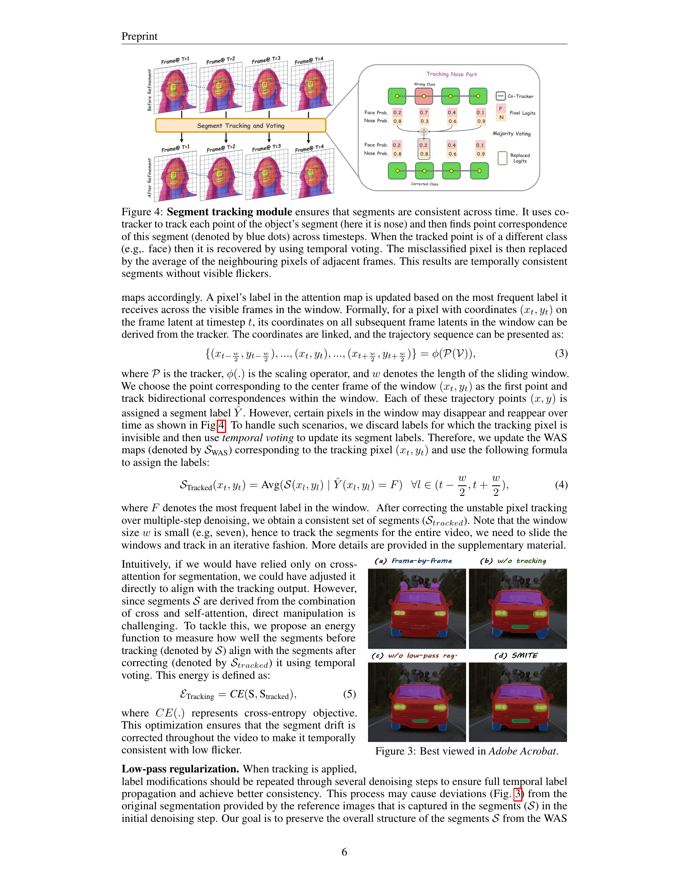
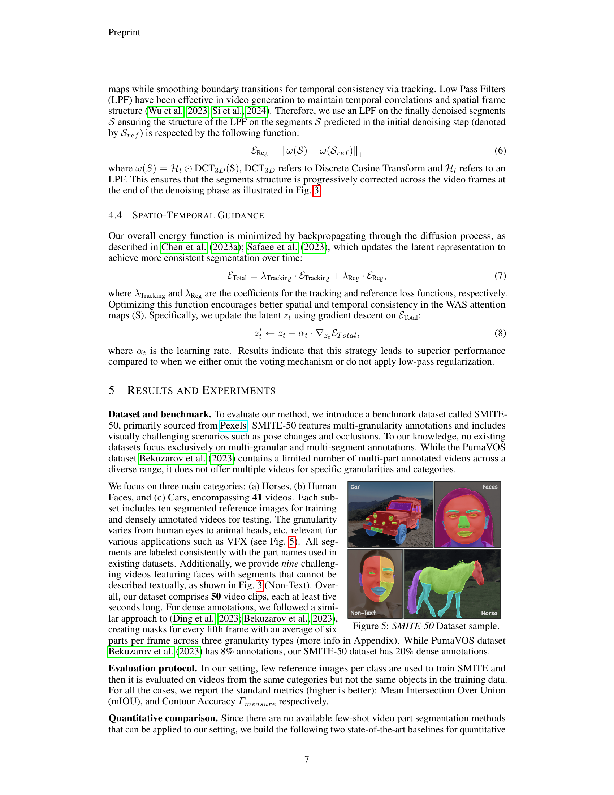

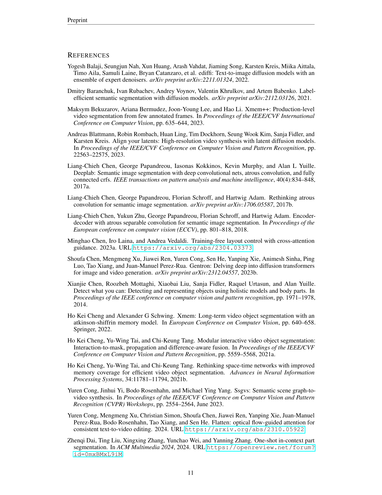

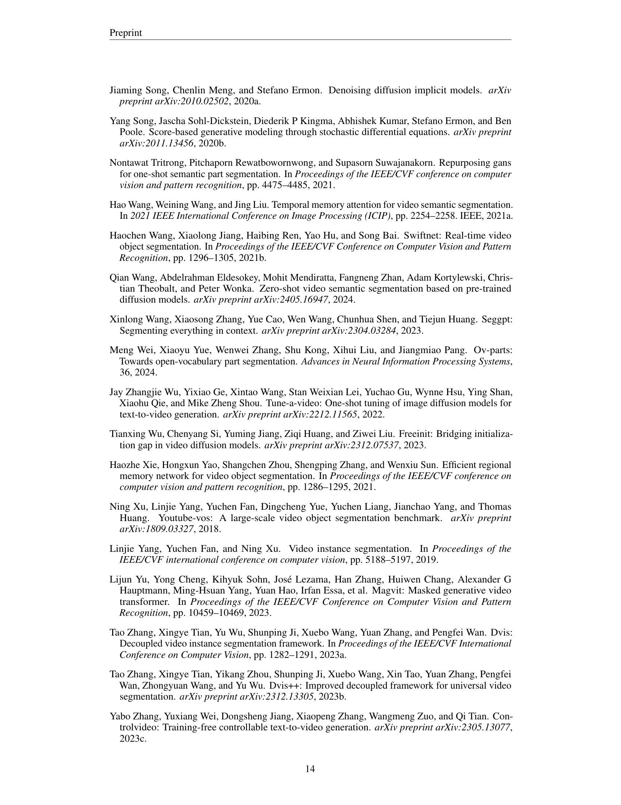

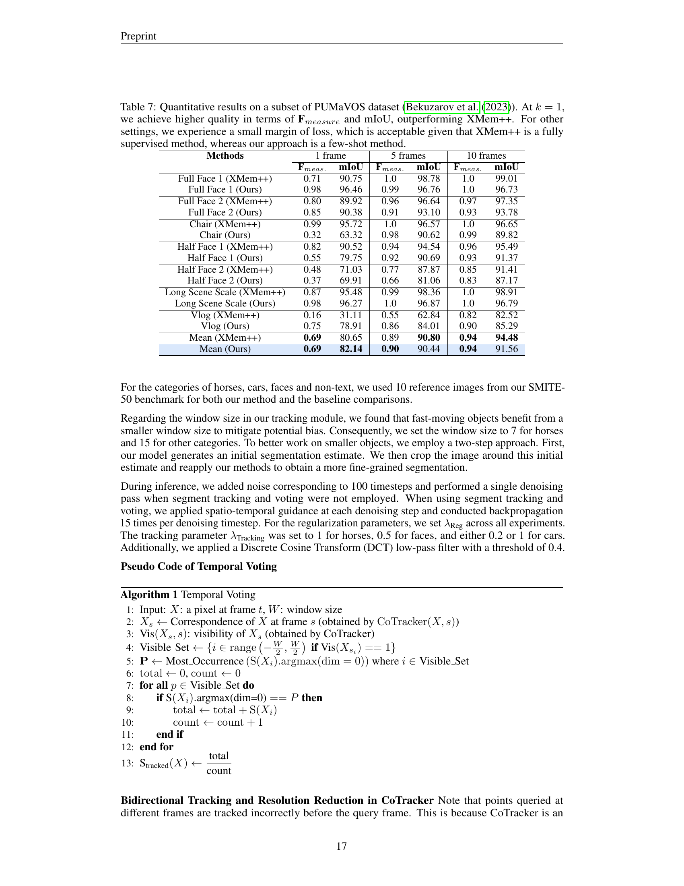
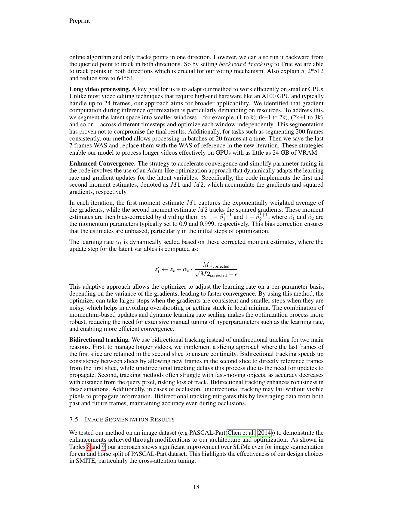

