### TL;DR



The research introduces ScaleQuest, a novel method for creating high-quality datasets for training large language models (LLMs) focused on mathematical reasoning.  Unlike previous approaches that rely on expensive, closed-source models or complex augmentation techniques, ScaleQuest leverages readily available, smaller open-source models to generate a million problem-solution pairs from scratch.  The efficiency and low cost of this approach are key advantages.  The generated dataset significantly outperforms existing open-source datasets in improving the performance of various LLMs on mathematical reasoning benchmarks.  The researchers demonstrate that simply fine-tuning a base model with their dataset can surpass even strong, closed-source models like GPT-4-Turbo and Claude-3.5 Sonnet. This work addresses a major bottleneck in LLM development – the lack of affordable, high-quality data – and paves the way for increased open-source contributions to the field.




 &nbsp; read the paper on arXiv


#### Why does it matter?
ScaleQuest synthesizes a million high-quality math problems using efficient open-source methods, boosting LLM reasoning abilities significantly.
#### Key Takeaways


 ScaleQuest efficiently creates a large-scale mathematical reasoning dataset using small, open-source language models. 



 Fine-tuning LLMs with the ScaleQuest dataset substantially improves their performance on various mathematical reasoning benchmarks. 



 The method is cost-effective, opening up possibilities for open-source community contributions in LLM development. 


------
#### Visual Insights

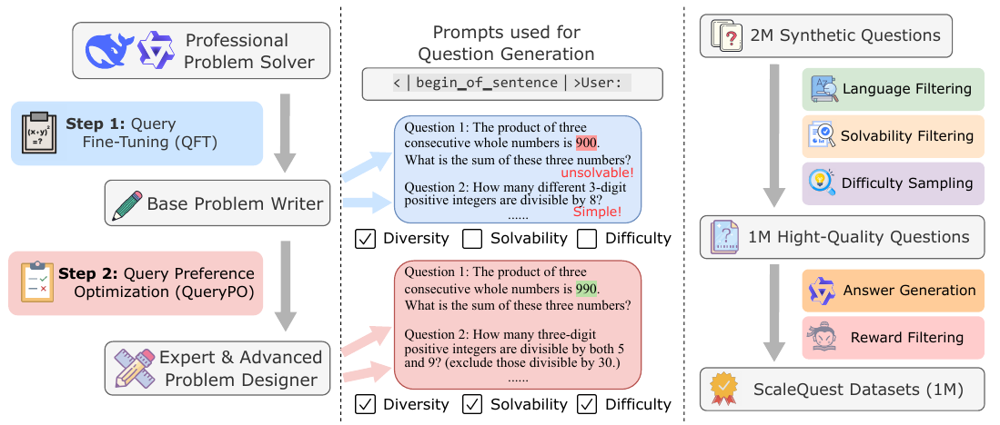

> This figure shows the overview of the ScaleQuest method, which includes three main stages: training question generators, question generation, and final data construction.

> The chart displays the performance of various language models on the MATH benchmark, comparing the impact of different data synthesis methods, particularly highlighting the improvement achieved using the ScaleQuest method.


<table id='2' style='font-size:14px'><tr><td>Model</td><td>Synthesis Model</td><td>GSM8K</td><td>MATH</td><td>College Math</td><td>Olympiad Bench</td><td>Average</td></tr><tr><td colspan="7">Teacher Models in Data Synthesis</td></tr><tr><td>GPT-4-0314</td><td>-</td><td>94.7</td><td>52.6</td><td>24.4</td><td>-</td><td>-</td></tr><tr><td>GPT-4-Turbo-24-04-09</td><td>-</td><td>94.5</td><td>73.4</td><td>-</td><td>-</td><td>-</td></tr><tr><td>GPT-4o-2024-08-06</td><td>-</td><td>92.9</td><td>81.1</td><td>50.2</td><td>43.3</td><td>66.9</td></tr><tr><td>DeepSeekMath-7B-RL</td><td>-</td><td>88.2</td><td>52.4</td><td>41.4</td><td>19.0</td><td>49.3</td></tr><tr><td>Qwen2-Math-7B-Instruct</td><td>-</td><td>89.5</td><td>73.1</td><td>50.5</td><td>37.8</td><td>62.7</td></tr><tr><td colspan="7">General Base Model</td></tr><tr><td>Mistral-7B- WizardMath</td><td>GPT-4</td><td>81.9</td><td>33.3</td><td>21.5</td><td>8.6</td><td>36.3</td></tr><tr><td>Mistral-7B-MetaMath</td><td>GPT-3.5</td><td>77.7</td><td>28.2</td><td>19.1</td><td>5.8</td><td>32.7</td></tr><tr><td>Mistral-7B-MMIQC</td><td>GPT-4</td><td>75.7</td><td>36.3</td><td>24.8</td><td>10.8</td><td>36.9</td></tr><tr><td>Mistral-7B-MathScale</td><td>GPT-3.5</td><td>74.8</td><td>35.2</td><td>21.8</td><td>-</td><td>-</td></tr><tr><td>Mistral-7B-KPMath</td><td>GPT-4</td><td>82.1</td><td>46.8</td><td>-</td><td>-</td><td>-</td></tr><tr><td>Mistral-7B-DART-Math</td><td>DSMath-7B-RL</td><td>81.1</td><td>45.5</td><td>29.4</td><td>14.7</td><td>42.7</td></tr><tr><td>Mistral-7B-NuminaMath</td><td>GPT-4o</td><td>82.1</td><td>49.4</td><td>33.8</td><td>19.4</td><td>46.2</td></tr><tr><td>Mistral-7B-ScaleQuest</td><td>Qwen2-Math-7B-Ins</td><td>88.5</td><td>62.9</td><td>43.5</td><td>26.8</td><td>55.4</td></tr><tr><td>Llama3-8B-MetaMath</td><td>GPT-3.5</td><td>77.3</td><td>32.5</td><td>20.6</td><td>5.5</td><td>34.0</td></tr><tr><td>Llama3-8B-MMIQC</td><td>GPT-4</td><td>77.6</td><td>39.5</td><td>29.5</td><td>9.6</td><td>39.1</td></tr><tr><td>Llama3-8B-DART-Math</td><td>, DSMath-7B-RL</td><td>81.1</td><td>46.6</td><td>28.8</td><td>14.5</td><td>42.8</td></tr><tr><td>Llama3-8B-NuminaMath</td><td>GPT-4o</td><td>77.2</td><td>50.7</td><td>33.2</td><td>17.8</td><td>44.7</td></tr><tr><td>Llama3-8B-ScaleQuest</td><td>Qwen2-Math-7B-Ins</td><td>87.9</td><td>64.4</td><td>42.8</td><td>25.3</td><td>55.1</td></tr><tr><td colspan="7">Math-Specialized Base Model</td></tr><tr><td>DeepSeekMath-7B-Instruct</td><td>-</td><td>82.7</td><td>46.9</td><td>37.1</td><td>14.2</td><td>45.2</td></tr><tr><td>DeepSeekMath-7B-MMIQC</td><td>GPT-4</td><td>79.0</td><td>45.3</td><td>35.3</td><td>13.0</td><td>43.2</td></tr><tr><td>DeepSeekMath-7B-KPMath-Plus</td><td>GPT-4</td><td>83.9</td><td>48.8</td><td>-</td><td>-</td><td>-</td></tr><tr><td>DeepSeekMath-7B-DART-Math</td><td>DSMath-7B-RL</td><td>86.8</td><td>53.6</td><td>40.7</td><td>21.7</td><td>50.7</td></tr><tr><td>DeepSeekMath-7B-Nurnina-Math</td><td>GPT-4o</td><td>75.4</td><td>55.2</td><td>36.9</td><td>19.9</td><td>46.9</td></tr><tr><td>DeepSeekMath-7B-ScaleQuest</td><td>Qwen2-Math-7B-Ins</td><td>89.5</td><td>66.6</td><td>47.7</td><td>29.9</td><td>58.4</td></tr><tr><td>Qwen2-Math-7B-MetaMath</td><td>GPT-3.5</td><td>83.9</td><td>49.5</td><td>39.9</td><td>17.9</td><td>47.8</td></tr><tr><td>Qwen2-Math-7B-DART-Math</td><td>DSMath-7B-RL</td><td>88.6</td><td>58.8</td><td>45.4</td><td>23.1</td><td>54.0</td></tr><tr><td>Qwen2-Math-7B-Numina-Math</td><td>GPT-4o</td><td>84.6</td><td>65.6</td><td>45.5</td><td>33.6</td><td>57.3</td></tr><tr><td>Qwen2-Math-7B-ScaleQuest</td><td>Qwen2-Math-7B-Ins</td><td>89.7</td><td>73.4</td><td>50.0</td><td>38.5</td><td>62.9</td></tr></table>

> Table 1 presents the main results of four mathematical reasoning benchmarks, comparing different models' performance with various data synthesis methods.

### More visual insights

More on figures

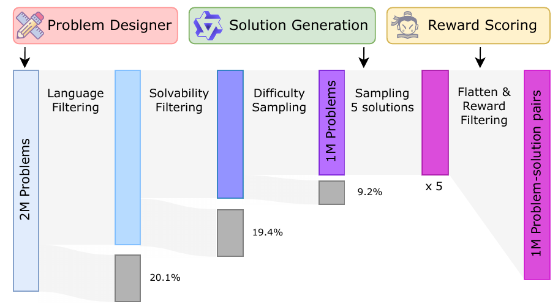

> The figure illustrates the overall process of the ScaleQuest method, starting from training question generators to constructing the final dataset.

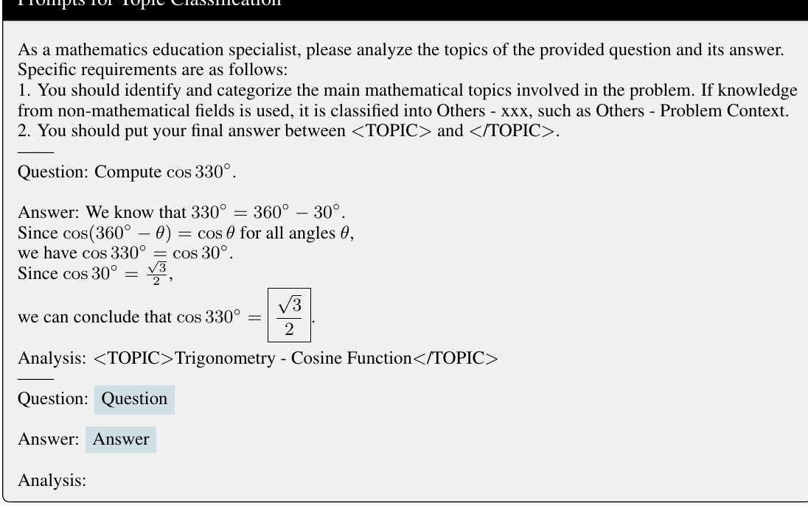

> The figure shows the performance comparison of various LLMs on MATH benchmark and Llama3-8B fine-tuned on different publicly available datasets.

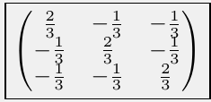

> The figure shows the performance comparison of different LLMs on MATH benchmark with and without using ScaleQuest dataset and also the comparison of Llama3-8B fine-tuned on different publicly available datasets.

More on charts

> The chart displays the performance of various models on the MATH benchmark, comparing the performance gains achieved using different data synthesis methods, notably highlighting the performance boost from the ScaleQuest method.

> The chart displays the performance of various models on the MATH benchmark and Llama3-8B fine-tuned on different datasets, highlighting the impact of ScaleQuest.

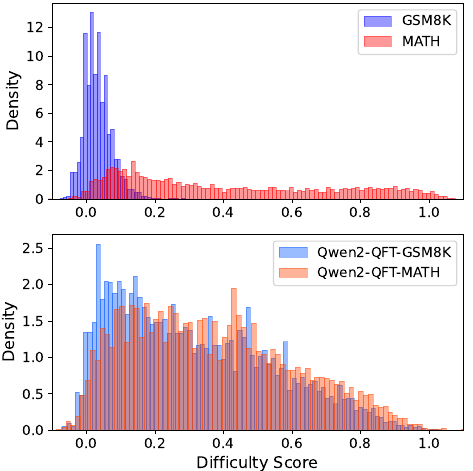

> The chart displays the distribution of difficulty scores for two real-world datasets (GSM8K and MATH) and two synthetic datasets generated using a question fine-tuning method.

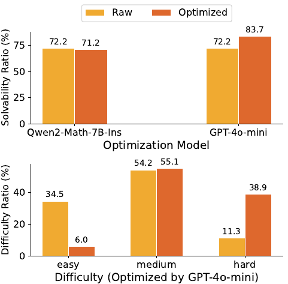

> The chart displays the solvability and difficulty ratios of questions before and after optimization using two different optimization models.

> The chart compares the solvability, difficulty, and accuracy of a synthetic dataset generated using different stages of a question generation method, showing improvements at each stage.

> The chart displays a comparison of various LLMs' performance on the MATH benchmark, showcasing the improvement achieved using the ScaleQuest dataset.

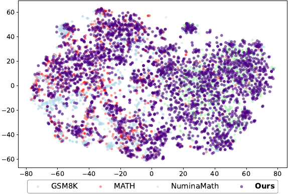

> The chart displays the performance of various models on the MATH benchmark, comparing the impact of different data synthesis methods, including ScaleQuest, on model accuracy.

More on tables


<table id='2' style='font-size:14px'><tr><td>Questions Source</td><td>Response Synthesis Model</td><td>GSM8K</td><td>MATH</td><td>College Math</td><td>Olympiad Bench</td><td>Average</td></tr><tr><td>MetaMath</td><td>Qwen2-Math-7B-Instruct</td><td>84.5</td><td>53.8</td><td>40.1</td><td>22.1</td><td>50.1</td></tr><tr><td>OrcaMath</td><td>Qwen2-Math-7B-Instruct</td><td>84.2</td><td>53.7</td><td>40.5</td><td>23.7</td><td>50.5</td></tr><tr><td>NuminaMath</td><td>Qwen2-Math-7B-Instruct</td><td>86.0</td><td>65.9</td><td>46.1</td><td>30.2</td><td>57.1</td></tr><tr><td>ScaleQuest</td><td>Qwen2-Math-7B-Instruct</td><td>89.5</td><td>66.6</td><td>47.7</td><td>29.9</td><td>58.4</td></tr></table>

> Table 1 presents the main results of four mathematical reasoning benchmarks, comparing the performance of various models using different data synthesis methods.


<table id='4' style='font-size:16px'><tr><td>Synthetic Dataset</td><td># Samples</td><td>GSM8K</td><td>MATH</td><td>College Math</td><td>Olympiad Bench</td><td>Average</td></tr><tr><td>ScaleQuest-DSMath</td><td>400K</td><td>87.6</td><td>52.2</td><td>39.8</td><td>19.4</td><td>49.8</td></tr><tr><td>ScaleQuest-Qwen2-Math</td><td>400K</td><td>86.8</td><td>56.1</td><td>39.6</td><td>18.7</td><td>50.3</td></tr><tr><td>Mixed</td><td>400K</td><td>87.8</td><td>58.0</td><td>40.1</td><td>22.2</td><td>52.0</td></tr></table>

> Table 1 presents the main results of four mathematical reasoning benchmarks, comparing the performance of different models using various data synthesis methods.


<table id='2' style='font-size:16px'><tr><td colspan="2">Phase</td><td>Type</td><td># Samples</td><td>GPU hours</td><td>Cost ($)</td></tr><tr><td rowspan="2">QFT</td><td>Training DSMath-QFT</td><td>Train</td><td>15K</td><td>2.0</td><td>2.6</td></tr><tr><td>Training Qwen2-Math-QFT</td><td>Train</td><td>15K</td><td>1.9</td><td>2.5</td></tr><tr><td rowspan="3">QPO</td><td>Generate Questions</td><td>Infer</td><td>10Kx2</td><td>0.4</td><td>0.5</td></tr><tr><td>Construct Preference Data</td><td>API</td><td>10Kx2</td><td>-</td><td>6.2</td></tr><tr><td>QPO Training</td><td>Train</td><td>10Kx2</td><td>6.6</td><td>8.5</td></tr><tr><td rowspan="4">Data Synthesis</td><td>Question Generation</td><td>Infer</td><td>2M</td><td>38.4</td><td>49.5</td></tr><tr><td>solvability & difficulty check</td><td>Infer</td><td>2M</td><td>110.6</td><td>142.7</td></tr><tr><td>Response Generation</td><td>Infer</td><td>1Mx5</td><td>251.0</td><td>323.8</td></tr><tr><td>Reward Scoring</td><td>Infer</td><td>1Mx5</td><td>112.0</td><td>144.5</td></tr><tr><td colspan="3">Total</td><td>1M</td><td>522.9</td><td>680.8</td></tr><tr><td colspan="3">GPT-4 cost (generating the same number of tokens)</td><td>-</td><td>-</td><td>24,939.5</td></tr><tr><td colspan="3">GPT-4o cost (generating the same number of tokens)</td><td>-</td><td>-</td><td>6,115.9</td></tr></table>

> Table 1 presents the main results of four mathematical reasoning benchmarks, comparing different models' performance using various data synthesis methods and highlighting the best performance achieved within each base model.


 <table id='2' style='font-size:16px'><tr><td>REFERENCES</td></tr><tr><td></td></tr><tr><td>Zhangir Azerbayev, Hailey Schoelkopf, Keiran Paster, Marco Dos Santos, Stephen McAleer, Al- bert Q Jiang, Jia Deng, Stella Biderman, and Sean Welleck. Llemma: An open language model for mathematics. arXiv preprint arXiv:2310.10631, 2023. Zheng Cai, Maosong Cao, Haojiong Chen, Kai Chen, Keyu Chen, Xin Chen, Xun Chen, Zehui Chen, Zhi Chen, Pei Chu, et al. Internlm2 technical report. arXiv preprint arXiv:2403.17297, 2024.</td></tr><tr><td>Jiaao Chen, Xiaoman Pan, Dian Yu, Kaiqiang Song, Xiaoyang Wang, Dong Yu, and Jianshu Chen. Skills-in-context prompting: Unlocking compositionality in large language models. arXiv preprint arXiv:2308.00304, 2023.</td></tr><tr><td>Wenhu Chen, Xueguang Ma, Xinyi Wang, and William w Cohen. Program of thoughts prompt- ing: Disentangling computation from reasoning for numerical reasoning tasks. arXiv preprint arXiv:2211.12588, 2022.</td></tr><tr><td>Yew Ken Chia, Guizhen Chen, Luu Anh Tuan, Soujanya Poria, and Lidong Bing. Contrastive chain- of-thought prompting. arXiv preprint arXiv:2311.09277, 2023.</td></tr><tr><td>Karl Cobbe, Vineet Kosaraju, Mohammad Bavarian, Mark Chen, Heewoo Jun, Lukasz Kaiser, Matthias Plappert, Jerry Tworek, Jacob Hilton, Reiichiro Nakano, et al. Training verifiers to solve math word problems. arXiv preprint arXiv:2110.14168, 2021.</td></tr><tr><td>Aniket Didolkar, Anirudh Goyal, Nan Rosemary Ke, Siyuan Guo, Michal Valko, Timothy Lillicrap, Danilo Rezende, Yoshua Bengio, Michael Mozer, and Sanjeev Arora. Metacognitive capabilities of llms: An exploration in mathematical problem solving. arXiv preprint arXiv:2405.12205, 2024.</td></tr><tr><td>Abhimanyu Dubey, Abhinav Jauhri, Abhinav Pandey, Abhishek Kadian, Ahmad Al-Dahle, Aiesha Letman, Akhil Mathur, Alan Schelten, Amy Yang, Angela Fan, et al. The llama 3 herd of models. arXiv preprint arXiv:2407.21783, 2024.</td></tr><tr><td>Run-Ze Fan, Xuefeng Li, Haoyang Zou, Junlong Li, Shwai He, Ethan Chern, Jiewen Hu, and Pengfei Liu. Reformatted alignment. arXiv preprint arXiv:2402.12219, 2024.</td></tr><tr><td>Luyu Gao, Aman Madaan, Shuyan Zhou, Uri Alon, Pengfei Liu, Yiming Yang, Jamie Callan, and Graham Neubig. Pal: Program-aided language models. In International Conference on Machine Learning, pp. 10764-10799. PMLR, 2023.</td></tr><tr><td>Zhibin Gou, Zhihong Shao, Yeyun Gong, Yujiu Yang, Minlie Huang, Nan Duan, Weizhu Chen, et al. Tora: A tool-integrated reasoning agent for mathematical problem solving. arXiv preprint arXiv:2309.17452, 2023.</td></tr><tr><td>Chaoqun He, Renjie Luo, Yuzhuo Bai, Shengding Hu, Zhen Leng Thai, Junhao Shen, Jinyi Hu, Xu Han, Yujie Huang, Yuxiang Zhang, et al. Olympiadbench: A challenging benchmark for promoting agi with olympiad-level bilingual multimodal scientific problems. arXiv preprint arXiv:2402.14008, 2024.</td></tr><tr><td>Dan Hendrycks, Collin Burns, Saurav Kadavath, Akul Arora, Steven Basart, Eric Tang, Dawn Song, and Jacob Steinhardt. Measuring mathematical problem solving with the math dataset. arXiv preprint arXiv:2103.03874, 2021.</td></tr><tr><td>Yiming Huang, Xiao Liu, Yeyun Gong, Zhibin Gou, Yelong Shen, Nan Duan, and Weizhu Chen. Key-point-driven data synthesis with its enhancement on mathematical reasoning. arXiv preprint arXiv:2403.02333, 2024a.</td></tr><tr><td>Yinya Huang, Xiaohan Lin, Zhengying Liu, Qingxing Cao, Huajian Xin, Haiming Wang, Zhenguo Li, Linqi Song, and Xiaodan Liang. Mustard: Mastering uniform synthesis of theorem and proof data. arXiv preprint arXiv:2402.08957, 2024b.</td></tr></table>

> Table 1 presents the main results of four mathematical reasoning benchmarks comparing different models and data synthesis methods, showing ScaleQuest's significant outperformance.


<table id='4' style='font-size:14px'><tr><td>Dataset</td><td>Size</td><td>Synthesis Model</td><td>Public</td></tr><tr><td>WizardMath uo et al 2023</td><td>96K</td><td>GPT-4</td><td></td></tr><tr><td>MetaMath Yu et al 23a</td><td>395K</td><td>GPT-3.5-Turbo</td><td></td></tr><tr><td>MMIQC LIU & Yao 24 1tra et a 24</td><td>2294K</td><td>GPT-4 & GPT-3.5-Turbo & Human</td><td></td></tr><tr><td>Orca-Math Xwin-Math 1 et al )24a</td><td>200K 1440K</td><td>GPT-4-Turbo</td><td></td></tr><tr><td>KPMath-Plus Huang et al 2024a</td><td>1576K</td><td>GPT-4-Turbo GPT-4</td><td>X</td></tr><tr><td>MathsScale lang et al 2024</td><td>2021K</td><td>GPT-3.5 & Human</td><td>X</td></tr><tr><td>DART-Math long et al 2024</td><td>585K</td><td>DeepSeekMath-7B-RL</td><td>V</td></tr><tr><td>Numina-Math L1 et al. 2024c</td><td>860K</td><td>GPT-4 & GPT-4o</td><td></td></tr><tr><td>ScaleQuest</td><td>1000K</td><td>DeepSeekMath-7B-RL Qwen2-Math-7B-Instruct</td><td>V</td></tr></table>

> Table 1 presents the main results of four mathematical reasoning benchmarks, comparing the performance of different models using various data synthesis methods.


<table id='1' style='font-size:14px'><tr><td>Examples for Solvability Optimization</td></tr><tr><td>Problems 1 (Before Optimization):</td></tr><tr><td>There are 10 survivors in an emergency room. Each survivor is either a child, a woman, or a man. If there are 4 men and 3 times as many women as men, how many children are there?</td></tr><tr><td>Problems 1 (After Optimization):</td></tr><tr><td>There are 10 survivors in an emergency room. Each survivor is either a child, a woman, or a man. If there are 4 men and an equal number of women as men, how many children are there?</td></tr><tr><td>Problems 2 (Before Optimization):</td></tr><tr><td>How many sides does a polygon have if it is a regular polygon?</td></tr><tr><td>Problems 2 (After Optimization):</td></tr><tr><td>How many sides does a regular polygon have if each interior angle is 120 degrees?</td></tr><tr><td>Problems 3 (Before Optimization):</td></tr><tr><td>Find the sum of the first three terms of this series.</td></tr><tr><td>Problems 3 (After Optimization):</td></tr><tr><td>Calculate the sum of the first three terms of the arithmetic series where the first term is 5 and the common difference is 3.</td></tr></table>

> Table 1 presents the main results of four mathematical reasoning benchmarks comparing different models' performance with various data synthesis methods.


 <table id='4' style='font-size:14px'><tr><td>Problems 1 (Before Optimization):</td></tr><tr><td>How many 4-digit positive integers are there?</td></tr><tr><td>Problems 1 (After Optimization):</td></tr><tr><td>How many 4-digit positive integers can be formed using non-repeating digits where the sum of these digits must be even, and the integers fall within the range of 1000 to 9999?</td></tr><tr><td>Problems 2 (Before Optimization):</td></tr><tr><td>The average of 15 numbers is 32. An additional number is then added to the list, and the new average of the 16 numbers is 34. What number was added to the list?</td></tr><tr><td>Problems 2 (After Optimization): The average of 15 positive integers is 32, but one integer fluctuates to 30 before adding a new number. After adding this new number, the average of the 16 integers becomes 34. Calculate the added number and find the standard deviation of all 16 integers, considering their ascending order.</td></tr><tr><td>Problems 3 (Before Optimization):</td></tr><tr><td></td></tr><tr><td>A fair coin is tossed 50 times, what is the probability of getting heads at least 25 times? Problems 3 (After Optimization):</td></tr><tr><td>A fair coin is tossed 50 times; what is the probability of obtaining heads at least 25 times, and can you also calculate the expected number, variance, and standard deviation of heads while determining the likelihood that the total number of heads exceeds 30?</td></tr></table>

> Table 1 presents the main results of four mathematical reasoning benchmarks, comparing various models' performance using different data synthesis methods.

### Full paper



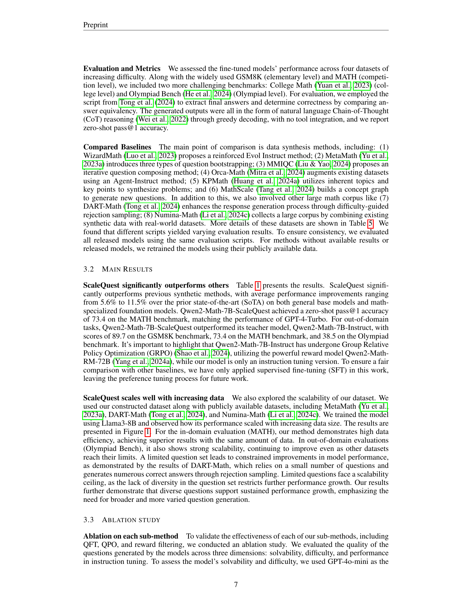

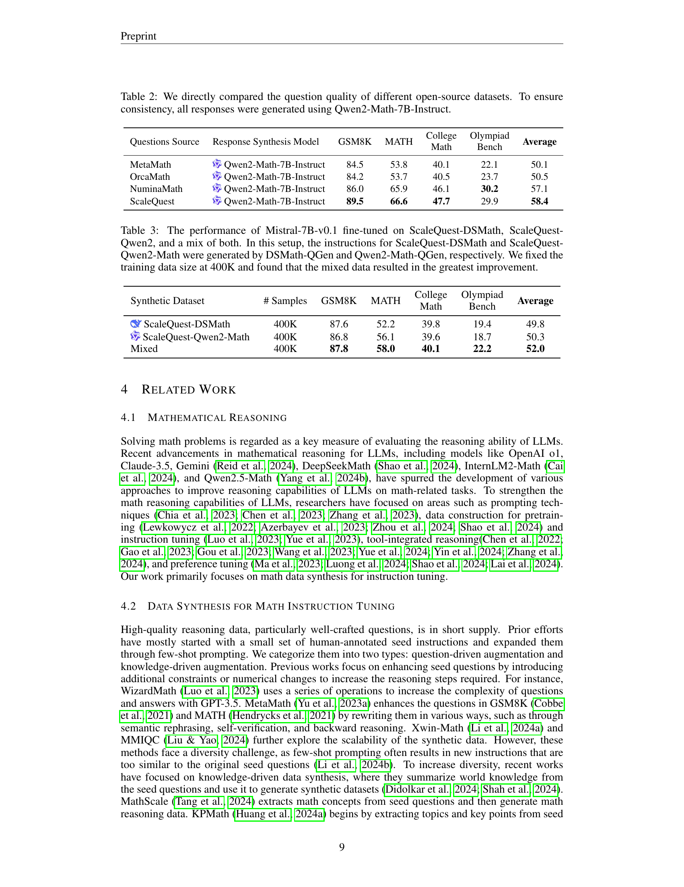

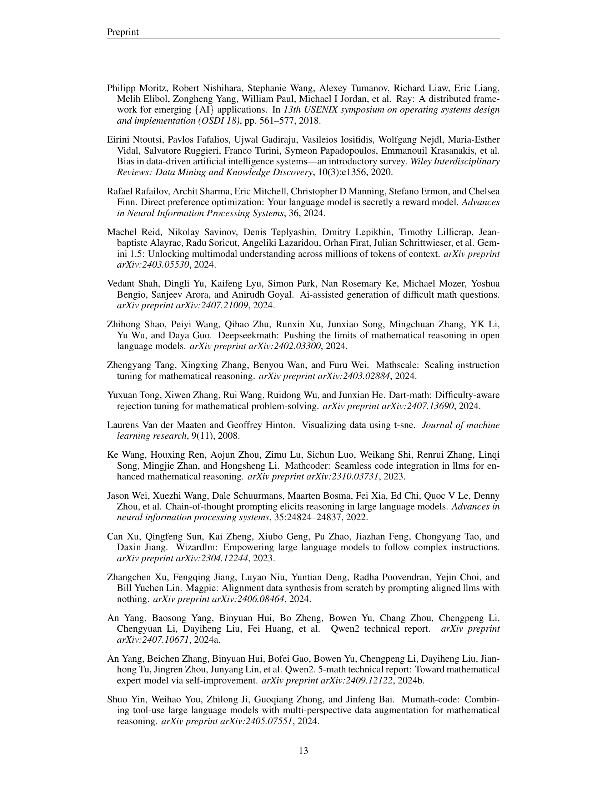
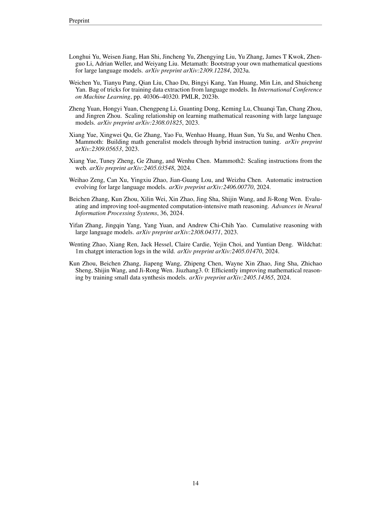
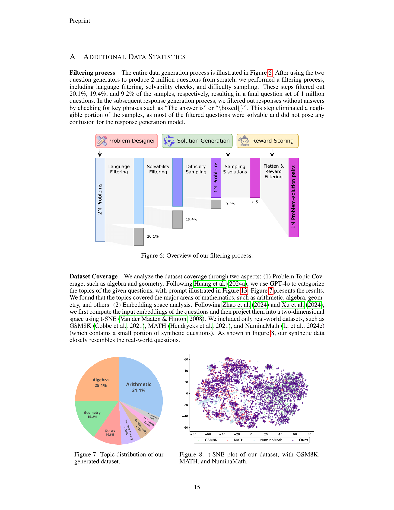
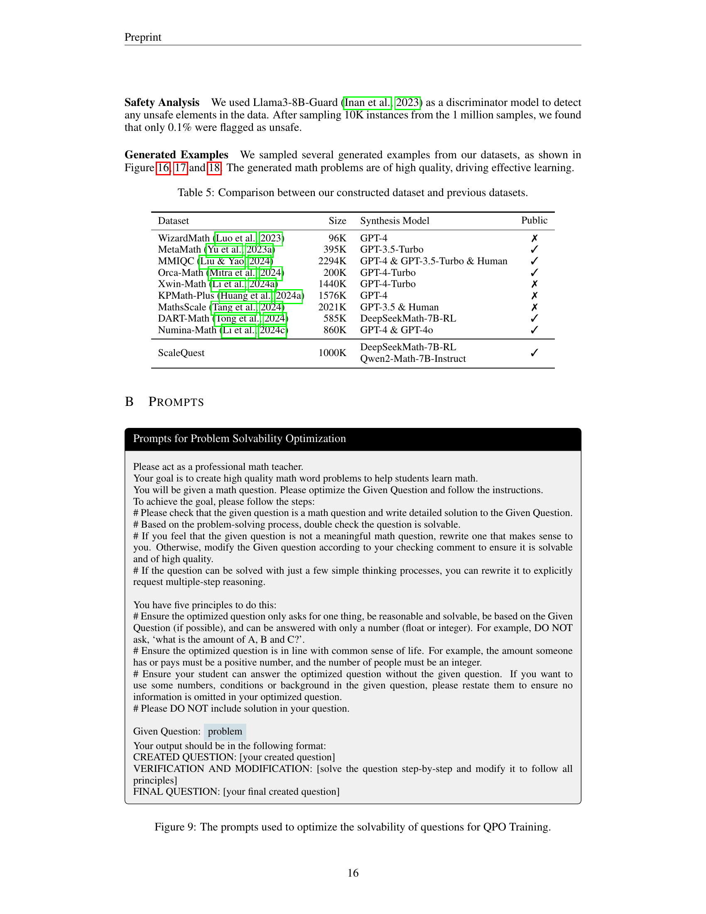
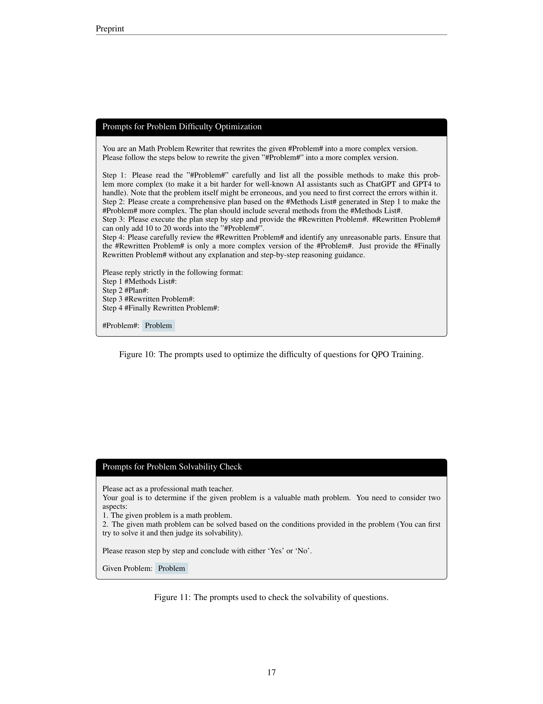

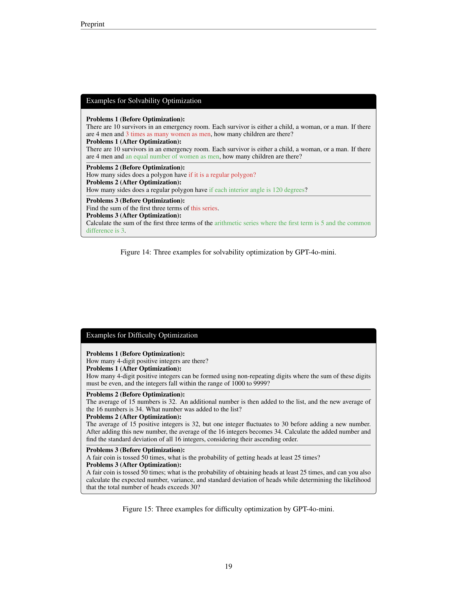

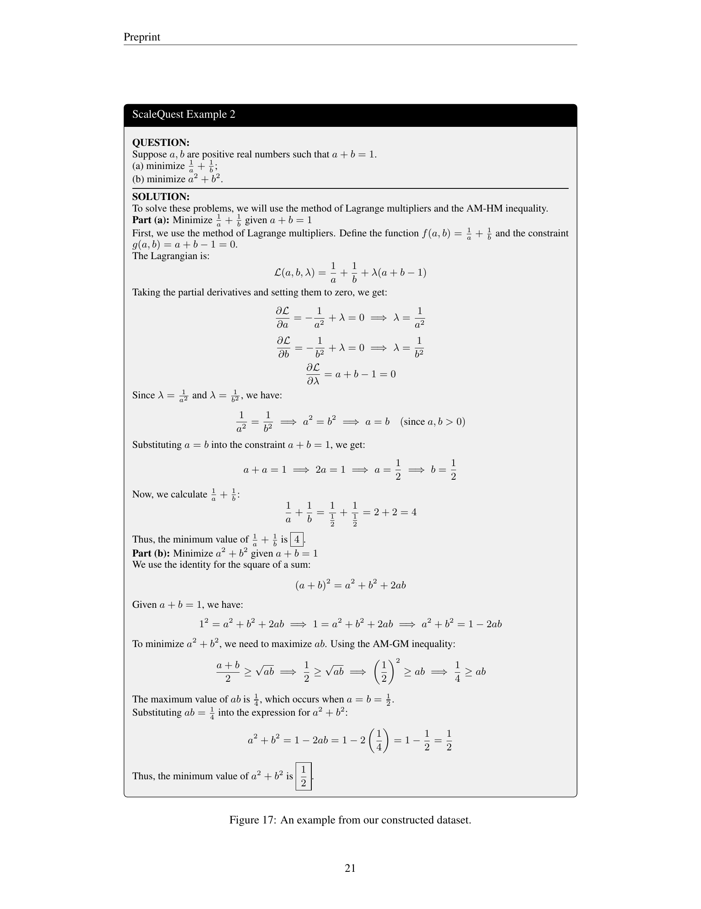

