### TL;DR



Large Language Models (LLMs) are limited by their effective context length, often falling short of their training capacity. This paper identifies the cause: a left-skewed frequency distribution of relative positions used during training.  To address this, the researchers propose STRING, a training-free method that shifts well-trained position embeddings to overwrite less effective ones. STRING significantly improves performance across several LLMs on long-context benchmarks, establishing new state-of-the-art results for open-source models.  Even without additional training, STRING enhances the ability of LLMs to effectively use longer contexts, bringing them closer to their theoretical potential. This is achieved through a clever manipulation of the position embedding matrix to leverage frequently-used positions for representing longer distances, thus compensating for the under-training of less frequent, long-distance positions.




 &nbsp; read the paper on arXiv


#### Why does it matter?
Shifted Rotray position embeddING (STRING) significantly improves the effective context length of large language models by addressing the left-skewed frequency distribution of relative positions, achieving state-of-the-art results for open-source LLMs.
#### Key Takeaways


 STRING dramatically improves the performance of LLMs on long-context benchmarks without additional training. 



 The left-skewed frequency distribution of relative positions in LLMs hinders their ability to utilize longer contexts effectively. 



 STRING achieves state-of-the-art results for open-source LLMs, even surpassing some commercial models in performance. 


------
#### Visual Insights

 and position indices (shown in blue). The left Y-axis indicates the frequency of each position, while the right Y-axis represents the number of data for each length.")

> The figure shows that the position frequency distribution is usually highly left-skewed, indicating that the model is frequently exposed to small positions, while larger positions account for only a small proportion.

 and position indices (shown in blue). The left Y-axis indicates the frequency of each position, while the right Y-axis represents the number of data for each length.")

> The chart shows that the position frequency distribution is usually highly left-skewed across training data of varying lengths, indicating that the model is frequently exposed to small positions, while larger positions account for only a small proportion.


<table id='3' style='font-size:14px'><tr><td>Model</td><td>Ltrain</td><td>ReRoPE</td><td>NTK</td><td>RoPE(origin)</td><td>Self-Extend</td><td>YaRN</td><td>DCA</td><td>STRING</td></tr><tr><td>TinyLlama-1.3B (ours)</td><td>2k</td><td>62.8</td><td>62.0</td><td>56.6</td><td>60.2</td><td>68.6</td><td>74.4</td><td>84.6</td></tr><tr><td>TinyLlama-1.1B-3T</td><td>2k</td><td>77.2</td><td>79.8</td><td>69.8</td><td>83.2</td><td>88.0</td><td>80.2</td><td>97.2</td></tr><tr><td>Llama-2-7B</td><td>4k</td><td>98.6</td><td>98.6</td><td>98.0</td><td>95.4</td><td>98.0</td><td>91.6</td><td>100.0</td></tr><tr><td>Llama-3-8B</td><td>8k</td><td>99.6</td><td>100.0</td><td>99.8</td><td>99.8</td><td>100.0</td><td>99.9</td><td>99.6</td></tr><tr><td>LWM-7B-base</td><td>32k</td><td>25.2</td><td>19.4</td><td>31.8</td><td>29.0</td><td>22.2</td><td>28.8</td><td>50.4</td></tr><tr><td>Mistral-7B-base</td><td>32k</td><td>54.5</td><td>42.2</td><td>52.8</td><td>54.2</td><td>48.2</td><td>64.2</td><td>73.0</td></tr><tr><td>Llama-3.1-8B</td><td>128k</td><td>53.6</td><td>71.2</td><td>66.0</td><td>65.8</td><td>68.8</td><td>72.8</td><td>95.2</td></tr><tr><td>Average</td><td>-</td><td>67.3</td><td>67.6</td><td>67.8</td><td>69.6</td><td>70.5</td><td>73.1</td><td>85.7</td></tr></table>

> Table 1 presents the Needle-in-a-Haystack (4 needles) results of 7 base models across various methods, showing the impact of different methods on improving the effective context length.

### More visual insights

More on figures

 and position indices (shown in blue). The left Y-axis indicates the frequency of each position, while the right Y-axis represents the number of data for each length.")

> The figure shows the left-skewed position frequency distribution across training data of varying lengths, indicating an underrepresentation of long-range dependencies.

 and position indices (shown in blue). The left Y-axis indicates the frequency of each position, while the right Y-axis represents the number of data for each length.")

> The figure shows that the position frequency distribution is usually highly left-skewed across training data of varying lengths, indicating that the model is frequently exposed to small positions, while larger positions account for only a small proportion.

More on charts

> The chart displays the relationship between effective context length, consumed tokens, and position frequency in LLMs pretrained on SlimPajama dataset.

> The chart displays the position frequency distribution for models trained with different training lengths (2K and 4K) after consuming 1 trillion tokens, illustrating the impact of training length on the distribution of position indices.

 and Llama3.1 (128K) where the X-axis means input context length and the Y-axis represents the document depth. In this figure, we clearly observe that for TinyLlama 2K and Llama3.1 128K, most poor-performing cases are concentrated in the lower-left triangle, indicating that the models are unable to gather distant needles.")

> The heatmaps show the performance of two LLMs on the Needle-in-a-Haystack task, revealing that their ability to retrieve distant needles significantly degrades as the distance between the query and the needle increases.

 and position indices (shown in blue). The left Y-axis indicates the frequency of each position, while the right Y-axis represents the number of data for each length.")

> The chart displays the left-skewed position frequency distribution across various training data lengths, highlighting the underrepresentation of long-distance positions.

> The ablation study shows the effect of local window size and shifted offset size on the performance of four different LLMs on the Needle-in-a-Haystack task.

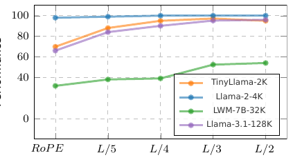

> The chart displays the ablation study results on the local window size (W) and shifted offset size (S) parameters of STRING across four different LLMs with varying training lengths, showing how these parameters impact model performance on the Needle-in-a-Haystack task.

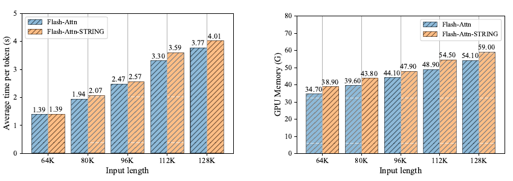

> The chart compares the inference time and GPU memory consumption of STRING and standard Flash Attention on Llama3.1 8B with varying input lengths.

More on tables

{{< table-caption caption="🔽 Table 2: Performance of various models and methods on RULER with a tested at a sequence length of 128K. The RULER benchmark consists of 13 tasks (500 test cases for each task) categorized into Needle-in-a-Haystack (NIAH), Variable Tracing (VT), Aggregation, and Question Answering (QA). We report the average scores for each category as well as the overall average across all 13 tasks. Effective denotes the actual effective sequence length as defined in RULER, indicating whether the model surpasses the performance of Llama2 (Touvron et al., 2023b), and Claimed represents the sequence length reported by the model." >}}
 <table id='2' style='font-size:14px'><tr><td>Models</td><td>Effective/Claimed</td><td>NIAH</td><td>VT</td><td>Aggregation</td><td>QA</td><td>Avg. (13 tasks)</td></tr><tr><td>Llama2-chat</td><td>4K / 4K</td><td>96.9</td><td>89.7</td><td>84.8</td><td>49.7</td><td>85.6</td></tr><tr><td>GPT-4-1106-preview</td><td>64K / 128K</td><td>84.8</td><td>99.6</td><td>79.7</td><td>59.0</td><td>81.2</td></tr><tr><td>GLM4 (Open-source best)</td><td>64K / 1M</td><td>94.4</td><td>97.7</td><td>49.7</td><td>63.6</td><td>83.1</td></tr><tr><td>LWM (7B)</td><td>4K / 128K</td><td>83.4</td><td>15.2</td><td>29.1</td><td>52.6</td><td>65.0</td></tr><tr><td>Phi3-medium (14B)</td><td>8K / 128K</td><td>51.3</td><td>26.0</td><td>43.5</td><td>38.0</td><td>46.1</td></tr><tr><td>Llama3.1 (8B)</td><td>32K / 128K</td><td>92.6</td><td>70.4</td><td>36.2</td><td>58.8</td><td>77.0</td></tr><tr><td>+ YaRN</td><td>32K / 128K</td><td>94.7</td><td>39.8</td><td>38.2</td><td>58.8</td><td>76.3</td></tr><tr><td>+ DCA</td><td>32K / 128K</td><td>89.5</td><td>62.5</td><td>39.2</td><td>55.2</td><td>74.4</td></tr><tr><td>+ Self-Extend</td><td>32K / 128K</td><td>94.9</td><td>65.0</td><td>37.3</td><td>49.8</td><td>76.8</td></tr><tr><td>+ ReRoPE</td><td>32K / 128K</td><td>90.0</td><td>56.3</td><td>38.7</td><td>56.9</td><td>74.4</td></tr><tr><td>+ STRING</td><td>32K / 128K</td><td>94.0</td><td>88.1</td><td>37.6</td><td>62.7</td><td>80.0</td></tr><tr><td>Yi (34B)</td><td>32K / 200K</td><td>90.2</td><td>76.8</td><td>43.4</td><td>59.9</td><td>77.3</td></tr><tr><td>GradientAI/Llama3 (70B)</td><td>16K / 1M</td><td>84.9</td><td>56.2</td><td>41.4</td><td>59.8</td><td>72.1</td></tr><tr><td>Mixtral (8x22B)</td><td>32K / 64K</td><td>23.8</td><td>0.0</td><td>69.7</td><td>40.8</td><td>31.7</td></tr><tr><td>Command-R-plus (104B)</td><td>32K / 128K</td><td>65.7</td><td>97.2</td><td>59.5</td><td>39.2</td><td>63.1</td></tr><tr><td>Llama3.1 (70B)</td><td>64K / 128K</td><td>78.9</td><td>59.2</td><td>39.8</td><td>47.6</td><td>66.6</td></tr><tr><td>+ STRING</td><td>100K / 128K</td><td>92.7</td><td>95.6</td><td>50.0</td><td>63.0</td><td>81.7</td></tr><tr><td>Qwen2 (72B)</td><td>64K / 128K</td><td>48.0</td><td>79.0</td><td>70.3</td><td>47.2</td><td>53.7</td></tr><tr><td>+ STRING (new SOTA)</td><td>100K / 128K</td><td>91.2</td><td>98.4</td><td>83.7</td><td>52.2</td><td>84.6</td></tr><tr><td>Test Length: 100K</td><td></td><td></td><td></td><td></td><td></td><td></td></tr><tr><td>Llama3.1-STRING (70B)</td><td>100K / 128K</td><td>94.6</td><td>97.8</td><td>72.1</td><td>67.3</td><td>87.2</td></tr><tr><td>Qwen2-STRING (72B)</td><td>100K / 128K</td><td>93.9</td><td>97.7</td><td>88.1</td><td>57.8</td><td>87.8</td></tr></table>

> Table 2 presents the performance comparison of various models and methods on the RULER benchmark, showing their effective sequence lengths and scores on different tasks.


 <table id='4' style='font-size:14px'><tr><td rowspan="2">Tasks</td><td colspan="3">Commercial Models</td><td colspan="2">Llama3.1 8B</td><td colspan="2">Llama3.1 70B</td></tr><tr><td>GPT-4</td><td>Claude2</td><td>Kimi-chat</td><td>RoPE(origin)</td><td>STRING</td><td>RoPE(origin)</td><td>STRING</td></tr><tr><td>En.Sum</td><td>14.73</td><td>14.45</td><td>17.93</td><td>26.00</td><td>28.22</td><td>26.89</td><td>27.64</td></tr><tr><td>En.QA</td><td>22.22</td><td>11.97</td><td>16.52</td><td>10.05</td><td>10.20</td><td>13.68</td><td>16.73</td></tr><tr><td>En.MC</td><td>67.25</td><td>62.88</td><td>72.49</td><td>65.50</td><td>70.30</td><td>76.41</td><td>81.98</td></tr><tr><td>En.Dia</td><td>8.50</td><td>46.50</td><td>11.50</td><td>20.00</td><td>19.50</td><td>18.00</td><td>30.50</td></tr><tr><td>Retr.PassKey</td><td>100.00</td><td>97.80</td><td>98.14</td><td>100.00</td><td>100.00</td><td>100.00</td><td>100.00</td></tr><tr><td>Retr.Number</td><td>100.00</td><td>98.14</td><td>94.42</td><td>99.32</td><td>99.89</td><td>100.00</td><td>100.00</td></tr><tr><td>Retr.KV</td><td>89.00</td><td>65.40</td><td>53.60</td><td>42.00</td><td>83.00</td><td>2.22</td><td>76.07</td></tr><tr><td>Code.debug</td><td>39.59</td><td>2.28</td><td>18.02</td><td>22.84</td><td>26.90</td><td>29.20</td><td>32.80</td></tr><tr><td>Math.find</td><td>60.00</td><td>32.29</td><td>12.57</td><td>32.18</td><td>34.87</td><td>40.92</td><td>46.28</td></tr><tr><td>Avg.</td><td>55.69</td><td>47.96</td><td>43.91</td><td>46.43</td><td>52.54</td><td>45.25</td><td>56.88</td></tr></table>

> Table 3 compares the performance of STRING against three leading commercial long-context models and Llama3.1 8B and 70B on InfiniteBench, showcasing STRING's performance improvement.


<table id='6' style='font-size:16px'><tr><td>Model</td><td>Ltrain</td><td>HF PATH</td><td>Peak Failure Depth</td><td>Acc</td></tr><tr><td>GPT-4-128K</td><td></td><td>-</td><td>0-33.3%</td><td>100.0</td></tr><tr><td>Trained on open-source data</td><td></td><td></td><td></td><td></td></tr><tr><td>TinyLlama-1.3b-1T(ours)</td><td>2k</td><td></td><td>0-33.3%</td><td>56.6</td></tr><tr><td>TinyLlama-1.1b-1T</td><td>2k</td><td>TimyLicon/Tinyliama/LIB-interneciatex-4806-IT</td><td>0-33.3%</td><td>38.0</td></tr><tr><td>TinyLlama-1.1b-3T</td><td>2k</td><td>TheyJlamaYIng liam.I.IB-uternesdinep:14211421</td><td>0-33.3%</td><td>69.8</td></tr><tr><td>Pythia-1.4b</td><td>2k</td><td>EleutherAI/pythia-1.4b</td><td>0-33.3%</td><td>22.5</td></tr><tr><td>OpenLlama-3B</td><td>2k</td><td>openlm-research/open_llama_3b</td><td>0-33.3%</td><td>85.0</td></tr><tr><td>Llama2-7B</td><td>4k</td><td>meta-llama/Llama-2-7b</td><td>0-33.3%</td><td>98.0</td></tr><tr><td>Llama3-8B</td><td>8k</td><td>meta-llama/Llama-3-7b</td><td>0-33.3%</td><td>99.8</td></tr><tr><td>Together-base</td><td>32k</td><td>togethercomputer/Llama-2-7B-32K</td><td>0-33.3%</td><td>63.0</td></tr><tr><td>LWM-base</td><td>32k</td><td>LargeWorldModel/LWM-Text-32K</td><td>0-33.3%</td><td>31.8</td></tr><tr><td>Mistral-base</td><td>32k</td><td>alpindale/Mistral-7B-v0.2-hf</td><td>0-33.3%</td><td>52.8</td></tr><tr><td>Llama3.1-8B</td><td>128k</td><td>meta-Ilama/Meta-Llama-3.1-8B</td><td>0-33.3%</td><td>66.0</td></tr><tr><td>Yarn-base</td><td>128k</td><td>NousResearch/Yam-Llama-2-7b-128k</td><td>0-33.3%</td><td>32.4</td></tr><tr><td>Yi-6b-200k</td><td>200k</td><td>01-ai/Yi-6B-200K</td><td>0-33.3%</td><td>20.8</td></tr><tr><td>Gradient-Llama3-8B</td><td>262k</td><td>graiientaiLlama-3-70B-Instruct-Graien-256k</td><td>0-33.3%</td><td>46.0</td></tr></table>

> Table 1 presents the Needle-in-a-Haystack results of seven base models across various methods, showing the impact of different training context window sizes on the performance.


<table id='2' style='font-size:14px'><tr><td>Haystack Needles Query</td><td>There is an important info hidden inside a lot of irrelevant text. Find it and memorize them. I will quiz you about the important information there.\n\n July 2006I've discovered a handy test for figuring out what you're addicted to. Imagine you were going to spend the weekend at a friend's house on a little island off the coast of Maine. There are no shops on the island and you won't be able to leave while you're there. Also, you've never been to this house before, so you can't assume it will have more than any house might. What, besides clothes and toiletries, do you make a point of packing? That's what you're addicted to... One of the magic numbers is 144231. they're going to issue a public report tracking how this specific tranche of money is spent, NFTs are a new territory, and this way of using them is especially new, but I'm excited about its potential. And I'm excited to see what happens with this particular auction, because unlike an NFT representing something that has already happened, this NFT gets better as the price gets higher.The reserve price was about $2.5 million, because that's what it takes for the name to be accurate: that's what it costs to... One of the magic numbers is 543171. you can 't expect an idea to be novel to everyone. Any insight that you have will probably have already been had by at least one of the world's 7 billion people. But it's sufficient if an idea is novel to a lot of readers.Ditto for correctness, importance, and strength. In effect the four components One of the magic numbers is 264468. And we were always far ahead of them in features.Sometimes, in desperation, competitors would try to introduce features that we didn't have. But with Lisp our development cycle was so fast that we could sometimes duplicate a new feature within a day or two of a competitor announcing it in a press release. By the time journalists covering the press release got round to One of the magic numbers is 423103. nThere is a founder community just as there's a VC community. They all know one another, and techniques spread rapidly between them. If one tries a new programming language or a new hosting provider and gets good results, 6 months later half of... \n\n What are the magic numbers mentioned in the provided text?\n The numbers are</td></tr><tr><td>Answer</td><td>[144231, 543171, 264468, 423103]</td></tr></table>

> Table 1 presents the Needle-in-a-Haystack task results for seven base models across different methods, showing the impact of training context window size on model performance.


<table id='2' style='font-size:14px'><tr><td>Llama 3 report</td><td>Read the following paper about Llama 3. Answer the question based on the paper. \n\n The Llama 3 Herd of Models\n Llama Team, AI @ Meta 1\n\n 1A detailed contributor list can be found in the appendix of this paper.Modern artificial intelligence (AI) systems are powered by foundation models. This paper presents a new set of foundation models, called Llama 3. It is a herd of language models that natively support multilinguality, coding, reasoning, and tool usage. Our largest model is a dense Transformer with 405B parameters and a context window of up to 128K tokens. This paper presents an extensive empirical evaluation of Llama 3. We find that Llama 3 delivers...</td></tr><tr><td>Question</td><td>At which stages does the llama3 team average the models (The answer is in Section 4.1.5 of Llama Team (2024) )</td></tr><tr><td>Llama 3 RoPE</td><td>obtained from experiments using various versions of data or hyperparameters at each RM, SFT, or DPO stage? The answer is 4.1.6, Iterative Rounds, and 4.1.6, Iterative RoundsX(not fluent)</td></tr><tr><td>Llama 3 STRING</td><td>The Llama 3 team averages models obtained from experiments using various versions of data or hyperparameters at each RM, SFT, or DPO stage.V</td></tr><tr><td>Question</td><td>Describe the sources of Llama3's SFT data (The answer is in Section 4.2.2 of Llama Team (2024) )</td></tr><tr><td>Llama 3 RoPE</td><td>Llama3's SFT data is sourced from various places, including human annotations, other NLP tasks, and translated data. Human annotations are collected from linguists and native speakers, and are used to create open-ended prompts that represent real-world use cases. X(hallucination! it describes the multilingual SFT data)</td></tr><tr><td>Llama 3 STRING</td><td>In the paper, it is stated that the SFT data is comprised of the following sources: "prompts from our human annotation collection with rejection-sampled responses" and "synthetic data targeting specific capabilities" · Additionally, it is mentioned that the SFT data is also comprised of "human-curated data" and "small amounts of human-curated data" for certain capabilities. The Llama3 team uses a combination of model-based and rule- based techniques to filter out low-quality training samples and improve overall model performance.V (More accurate)</td></tr><tr><td>Question</td><td>From what is Llama-3's multilingual SFT data derived (The answer is in Section 4.3.2 ) of Llama Team (2024))</td></tr><tr><td>Llama 3 RoPE</td><td>Human annotations, data from other NLP tasks, rejection sampled data, and translated reasoning data. V</td></tr><tr><td>Llama 3 STRING</td><td>The multilingual SFT data is primarily derived from sources such as human annotations, data from other NLP tasks, rejection sampled data, and translated reasoning data. V</td></tr><tr><td>Question</td><td>How do the authors verify the long context code reasoning of Llama-3 (The answer is in Section 4.3.4 of Llama Team (2024))</td></tr><tr><td>Llama 3 RoPE</td><td>They select the most commonly depended-upon files, specifically those referenced by at least five other files, and remove one of these key files from a repository.X(not addressing the question)</td></tr><tr><td>Llama 3 STRING</td><td>The authors verify the long context code reasoning of Llama-3 by parsing Python files to identify import statements and determine their dependencies. From here, they select the most commonly depended-upon files, specifically those referenced by at least five other files. They remove one of these key files from a repository and prompt the model to identify which files depended on the missing file and to generate the necessary missing code. V</td></tr><tr><td>Question</td><td>How does the llama3 team solve the Hallucinations issues (The answer is in Section 4.3.6 of Llama Team (2024))</td></tr><tr><td>Llama 3 RoPE</td><td>They follow the principle that post-training should align the model to "know what it knows" rather than add knowledge, and generate data that aligns model generations with subsets of factual data present in the pre-training data.X(in complete)</td></tr><tr><td>Llama 3 STRING</td><td>The authors use a knowledge probing technique to align the model generations with subsets of factual data present in the pre-training data. This data generation process involves extracting a data snippet from the pre-training data, generating a factual question about these snippets, sampling responses from the model, scoring the correctness of the generations, scoring the informativeness of the generations, and generating a refusal for responses that are consistently informative and incorrect across the generations. V</td></tr></table>

> Table 1 presents the Needle-in-a-Haystack results of seven base models across various methods, showing the impact of different methods on effective context length.

### Full paper


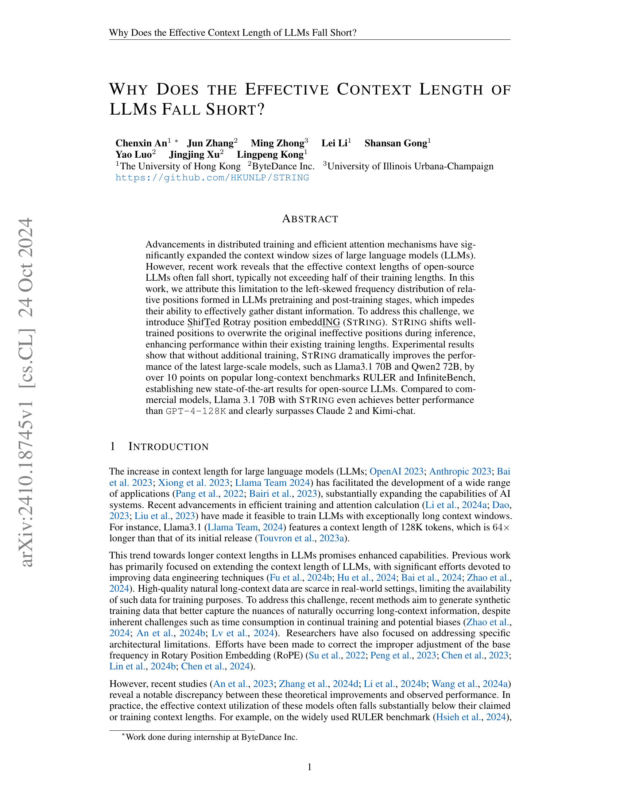
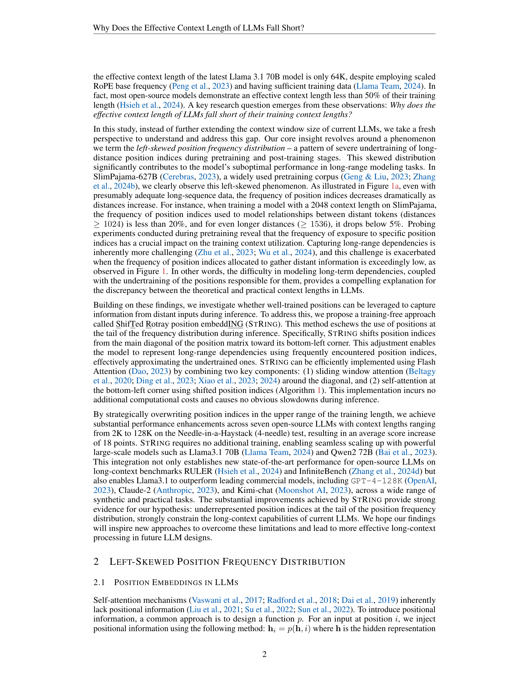
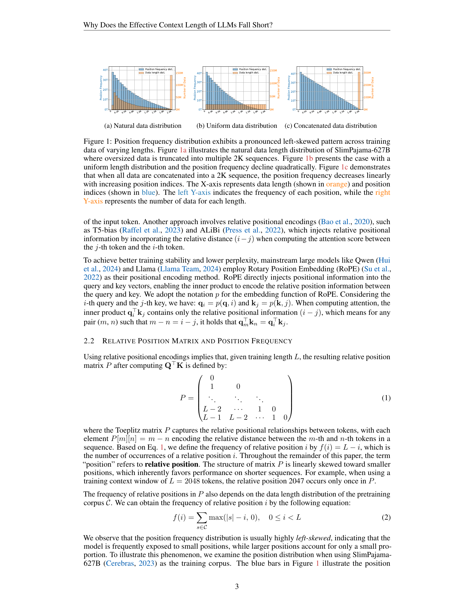
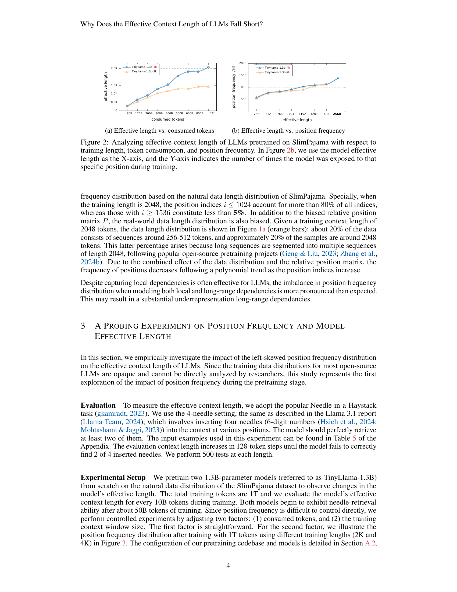

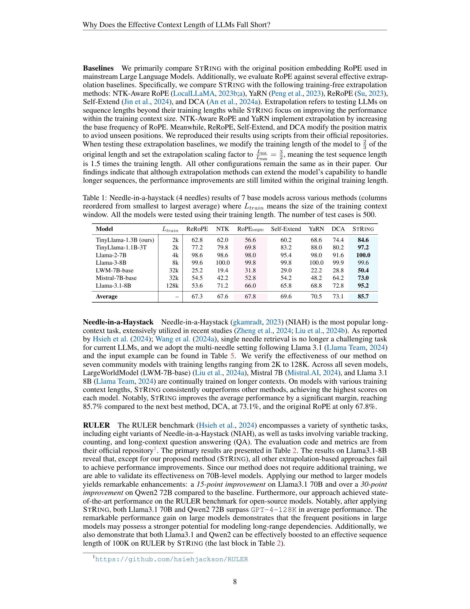

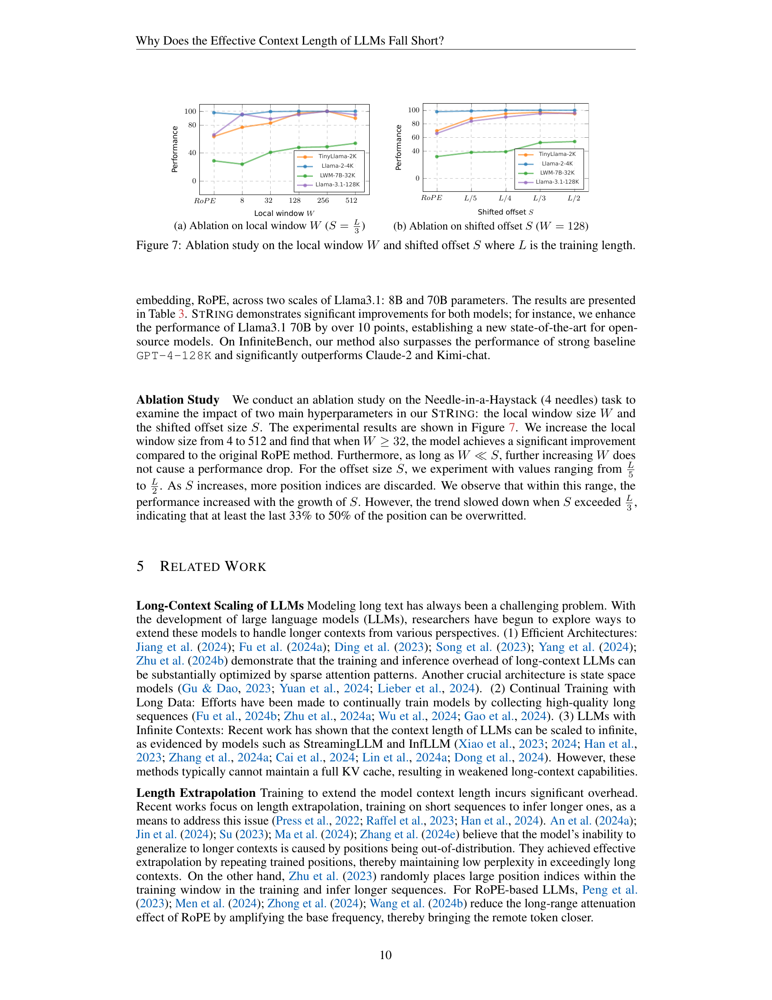
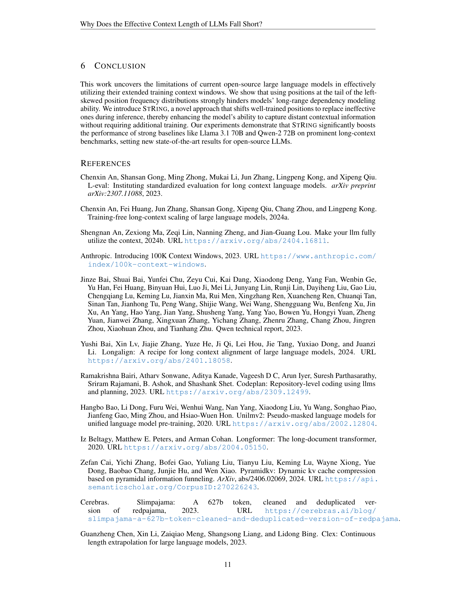

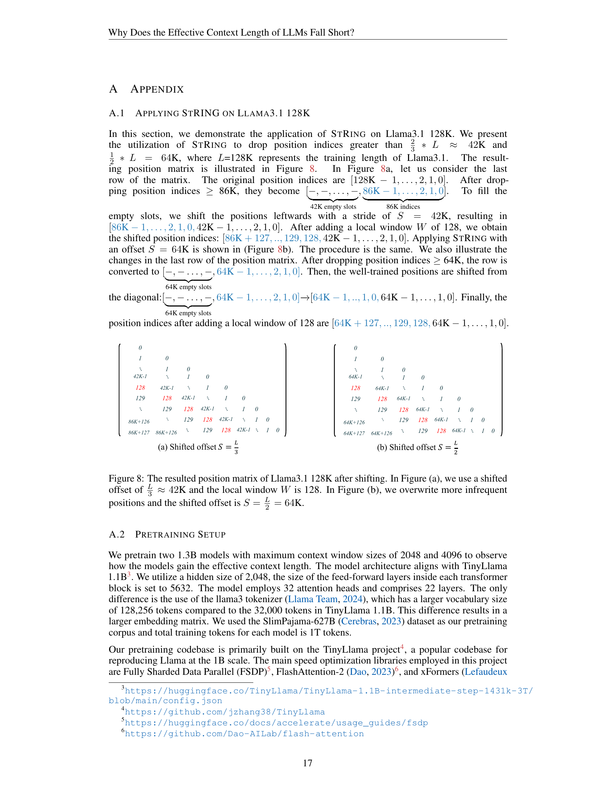
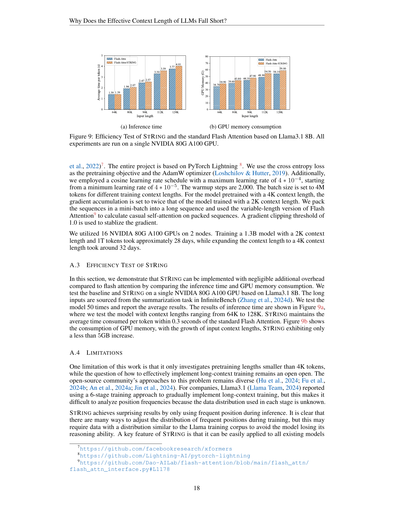

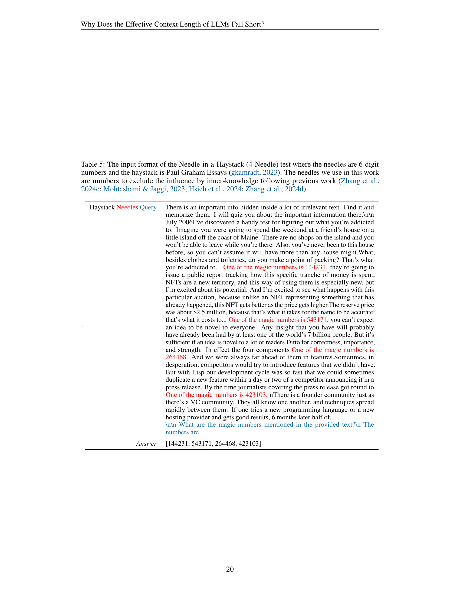
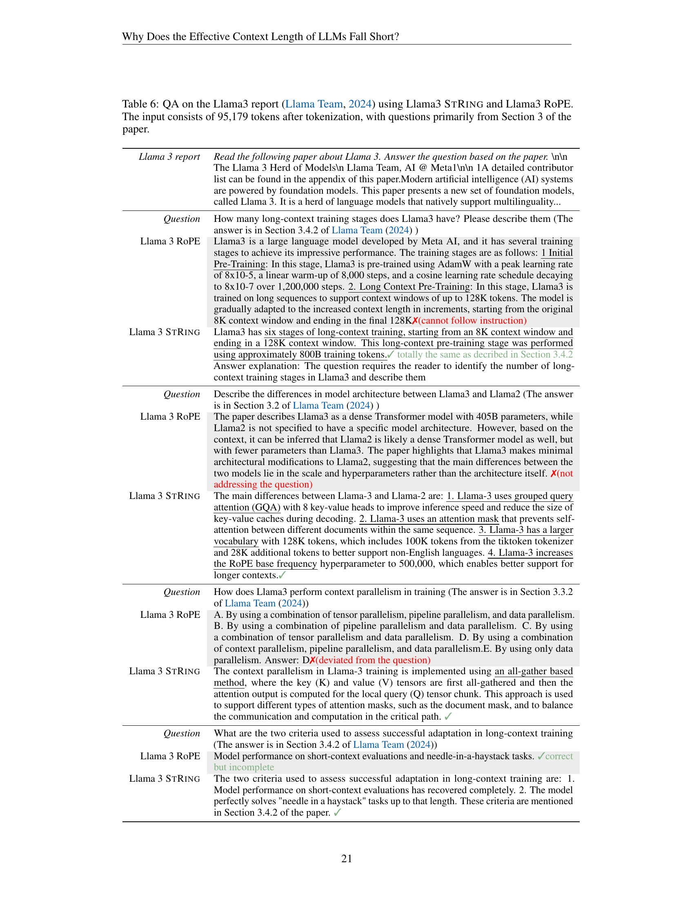

