### TL;DR



This paper tackles the challenge of watermarking images in the age of sophisticated image editing tools powered by AI.  Current methods struggle to survive advanced edits that alter images without readily apparent changes.  The authors introduce W-Bench, a new benchmark to test these methods' resilience against various editing techniques (like regeneration, global and local changes, and even conversion to video).  Testing eleven existing methods, most failed to preserve the watermark under these advanced edits.  To address this, the authors developed a new method called VINE. VINE cleverly incorporates blurring distortions (which mimic the effects of some AI editing processes) into its training.  This helps the watermarking process become more resistant to such edits.  Additionally, VINE uses a powerful AI model (SDXL-Turbo) to more effectively and imperceptibly embed the watermark, enhancing image quality.  Experiments showed that VINE significantly outperformed existing methods in terms of both the watermarks' survival rate after edits and the quality of the watermarked images.  This is a valuable contribution because it tackles a critical challenge in copyright protection in the face of powerful image manipulation tools.




 &nbsp; read the paper on arXiv


#### Why does it matter?
To provide a concise and informative summary of the research paper on robust watermarking against image editing, highlighting its key contributions and impact on the field.
#### Key Takeaways


 W-Bench, the first comprehensive benchmark for evaluating watermarking methods' robustness against various image editing techniques, was introduced. 



 VINE significantly enhances watermark robustness against image editing while maintaining high image quality by using blurring distortions as surrogate attacks and adapting a large-scale pretrained diffusion model. 



 VINE outperforms existing methods in image quality and robustness against image editing techniques including regeneration, global and local editing, and image-to-video generation. 


------
#### Visual Insights

 Flowchart of the W-Bench evaluation process. (b) Watermarking performance. Each method is illustrated with a diamond and four bars. The area of the diamond represents the method's encoding capacity. The y-coordinate of the diamond's center indicates normalized image quality, calculated by averaging the normalized PSNR, SSIM, LPIPS, and FID between watermarked and input images. The x-coordinate represents robustness, measured by the True Positive Rate at a 0.1% False Positive Rate (TPR@0.1%FPR) averaged across four types of image editing methods, encompassing a total of seven distinct models and algorithms. The four bars are oriented to signify different editing tasks: image regeneration (left), global editing (top), local editing (right), and image-to-video generation (bottom). The length of each bar reflects the method's normalized TPR@0.1%FPR after each type of image editing-the longer the bar, the better the performance.")

> The figure shows a flowchart of the W-Bench evaluation process and a comparison of the watermarking performance of eleven methods against four types of image editing.

 Flowchart of the W-Bench evaluation process. (b) Watermarking performance. Each method is illustrated with a diamond and four bars. The area of the diamond represents the method's encoding capacity. The y-coordinate of the diamond's center indicates normalized image quality, calculated by averaging the normalized PSNR, SSIM, LPIPS, and FID between watermarked and input images. The x-coordinate represents robustness, measured by the True Positive Rate at a 0.1% False Positive Rate (TPR@0.1%FPR) averaged across four types of image editing methods, encompassing a total of seven distinct models and algorithms. The four bars are oriented to signify different editing tasks: image regeneration (left), global editing (top), local editing (right), and image-to-video generation (bottom). The length of each bar reflects the method's normalized TPR@0.1%FPR after each type of image editing-the longer the bar, the better the performance.")

> Figure 1(b) shows the watermarking performance of eleven methods against four image editing types (image regeneration, global editing, local editing, and image-to-video generation), measured by their True Positive Rate at 0.1% False Positive Rate (TPR@0.1%FPR).

{{< table-caption caption="🔽 Table 1: Comparison of watermarking performance in terms of watermarked image quality and detection accuracy across various image editing methods. Quality metrics are averaged over 10,000 images, and the TPR@0.1%FPR for each specific editing method is averaged over 5,000 images. The best value in each column is highlighted in bold, and the second best value is underlined. Abbreviations: Cap = Encoding Capacity; Sto = Stochastic Regeneration; Det = Deterministic Regeneration; Pix2Pix = Instruct-Pix2Pix; Ultra = UltraEdit; Magic = MagicBrush; CtrlN = ControlNet-Inpainting; SVD = Stable Video Diffusion." >}}
 <table id='2' style='font-size:14px'><tr><td rowspan="3">Method</td><td rowspan="3">Cap ↑</td><td rowspan="3">PSNR ↑</td><td rowspan="3">SSIM ↑</td><td rowspan="3">LPIPS ↓</td><td rowspan="3">FID ↓</td><td colspan="8">TPR @0.1%FPR ↑ (%) (averaged over all difficulty levels)</td></tr><tr><td colspan="2">Regeneration</td><td colspan="3">Global Editing</td><td colspan="2">Local Editing</td><td>I2V</td></tr><tr><td>Sto</td><td>Det</td><td>Pix2Pix</td><td>Ultra</td><td>Magic</td><td>Ultra</td><td>CtrlN</td><td>SVD</td></tr><tr><td>MBRS (Jia et al., 2021)</td><td>30</td><td>27.37</td><td>0.8940</td><td>0.1877</td><td>6.85</td><td>99.53</td><td>99.35</td><td>83.50</td><td>7.50</td><td>88.54</td><td>99.60</td><td>89.16</td><td>13.55</td></tr><tr><td>CIN (Ma et al., 2022)</td><td>30</td><td>43.19</td><td>0.9847</td><td>0.0270</td><td>1.13</td><td>44.85</td><td>51.65</td><td>51.40</td><td>17.00</td><td>68.38</td><td>51.28</td><td>66.04</td><td>2.93</td></tr><tr><td>PIM⌀G (Fang et al., 2022)</td><td>30</td><td>37.72</td><td>0.9863</td><td>0.0289</td><td>3.43</td><td>82.85</td><td>71.18</td><td>72.78</td><td>40.14</td><td>81.88</td><td>74.30</td><td>64.22</td><td>14.33</td></tr><tr><td>RivaGAN (Zhang et al., 2019)</td><td>32</td><td>40.43</td><td>0.9702</td><td>0.0488</td><td>1.86</td><td>10.12</td><td>12.50</td><td>6.22</td><td>4.14</td><td>33.96</td><td>34.28</td><td>56.92</td><td>3.15</td></tr><tr><td>SepMark (Wu et al., 2023)</td><td>30</td><td>35.48</td><td>0.9814</td><td>0.0150</td><td>1.72</td><td>61.21</td><td>73.85</td><td>87.74</td><td>51.84</td><td>82.58</td><td>92.94</td><td>97.14</td><td>8.81</td></tr><tr><td>DWTDCT (Al-Haj, 2007)</td><td>30</td><td>40.46</td><td>0.9705</td><td>0.0136</td><td>0.24</td><td>0.09</td><td>0.00</td><td>0.04</td><td>0.06</td><td>0.04</td><td>0.32</td><td>0.56</td><td>0.01</td></tr><tr><td>DWTDCTSVD (Navas et al., 2008)</td><td>30</td><td>40.40</td><td>0.9799</td><td>0.0265</td><td>0.86</td><td>3.12</td><td>1.43</td><td>3.82</td><td>4.02</td><td>30.84</td><td>24.56</td><td>50.04</td><td>0.76</td></tr><tr><td>SSL (Fernandez et al., 2022)</td><td>30</td><td>41.77</td><td>0.9796</td><td>0.0350</td><td>3.54</td><td>1.76</td><td>9.70</td><td>25.06</td><td>10.58</td><td>50.10</td><td>25.28</td><td>31.46</td><td>3.65</td></tr><tr><td>StegaStamp (Tancik et al., 2020)</td><td>100</td><td>29.65</td><td>0.9107</td><td>0.0645</td><td>7.61</td><td>91.09</td><td>92.13</td><td>93.72</td><td>51.24</td><td>91.18</td><td>98.84</td><td>99.06</td><td>30.85</td></tr><tr><td>TrustMark (Bui et al., 2023)</td><td>100</td><td>41.27</td><td>0.9910</td><td>0.0026</td><td>0.86</td><td>9.22</td><td>34.20</td><td>77.72</td><td>43.48</td><td>85.90</td><td>76.62</td><td>59.78</td><td>39.60</td></tr><tr><td>EditGuard (Zhang et al., 2024d)</td><td>64</td><td>37.58</td><td>0.9406</td><td>0.0171</td><td>0.51</td><td>0.09</td><td>6.00</td><td>0.06</td><td>1.16</td><td>0.24</td><td>0.18</td><td>2.66</td><td>0.18</td></tr><tr><td>VINE-Base</td><td>100</td><td>40.51</td><td>0.9954</td><td>0.0029</td><td>0.08</td><td>91.03</td><td>99.25</td><td>96.30</td><td>80.90</td><td>89.29</td><td>99.60</td><td>89.68</td><td>25.44</td></tr><tr><td>VINE-Robust</td><td>100</td><td>37.34</td><td>0.9934</td><td>0.0063</td><td>0.15</td><td>99.66</td><td>99.98</td><td>97.46</td><td>86.86</td><td>94.58</td><td>99.96</td><td>93.04</td><td>36.33</td></tr></table>

> Table 1 compares eleven watermarking methods across various image editing methods, showing their performance in terms of image quality and robustness.

### More visual insights

More on figures

, is employed. The function F(·) represents the Fourier transform, and we visualize its magnitude on a logarithmic scale.")

> The figure illustrates how image editing affects the frequency spectrum of an image, showing that Instruct-Pix2Pix primarily removes high-frequency components while preserving low-frequency content.

 and skip connections are added for better perceptual similarity. For decoding the watermark, we employ ConvNeXt-B (Liu et al., 2022b) as the decoder, with an additional fully connected layer to output a 100-bit watermark. Throughout the entire training process, the SDXL-Turbo text prompt is set to null prompt. Figure 9 shows the condition adaptor architecture.")

> The figure illustrates the architecture of the proposed VINE watermarking method, highlighting the use of SDXL-Turbo, a condition adaptor, zero-convolution layers, skip connections, and ConvNeXt-B.

 Flowchart of the W-Bench evaluation process. (b) Watermarking performance. Each method is illustrated with a diamond and four bars. The area of the diamond represents the method's encoding capacity. The y-coordinate of the diamond's center indicates normalized image quality, calculated by averaging the normalized PSNR, SSIM, LPIPS, and FID between watermarked and input images. The x-coordinate represents robustness, measured by the True Positive Rate at a 0.1% False Positive Rate (TPR@0.1%FPR) averaged across four types of image editing methods, encompassing a total of seven distinct models and algorithms. The four bars are oriented to signify different editing tasks: image regeneration (left), global editing (top), local editing (right), and image-to-video generation (bottom). The length of each bar reflects the method's normalized TPR@0.1%FPR after each type of image editing-the longer the bar, the better the performance.")

> The figure shows a flowchart of the W-Bench evaluation process and a comparison of the watermarking performance of eleven methods against four types of image editing.

 Flowchart of the W-Bench evaluation process. (b) Watermarking performance. Each method is illustrated with a diamond and four bars. The area of the diamond represents the method's encoding capacity. The y-coordinate of the diamond's center indicates normalized image quality, calculated by averaging the normalized PSNR, SSIM, LPIPS, and FID between watermarked and input images. The x-coordinate represents robustness, measured by the True Positive Rate at a 0.1% False Positive Rate (TPR@0.1%FPR) averaged across four types of image editing methods, encompassing a total of seven distinct models and algorithms. The four bars are oriented to signify different editing tasks: image regeneration (left), global editing (top), local editing (right), and image-to-video generation (bottom). The length of each bar reflects the method's normalized TPR@0.1%FPR after each type of image editing-the longer the bar, the better the performance.")

> Figure 1 shows the flowchart of the W-Bench evaluation process and a comparison of the watermarking performance of eleven methods across four types of image editing tasks.

 Flowchart of the W-Bench evaluation process. (b) Watermarking performance. Each method is illustrated with a diamond and four bars. The area of the diamond represents the method's encoding capacity. The y-coordinate of the diamond's center indicates normalized image quality, calculated by averaging the normalized PSNR, SSIM, LPIPS, and FID between watermarked and input images. The x-coordinate represents robustness, measured by the True Positive Rate at a 0.1% False Positive Rate (TPR@0.1%FPR) averaged across four types of image editing methods, encompassing a total of seven distinct models and algorithms. The four bars are oriented to signify different editing tasks: image regeneration (left), global editing (top), local editing (right), and image-to-video generation (bottom). The length of each bar reflects the method's normalized TPR@0.1%FPR after each type of image editing-the longer the bar, the better the performance.")

> Figure 1 shows a flowchart of the W-Bench evaluation process and a comparison of the watermarking performance of eleven methods across four types of image editing, showing robustness and image quality.

 Flowchart of the W-Bench evaluation process. (b) Watermarking performance. Each method is illustrated with a diamond and four bars. The area of the diamond represents the method's encoding capacity. The y-coordinate of the diamond's center indicates normalized image quality, calculated by averaging the normalized PSNR, SSIM, LPIPS, and FID between watermarked and input images. The x-coordinate represents robustness, measured by the True Positive Rate at a 0.1% False Positive Rate (TPR@0.1%FPR) averaged across four types of image editing methods, encompassing a total of seven distinct models and algorithms. The four bars are oriented to signify different editing tasks: image regeneration (left), global editing (top), local editing (right), and image-to-video generation (bottom). The length of each bar reflects the method's normalized TPR@0.1%FPR after each type of image editing-the longer the bar, the better the performance.")

> Figure 1 shows a flowchart of the W-Bench evaluation process and a comparison of the watermarking performance of eleven methods against four types of image editing.

 Flowchart of the W-Bench evaluation process. (b) Watermarking performance. Each method is illustrated with a diamond and four bars. The area of the diamond represents the method's encoding capacity. The y-coordinate of the diamond's center indicates normalized image quality, calculated by averaging the normalized PSNR, SSIM, LPIPS, and FID between watermarked and input images. The x-coordinate represents robustness, measured by the True Positive Rate at a 0.1% False Positive Rate (TPR@0.1%FPR) averaged across four types of image editing methods, encompassing a total of seven distinct models and algorithms. The four bars are oriented to signify different editing tasks: image regeneration (left), global editing (top), local editing (right), and image-to-video generation (bottom). The length of each bar reflects the method's normalized TPR@0.1%FPR after each type of image editing-the longer the bar, the better the performance.")

> Figure 1 shows a flowchart of the W-Bench evaluation process and a comparison of the watermarking performance of eleven methods against four types of image editing.

 Flowchart of the W-Bench evaluation process. (b) Watermarking performance. Each method is illustrated with a diamond and four bars. The area of the diamond represents the method's encoding capacity. The y-coordinate of the diamond's center indicates normalized image quality, calculated by averaging the normalized PSNR, SSIM, LPIPS, and FID between watermarked and input images. The x-coordinate represents robustness, measured by the True Positive Rate at a 0.1% False Positive Rate (TPR@0.1%FPR) averaged across four types of image editing methods, encompassing a total of seven distinct models and algorithms. The four bars are oriented to signify different editing tasks: image regeneration (left), global editing (top), local editing (right), and image-to-video generation (bottom). The length of each bar reflects the method's normalized TPR@0.1%FPR after each type of image editing-the longer the bar, the better the performance.")

> The figure shows a flowchart of the W-Bench evaluation process and a comparison of the watermarking performance of eleven methods against four types of image editing.

More on charts

> The chart visualizes the impact of image editing techniques and distortions on the frequency spectra of images, showing that image editing predominantly removes high-frequency patterns while low-frequency patterns remain relatively unaffected.

 Flowchart of the W-Bench evaluation process. (b) Watermarking performance. Each method is illustrated with a diamond and four bars. The area of the diamond represents the method's encoding capacity. The y-coordinate of the diamond's center indicates normalized image quality, calculated by averaging the normalized PSNR, SSIM, LPIPS, and FID between watermarked and input images. The x-coordinate represents robustness, measured by the True Positive Rate at a 0.1% False Positive Rate (TPR@0.1%FPR) averaged across four types of image editing methods, encompassing a total of seven distinct models and algorithms. The four bars are oriented to signify different editing tasks: image regeneration (left), global editing (top), local editing (right), and image-to-video generation (bottom). The length of each bar reflects the method's normalized TPR@0.1%FPR after each type of image editing—the longer the bar, the better the performance.")

> The chart shows a comparison of eleven watermarking methods based on their encoding capacity, image quality, and robustness against four types of image editing techniques.

 Gaussian blurring, (b) brightness adjustments, (c) contrast modifications, (d) Gaussian noise, and (e) JPEG compression.")

> The chart displays the performance of eleven watermarking methods against five different image distortions at a resolution of 512x512 pixels, measured by TPR@0.1%FPR, TPR@1%FPR, bit accuracy, and AUROC.

 Gaussian blurring, (b) brightness adjustments, (c) contrast modifications, (d) Gaussian noise, and (e) JPEG compression.")

> The chart displays the performance of eleven watermarking methods against five different image distortions at a resolution of 512x512 pixels, measuring true positive rate at 0.1% false positive rate (TPR@0.1%FPR), true positive rate at 1% false positive rate (TPR@1%FPR), bit accuracy, and area under the ROC curve (AUROC).

 Gaussian blurring, (b) brightness adjustments, (c) contrast modifications, (d) Gaussian noise, and (e) JPEG compression.")

> The chart displays the performance of eleven watermarking methods against five types of image distortions at a resolution of 512x512 pixels, showing their robustness and quality.

 Stochastic regeneration, (b) Global editing, and (c) Local editing. Additional results are available in Figure 16.")

> The chart displays the performance of eleven watermarking methods across various difficulty levels for stochastic image regeneration, global image editing, and local image editing, showing TPR@0.1%FPR, TPR@1%FPR, bit accuracy, and AUROC.

 Gaussian blurring, (b) brightness adjustments, (c) contrast modifications, (d) Gaussian noise, and (e) JPEG compression.")

> The chart displays the performance of eleven watermarking methods against five different image distortions at a resolution of 512x512 pixels, measuring TPR@0.1%FPR, TPR@1%FPR, bit accuracy, and AUROC.

 Gaussian blurring, (b) brightness adjustments, (c) contrast modifications, (d) Gaussian noise, and (e) JPEG compression.")

> The chart displays the performance of eleven watermarking methods across various image distortions at a resolution of 512x512 pixels.

 Stochastic regeneration, (b) Global editing, and (c) Local editing. Additional results are available in Figure 16.")

> The chart displays the performance of eleven watermarking methods across various difficulty levels for stochastic image regeneration, global image editing, and local image editing, showing their true positive rates at 0.1% false positive rate.

 Stochastic regeneration, (b) Global editing, and (c) Local editing. Additional results are available in Figure 16.")

> The chart displays the performance of eleven watermarking methods across various difficulty levels of three image editing techniques: stochastic regeneration, global editing, and local editing.

 Gaussian blurring, (b) brightness adjustments, (c) contrast modifications, (d) Gaussian noise, and (e) JPEG compression.")

> The chart displays the performance of eleven watermarking methods against five different image distortions at a resolution of 512x512 pixels, measured by TPR@0.1%FPR, TPR@1%FPR, bit accuracy, and AUROC.

 Stochastic regeneration, (b) Global editing, and (c) Local editing. Additional results are available in Figure 16.")

> The chart displays the performance of eleven watermarking methods across various difficulty levels for three types of image editing: stochastic regeneration, global editing, and local editing.

> The chart illustrates how different image editing techniques and distortions affect the frequency components of images, revealing that image editing primarily removes high-frequency information while leaving low frequencies relatively unchanged.

 Flowchart of the W-Bench evaluation process. (b) Watermarking performance. Each method is illustrated with a diamond and four bars. The area of the diamond represents the method's encoding capacity. The y-coordinate of the diamond's center indicates normalized image quality, calculated by averaging the normalized PSNR, SSIM, LPIPS, and FID between watermarked and input images. The x-coordinate represents robustness, measured by the True Positive Rate at a 0.1% False Positive Rate (TPR@0.1%FPR) averaged across four types of image editing methods, encompassing a total of seven distinct models and algorithms. The four bars are oriented to signify different editing tasks: image regeneration (left), global editing (top), local editing (right), and image-to-video generation (bottom). The length of each bar reflects the method's normalized TPR@0.1%FPR after each type of image editing-the longer the bar, the better the performance.")

> Figure 1(b) shows a comparison of eleven watermarking methods' performance across four image editing tasks (image regeneration, global editing, local editing, and image-to-video generation), measured by TPR@0.1%FPR, image quality, and encoding capacity.

 Gaussian blurring, (b) brightness adjustments, (c) contrast modifications, (d) Gaussian noise, and (e) JPEG compression.")

> The chart displays the performance of eleven watermarking methods against five types of image distortions at a resolution of 512x512 pixels, showing the True Positive Rate at 0.1% False Positive Rate (TPR@0.1%FPR), TPR@1%FPR, bit accuracy, and AUROC across various levels of distortion.

 Gaussian blurring, (b) brightness adjustments, (c) contrast modifications, (d) Gaussian noise, and (e) JPEG compression.")

> The chart displays the performance of eleven watermarking methods across various image distortions at a resolution of 512x512 pixels, evaluating their robustness against Gaussian blurring, brightness adjustments, contrast modifications, Gaussian noise, and JPEG compression.

 Gaussian blurring, (b) brightness adjustments, (c) contrast modifications, (d) Gaussian noise, and (e) JPEG compression.")

> The chart displays the performance of different watermarking methods against various image distortions at a resolution of 512x512 pixels, showing their robustness to Gaussian blurring, brightness adjustments, contrast modifications, Gaussian noise, and JPEG compression.

 Gaussian blurring, (b) brightness adjustments, (c) contrast modifications, (d) Gaussian noise, and (e) JPEG compression.")

> The chart displays the performance of eleven watermarking methods against various image distortions at a resolution of 512x512 pixels.

 Stochastic regeneration, (b) Global editing, and (c) Local editing. Additional results are available in Figure 16.")

> The chart displays the performance of eleven watermarking methods across various difficulty levels for stochastic regeneration, global editing, and local editing, showing TPR@0.1%FPR, TPR@1%FPR, bit accuracy, and AUROC.

 Stochastic regeneration, (b) Global editing, and (c) Local editing. Additional results are available in Figure 16.")

> The chart displays the performance of eleven watermarking methods across various difficulty levels for stochastic image regeneration, global image editing, and local image editing.

 Gaussian blurring, (b) brightness adjustments, (c) contrast modifications, (d) Gaussian noise, and (e) JPEG compression.")

> The chart displays the performance of eleven watermarking methods against various image distortions at a resolution of 512x512 pixels.

 Flowchart of the W-Bench evaluation process. (b) Watermarking performance. Each method is illustrated with a diamond and four bars. The area of the diamond represents the method's encoding capacity. The y-coordinate of the diamond's center indicates normalized image quality, calculated by averaging the normalized PSNR, SSIM, LPIPS, and FID between watermarked and input images. The x-coordinate represents robustness, measured by the True Positive Rate at a 0.1% False Positive Rate (TPR@0.1%FPR) averaged across four types of image editing methods, encompassing a total of seven distinct models and algorithms. The four bars are oriented to signify different editing tasks: image regeneration (left), global editing (top), local editing (right), and image-to-video generation (bottom). The length of each bar reflects the method's normalized TPR@0.1%FPR after each type of image editing-the longer the bar, the better the performance.")

> The chart displays the performance of eleven watermarking methods against various image editing techniques, showing robustness and image quality.

 Flowchart of the W-Bench evaluation process. (b) Watermarking performance. Each method is illustrated with a diamond and four bars. The area of the diamond represents the method's encoding capacity. The y-coordinate of the diamond's center indicates normalized image quality, calculated by averaging the normalized PSNR, SSIM, LPIPS, and FID between watermarked and input images. The x-coordinate represents robustness, measured by the True Positive Rate at a 0.1% False Positive Rate (TPR@0.1%FPR) averaged across four types of image editing methods, encompassing a total of seven distinct models and algorithms. The four bars are oriented to signify different editing tasks: image regeneration (left), global editing (top), local editing (right), and image-to-video generation (bottom). The length of each bar reflects the method's normalized TPR@0.1%FPR after each type of image editing—the longer the bar, the better the performance.")

> The chart displays a comparison of eleven watermarking methods' performance across four types of image editing, showing robustness and image quality.

 Flowchart of the W-Bench evaluation process. (b) Watermarking performance. Each method is illustrated with a diamond and four bars. The area of the diamond represents the method's encoding capacity. The y-coordinate of the diamond's center indicates normalized image quality, calculated by averaging the normalized PSNR, SSIM, LPIPS, and FID between watermarked and input images. The x-coordinate represents robustness, measured by the True Positive Rate at a 0.1% False Positive Rate (TPR@0.1%FPR) averaged across four types of image editing methods, encompassing a total of seven distinct models and algorithms. The four bars are oriented to signify different editing tasks: image regeneration (left), global editing (top), local editing (right), and image-to-video generation (bottom). The length of each bar reflects the method's normalized TPR@0.1%FPR after each type of image editing-the longer the bar, the better the performance.")

> The chart displays the performance of eleven watermarking methods against four types of image editing, showing their robustness, encoding capacity, and image quality.

More on tables

{{< table-caption caption="🔽 Table 1: Comparison of watermarking performance in terms of watermarked image quality and detection accuracy across various image editing methods. Quality metrics are averaged over 10,000 images, and the TPR@0.1%FPR for each specific editing method is averaged over 5,000 images. The best value in each column is highlighted in bold, and the second best value is underlined. Abbreviations: Cap = Encoding Capacity; Sto = Stochastic Regeneration; Det = Deterministic Regeneration; Pix2Pix = Instruct-Pix2Pix; Ultra = UltraEdit; Magic = MagicBrush; CtrlN = ControlNet-Inpainting; SVD = Stable Video Diffusion." >}}
 <table id='2' style='font-size:14px'><tr><td rowspan="2">Config</td><td rowspan="2">Blurring Distortions</td><td colspan="5">Watermark Encoder</td><td rowspan="2">PSNR ↑</td><td rowspan="2">SSIM ↑</td><td rowspan="2">LPIPS ↓</td><td rowspan="2">FID ↓</td><td colspan="4">TPR@0.1%FPR ↑ (%)</td></tr><tr><td>Backbone</td><td>Condition</td><td>Skip</td><td>Pretrained</td><td>Finetune</td><td>Sto</td><td>Det</td><td>Pix2Pix</td><td>Ultra</td></tr><tr><td>Config A</td><td></td><td rowspan="3">Simple UNet</td><td rowspan="3">N.A.</td><td rowspan="3">N.A.</td><td rowspan="3">N.A.</td><td>x</td><td>38.21</td><td>0.9828</td><td>0.0148</td><td>1.69</td><td>54.61</td><td>66.86</td><td>64.24</td><td>32.62</td></tr><tr><td>Config B</td><td></td><td></td><td>35.85</td><td>0.9766</td><td>0.0257</td><td>2.12</td><td>86.85</td><td>92.28</td><td>80.98</td><td>62.14</td></tr><tr><td>Config C</td><td></td><td></td><td>31.24</td><td>0.9501</td><td>0.0458</td><td>4.67</td><td>98.59</td><td>99.29</td><td>96.01</td><td>84.60</td></tr><tr><td>Config D</td><td></td><td rowspan="5"></td><td>ControlNet</td><td></td><td></td><td></td><td>32.68</td><td>0.9640</td><td>0.0298</td><td>2.87</td><td>90.82</td><td>94.89</td><td>91.86</td><td>70.69</td></tr><tr><td>Config E</td><td>SDXL-Turbo</td><td>Cond. Adaptor</td><td></td><td></td><td>36.76</td><td></td><td>0.9856</td><td>0.0102</td><td>0.53</td><td>90.86</td><td>94.78</td><td>92.88</td><td>70.68</td></tr><tr><td>Config F (VINE-B)</td><td></td><td>Cond. Adaptor</td><td></td><td></td><td></td><td>40.51</td><td>0.9954</td><td>0.0029</td><td>0.08</td><td>91.03</td><td>99.25</td><td>96.30</td><td>80.90</td></tr><tr><td>Config G (VINE-R)</td><td></td><td>Cond. Adaptor</td><td></td><td></td><td>37.34</td><td></td><td>0.9934</td><td>0.0063</td><td>0.15</td><td>99.66</td><td>99.98</td><td>97.46</td><td>86.86</td></tr><tr><td>Config H</td><td></td><td>Cond. Adaptor</td><td></td><td></td><td></td><td>35.18</td><td>0.9812</td><td>0.0137</td><td>1.03</td><td>99.67</td><td>99.92</td><td>96.13</td><td>84.66</td></tr></table>

> Table 1 compares eleven watermarking methods across various image editing methods in terms of image quality and robustness, showing the trade-off between these two aspects for each method.

{{< table-caption caption="🔽 Table 1: Comparison of watermarking performance in terms of watermarked image quality and detection accuracy across various image editing methods. Quality metrics are averaged over 10,000 images, and the TPR@0.1%FPR for each specific editing method is averaged over 5,000 images. The best value in each column is highlighted in bold, and the second best value is underlined. Abbreviations: Cap = Encoding Capacity; Sto = Stochastic Regeneration; Det = Deterministic Regeneration; Pix2Pix = Instruct-Pix2Pix; Ultra = UltraEdit; Magic = MagicBrush; CtrlN = ControlNet-Inpainting; SVD = Stable Video Diffusion." >}}
<table id='1' style='font-size:16px'><tr><td>Algorithm 1 Resolution scaling</td></tr><tr><td>1: Input: Input image Xo, binary watermark w 2: Output: Watermarked image Xw 3: Model: Watermark Encoder E(.) trained on the resolution of u x v</td></tr><tr><td>4: h, w ← Size(x。) 5: x⌀ ← x。/127.5 - 1 // normalize to range [-1, 1] 6: X⌀ ← interpolate(xo, (u, v)) 7: r ← E(x'。) - x' // resi dual image 8: r ← interpolate(r', (h, w)) 9: Xw ← clamp(x。 + r, -1, 1) 10: Xw ← Xw X 127.5 + 127.5</td></tr></table>

> Table 1 compares eleven watermarking methods across various image editing methods in terms of image quality and robustness, measured by TPR@0.1%FPR.

{{< table-caption caption="🔽 Table 1: Comparison of watermarking performance in terms of watermarked image quality and detection accuracy across various image editing methods. Quality metrics are averaged over 10,000 images, and the TPR@0.1%FPR for each specific editing method is averaged over 5,000 images. The best value in each column is highlighted in bold, and the second best value is underlined. Abbreviations: Cap = Encoding Capacity; Sto = Stochastic Regeneration; Det = Deterministic Regeneration; Pix2Pix = Instruct-Pix2Pix; Ultra = UltraEdit; Magic = MagicBrush; CtrlN = ControlNet-Inpainting; SVD = Stable Video Diffusion." >}}
 <table id='3' style='font-size:14px'><tr><td>Method</td><td>Resolution</td><td>Capacity ↑</td><td>PSNR ↑</td><td>SSIM ↑</td><td>LPIPS ↓</td><td>FID ↓</td><td>TPR@0.1%FPR ↑ (%)</td></tr><tr><td>MBRS (Jia et al., 2021)</td><td>128 x 128</td><td>30</td><td>25.14</td><td>0.8348</td><td>0.0821</td><td>13.51</td><td>100.0</td></tr><tr><td>CIN (Ma et al., 2022)</td><td>128 X 128</td><td>30</td><td>41.70</td><td>0.9812</td><td>0.0011</td><td>2.20</td><td>100.0</td></tr><tr><td>PIM⌀G (Fang et al., 2022)</td><td>128 X 128</td><td>30</td><td>37.54</td><td>0.9814</td><td>0.0140</td><td>2.97</td><td>100.0</td></tr><tr><td>SepMark (Wu et al., 2023)</td><td>128 X 128</td><td>30</td><td>35.50</td><td>0.9648</td><td>0.0116</td><td>2.95</td><td>100.0</td></tr><tr><td>StegaStamp (Tancik et al., 2020)</td><td>400 X 400</td><td>100</td><td>29.33</td><td>0.8992</td><td>0.1018</td><td>8.29</td><td>100.0</td></tr><tr><td>TrustMark (Bui et al., 2023)</td><td>256 x 256</td><td>100</td><td>40.94</td><td>0.9819</td><td>0.0015</td><td>1.04</td><td>100.0</td></tr><tr><td>VINE-Base</td><td>256 X 256</td><td>100</td><td>40.22</td><td>0.9961</td><td>0.0022</td><td>0.10</td><td>100.0</td></tr><tr><td>VINE-Robust</td><td>256 X 256</td><td>100</td><td>37.07</td><td>0.9942</td><td>0.0048</td><td>0.19</td><td>100.0</td></tr></table>

> Table 1 compares eleven watermarking methods across various image editing techniques in terms of image quality and detection accuracy.

{{< table-caption caption="🔽 Table 1: Comparison of watermarking performance in terms of watermarked image quality and detection accuracy across various image editing methods. Quality metrics are averaged over 10,000 images, and the TPR@0.1%FPR for each specific editing method is averaged over 5,000 images. The best value in each column is highlighted in bold, and the second best value is underlined. Abbreviations: Cap = Encoding Capacity; Sto = Stochastic Regeneration; Det = Deterministic Regeneration; Pix2Pix = Instruct-Pix2Pix; Ultra = UltraEdit; Magic = MagicBrush; CtrlN = ControlNet-Inpainting; SVD = Stable Video Diffusion." >}}
<table id='2' style='font-size:14px'><tr><td rowspan="2">Method</td><td colspan="3">Instruct-Pix2Pix</td><td colspan="3">UltraEdit</td><td colspan="3">MagicBrush</td></tr><tr><td>CLIPdir ↑</td><td>CLIPimg ↑</td><td>CLIPout ↑</td><td>CLIPdir ↑</td><td>CLIPimg ↑</td><td>CLIP, out ↑</td><td>CLIPdir ↑</td><td>CLIPimg ↑</td><td>CLIPout ↑</td></tr><tr><td>Unwatermarked Image</td><td>0.2693</td><td>0.7283</td><td>0.2732</td><td>0.3230</td><td>0.7268</td><td>0.3008</td><td>0.3025</td><td>0.7913</td><td>0.2930</td></tr><tr><td>MBRS (Jia et al., 2021)</td><td>0.2494</td><td>0.7385</td><td>0.2733</td><td>0.2919</td><td>0.6654</td><td>0.2891</td><td>0.2857</td><td>0.7816</td><td>0.2929</td></tr><tr><td>CIN (Ma et al., 2022)</td><td>0.2625</td><td>0.7232</td><td>0.2729</td><td>0.3152</td><td>0.7111</td><td>0.3010</td><td>0.2949</td><td>0.7841</td><td>0.2928</td></tr><tr><td>PIM⌀G (Fang et al., 2022)</td><td>0.2518</td><td>0.7021</td><td>0.2746</td><td>0.3010</td><td>0.6940</td><td>0.3024</td><td>0.2815</td><td>0.7662</td><td>0.2962</td></tr><tr><td>RivaGAN (Zhang et al., 2019)</td><td>0.2647</td><td>0.7317</td><td>0.2721</td><td>0.3168</td><td>0.7133</td><td>0.3003</td><td>0.3020</td><td>0.7948</td><td>0.2930</td></tr><tr><td>SepMark (Wu et al., 2023)</td><td>0.2659</td><td>0.7292</td><td>0.2743</td><td>0.3145</td><td>0.7181</td><td>0.3002</td><td>0.2975</td><td>0.7891</td><td>0.2936</td></tr><tr><td>DWTDCT (Al-Haj, 2007)</td><td>0.2644</td><td>0.7317</td><td>0.2734</td><td>0.3189</td><td>0.7250</td><td>0.3009</td><td>0.2959</td><td>0.7942</td><td>0.2934</td></tr><tr><td>DWTDCTSVD (Navas et al., 2008)</td><td>0.2581</td><td>0.7220</td><td>0.2751</td><td>0.3115</td><td>0.7118</td><td>0.3004</td><td>0.2869</td><td>0.7793</td><td>0.2939</td></tr><tr><td>SSL (Fernandez et al., 2022)</td><td>0.2583</td><td>0.7218</td><td>0.2752</td><td>0.3093</td><td>0.7065</td><td>0.3019</td><td>0.2896</td><td>0.7780</td><td>0.2944</td></tr><tr><td>StegaStamp (Tancik et al., 2020)</td><td>0.2436</td><td>0.6826</td><td>0.2697</td><td>0.2904</td><td>0.6886</td><td>0.3007</td><td>0.2663</td><td>0.7512</td><td>0.2944</td></tr><tr><td>TrustMark (Bui et al., 2023)</td><td>0.2634</td><td>0.7181</td><td>0.2729</td><td>0.3172</td><td>0.7146</td><td>0.2994</td><td>0.2943</td><td>0.7853</td><td>0.2936</td></tr><tr><td>EditGuard (Zhang et al., 2024d)</td><td>0.2722</td><td>0.7045</td><td>0.2722</td><td>0.3155</td><td>0.7170</td><td>0.3021</td><td>0.2882</td><td>0.7708</td><td>0.2940</td></tr><tr><td>VINE-Base</td><td>0.2743</td><td>0.7260</td><td>0.2743</td><td>0.3186</td><td>0.7189</td><td>0.2996</td><td>0.2977</td><td>0.7889</td><td>0.2931</td></tr><tr><td>VINE-Robust</td><td>0.2624</td><td>0.7248</td><td>0.2715</td><td>0.3176</td><td>0.7183</td><td>0.3001</td><td>0.2981</td><td>0.7953</td><td>0.2940</td></tr></table>

> Table 1 compares eleven watermarking methods across four image editing techniques (image regeneration, global editing, local editing, and image-to-video generation) based on image quality and robustness metrics.

{{< table-caption caption="🔽 Table 1: Comparison of watermarking performance in terms of watermarked image quality and detection accuracy across various image editing methods. Quality metrics are averaged over 10,000 images, and the TPR@0.1%FPR for each specific editing method is averaged over 5,000 images. The best value in each column is highlighted in bold, and the second best value is underlined. Abbreviations: Cap = Encoding Capacity; Sto = Stochastic Regeneration; Det = Deterministic Regeneration; Pix2Pix = Instruct-Pix2Pix; Ultra = UltraEdit; Magic = MagicBrush; CtrlN = ControlNet-Inpainting; SVD = Stable Video Diffusion." >}}
<table id='4' style='font-size:16px'><tr><td rowspan="2">Method</td><td colspan="3">ControlNet-Inpainting</td><td colspan="3">UltraEdit</td></tr><tr><td>CLIPdir ↑</td><td>CLIPimg ↑</td><td>CLIPout ↑</td><td>CLIPdir ↑</td><td>CLIPimg ↑</td><td>CLIPout ↑</td></tr><tr><td>Unwatermarked Image</td><td>0.1983</td><td>0.7076</td><td>0.2589</td><td>0.2778</td><td>0.7519</td><td>0.2917</td></tr><tr><td>MBRS (Jia et al., 2021)</td><td>0.1846</td><td>0.7058</td><td>0.2588</td><td>0.2657</td><td>0.7175</td><td>0.2913</td></tr><tr><td>CIN (Ma et al., 2022)</td><td>0.1966</td><td>0.7042</td><td>0.2613</td><td>0.2745</td><td>0.7389</td><td>0.2922</td></tr><tr><td>PIM⌀G (Fang et al., 2022)</td><td>0.1828</td><td>0.6909</td><td>0.2600</td><td>0.2578</td><td>0.7371</td><td>0.2920</td></tr><tr><td>RivaGAN (Zhang et al., 2019)</td><td>0.1975</td><td>0.7117</td><td>0.2612</td><td>0.2748</td><td>0.7469</td><td>0.2937</td></tr><tr><td>SepMark (Wu et al., 2023)</td><td>0.1932</td><td>0.7126</td><td>0.2582</td><td>0.2716</td><td>0.7588</td><td>0.2921</td></tr><tr><td>DWTDCT (Al-Haj, 2007)</td><td>0.1982</td><td>0.7197</td><td>0.2602</td><td>0.2776</td><td>0.7558</td><td>0.2924</td></tr><tr><td>DWTDCTSVD (Navas et al., 2008)</td><td>0.1922</td><td>0.6995</td><td>0.2608</td><td>0.2705</td><td>0.7469</td><td>0.2940</td></tr><tr><td>SSL (Fernandez et al., 2022)</td><td>0.1911</td><td>0.6995</td><td>0.2604</td><td>0.2677</td><td>0.7380</td><td>0.2940</td></tr><tr><td>StegaStamp (Tancik et al., 2020)</td><td>0.1752</td><td>0.6684</td><td>0.2606</td><td>0.2439</td><td>0.7246</td><td>0.2919</td></tr><tr><td>TrustMark (Bui et al., 2023)</td><td>0.1959</td><td>0.7001</td><td>0.2594</td><td>0.2728</td><td>0.7451</td><td>0.2919</td></tr><tr><td>EditGuard (Zhang et al., 2024d)</td><td>0.1921</td><td>0.6944</td><td>0.2606</td><td>0.2696</td><td>0.7392</td><td>0.2923</td></tr><tr><td>VINE-Base</td><td>0.1953</td><td>0.7023</td><td>0.2591</td><td>0.2726</td><td>0.7494</td><td>0.2906</td></tr><tr><td>VINE-Robust</td><td>0.1951</td><td>0.7030</td><td>0.2591</td><td>0.2710</td><td>0.7475</td><td>0.2909</td></tr></table>

> Table 1 compares eleven watermarking methods across various image editing techniques (image regeneration, global editing, local editing, and image-to-video generation) in terms of image quality and robustness.

{{< table-caption caption="🔽 Table 1: Comparison of watermarking performance in terms of watermarked image quality and detection accuracy across various image editing methods. Quality metrics are averaged over 10,000 images, and the TPR@0.1%FPR for each specific editing method is averaged over 5,000 images. The best value in each column is highlighted in bold, and the second best value is underlined. Abbreviations: Cap = Encoding Capacity; Sto = Stochastic Regeneration; Det = Deterministic Regeneration; Pix2Pix = Instruct-Pix2Pix; Ultra = UltraEdit; Magic = MagicBrush; CtrlN = ControlNet-Inpainting; SVD = Stable Video Diffusion." >}}
<table id='4' style='font-size:14px'><tr><td>Method</td><td>Running Time per Image (s)</td><td>GPU Memory Usage (MB)</td></tr><tr><td>MBRS (Jia et al., 2021)</td><td>0.0053</td><td>938</td></tr><tr><td>CIN (Ma et al., 2022)</td><td>0.0741</td><td>2944</td></tr><tr><td>PIMoG (Fang et al., 2022)</td><td>0.0212</td><td>878</td></tr><tr><td>RivaGAN (Zhang et al., 2019)</td><td>-</td><td>-</td></tr><tr><td>SepMark (Wu et al., 2023)</td><td>0.0109</td><td>928</td></tr><tr><td>DWTDCT (Al-Haj, 2007)</td><td>-</td><td>-</td></tr><tr><td>DWTDCTSVD (Navas et al., 2008)</td><td>-</td><td>-</td></tr><tr><td>SSL (Fernandez et al., 2022)</td><td>2.1938</td><td>1072</td></tr><tr><td>StegaStamp (Tancik et al., 2020)</td><td>0.0672</td><td>1984</td></tr><tr><td>TrustMark (Bui et al., 2023)</td><td>0.0705</td><td>648</td></tr><tr><td>EditGuard (Zhang et al., 2024d)</td><td>0.2423</td><td>1638</td></tr><tr><td>VINE</td><td>0.0795</td><td>4982</td></tr></table>

> Table 1 compares eleven watermarking methods across four image editing categories (image regeneration, global editing, local editing, and image-to-video generation) based on image quality and robustness metrics.

### Full paper



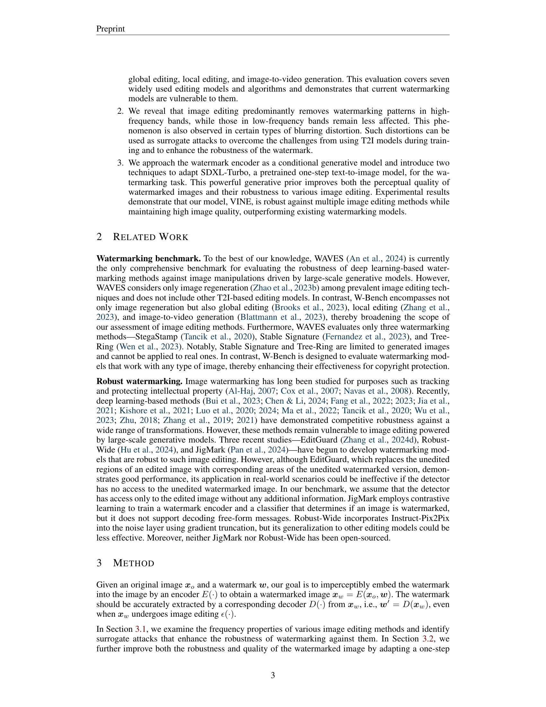
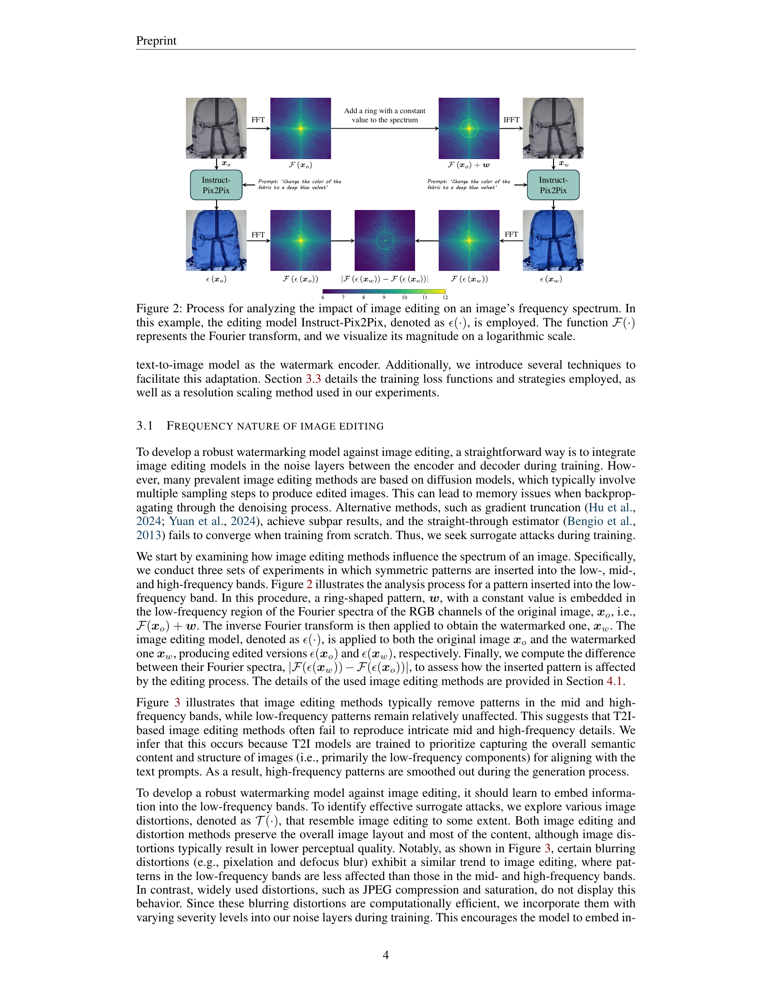
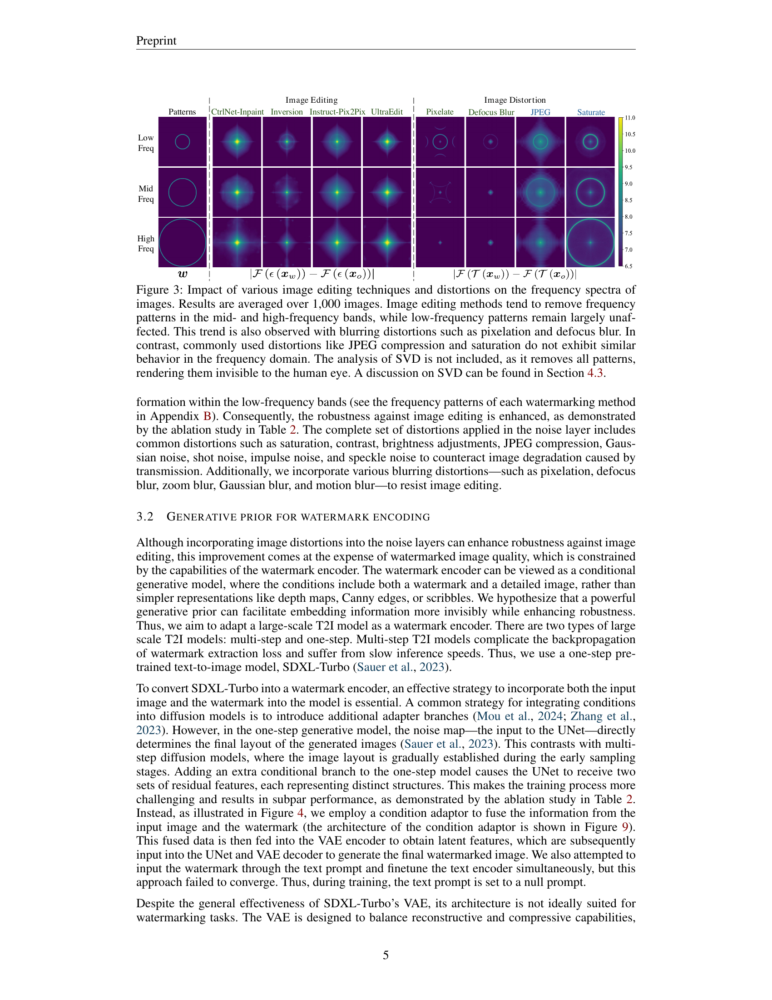

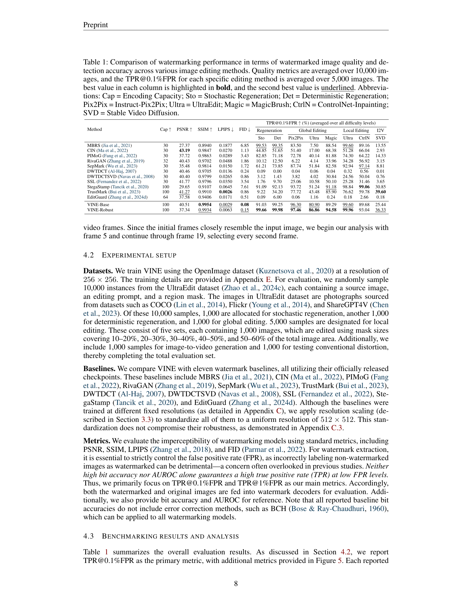
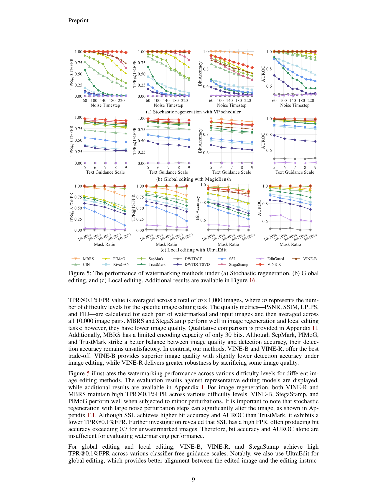

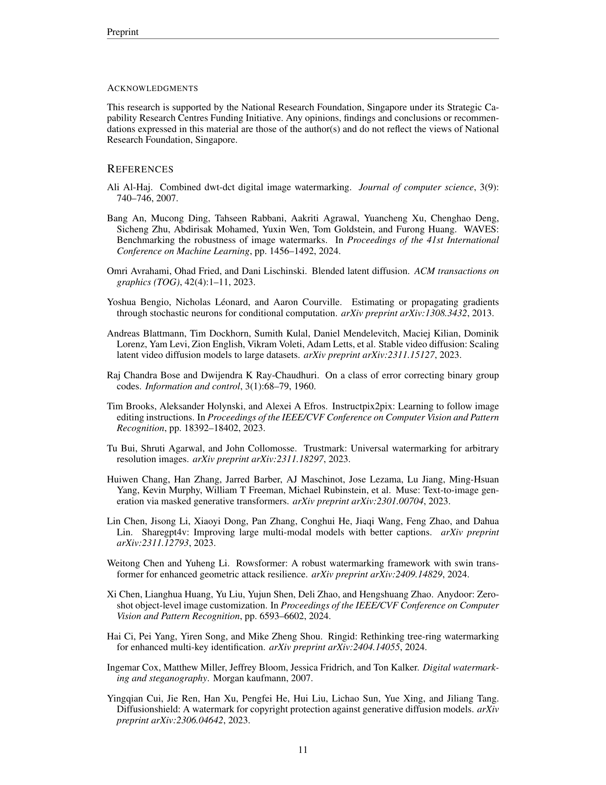
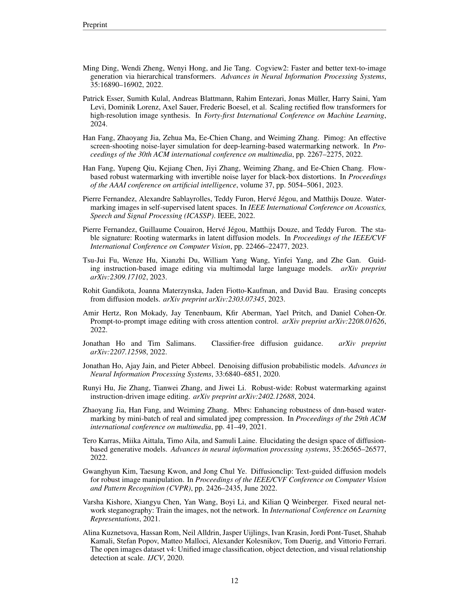

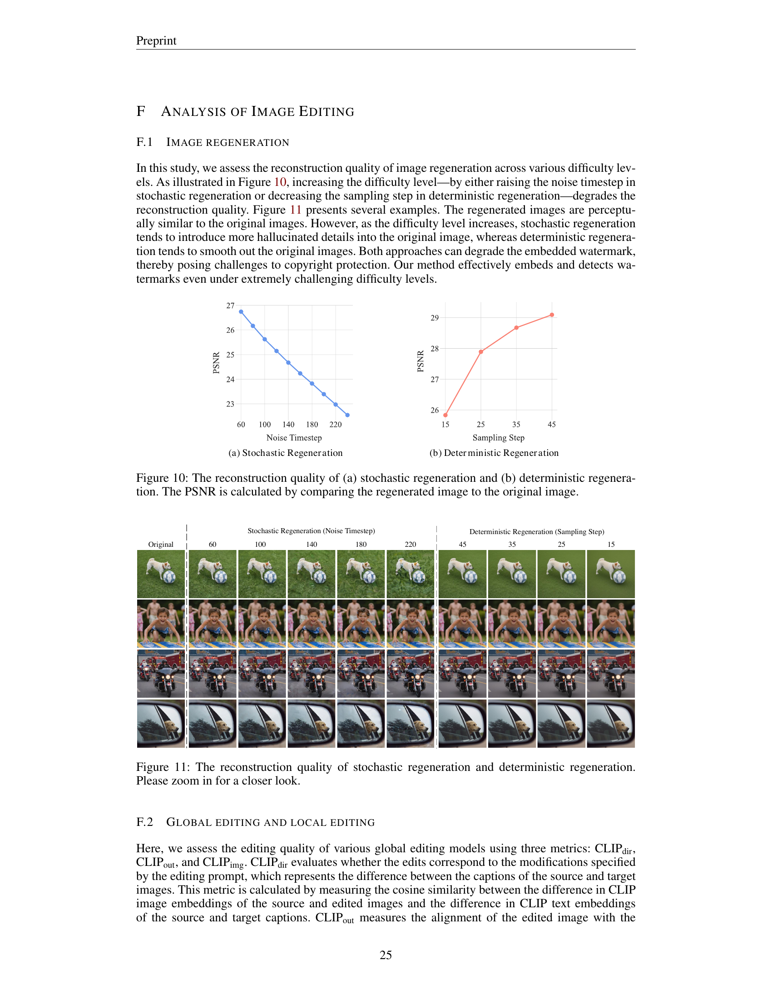

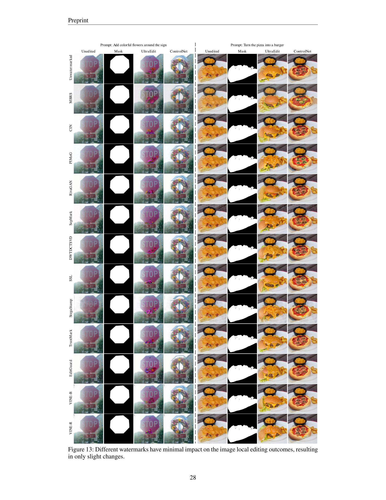
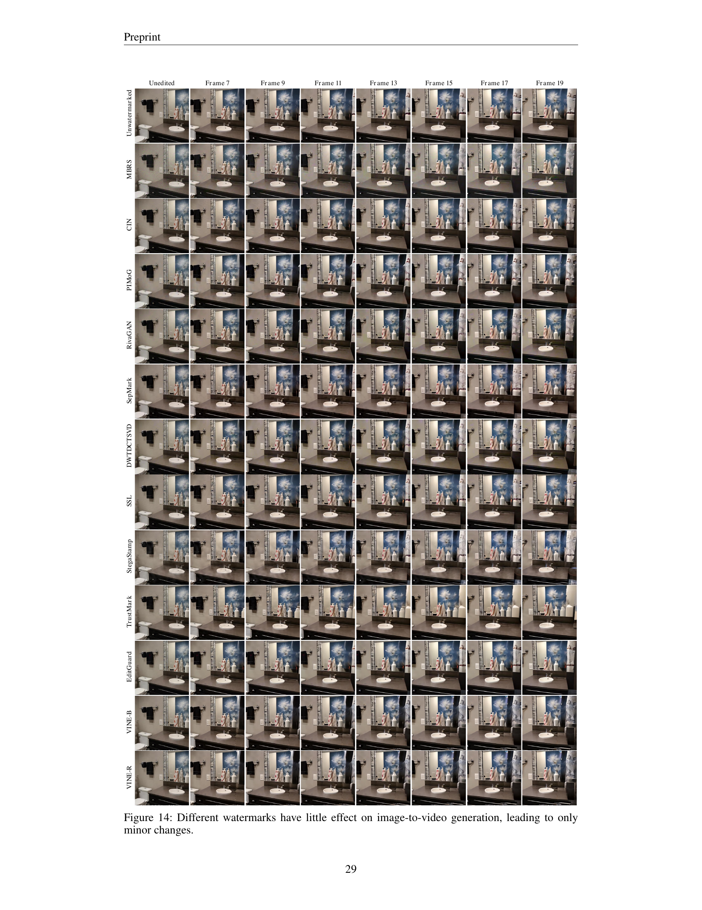

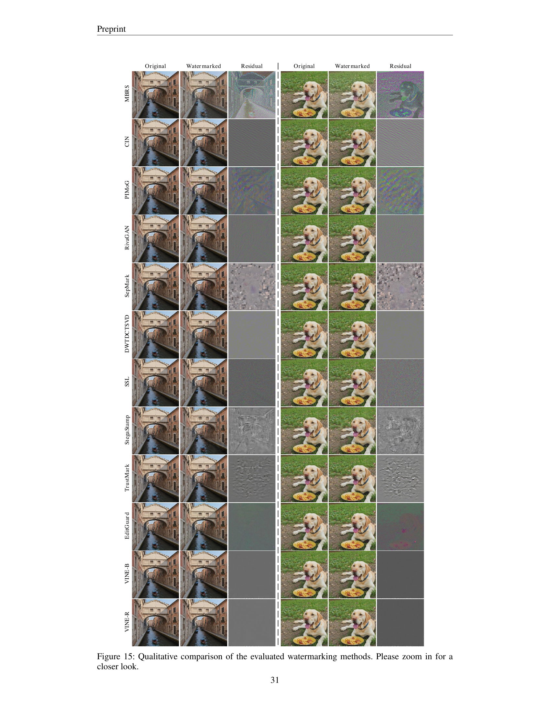

