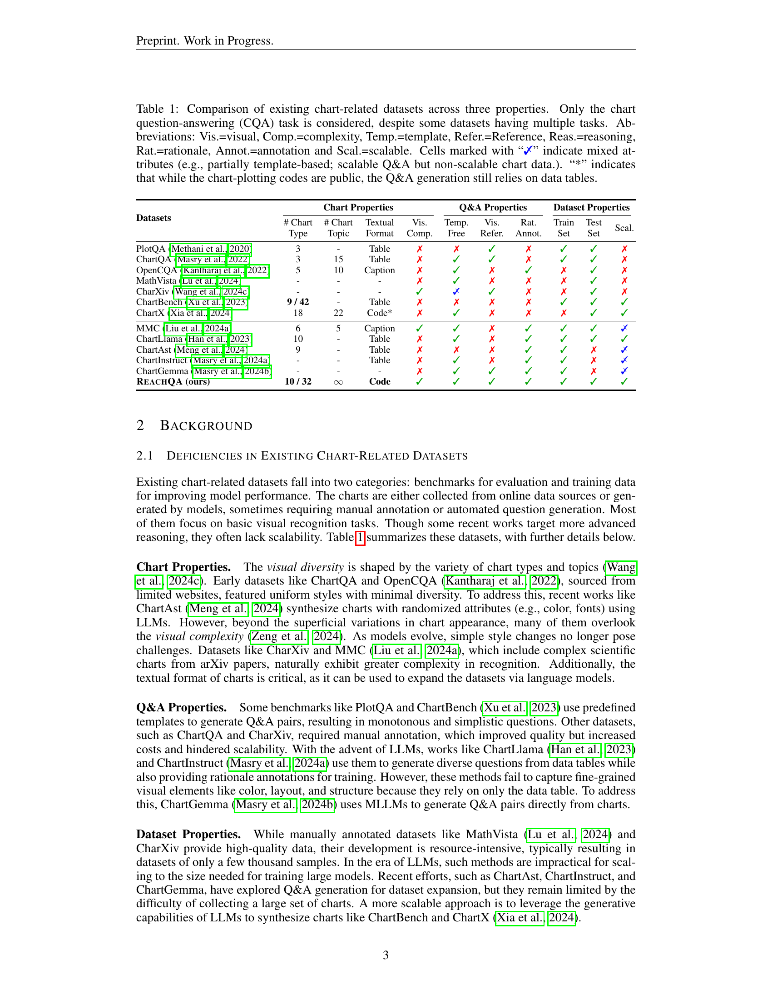
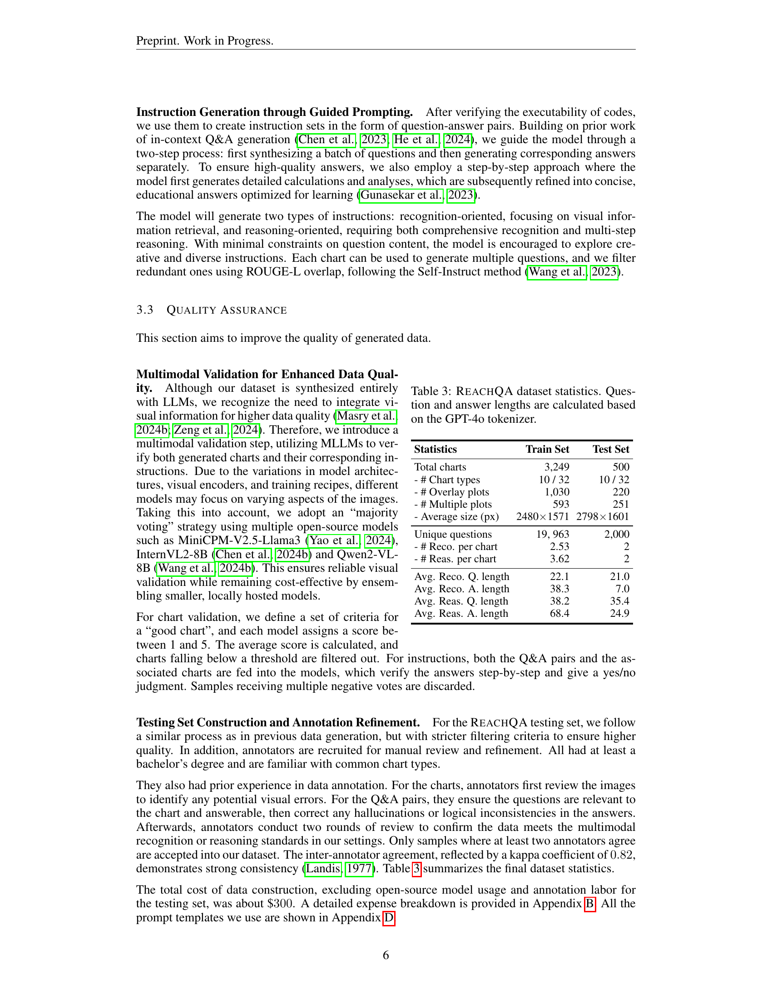
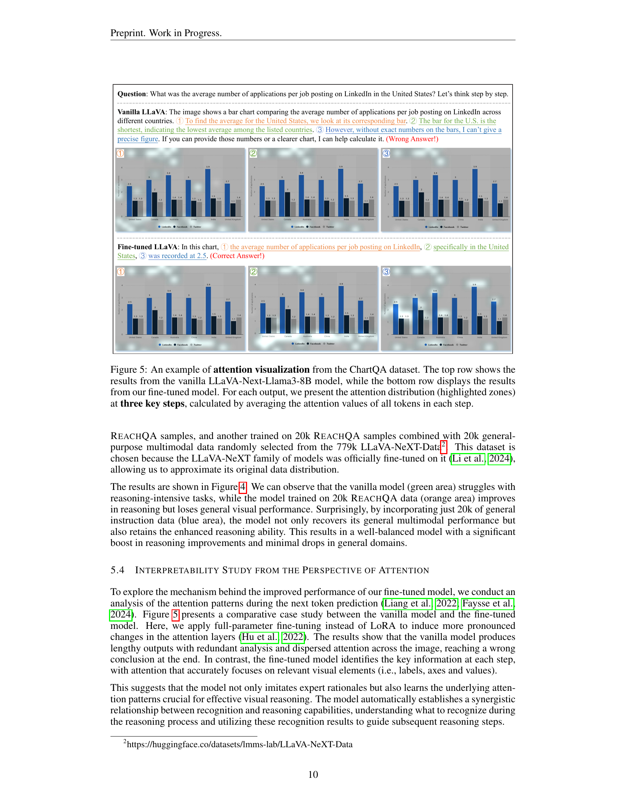
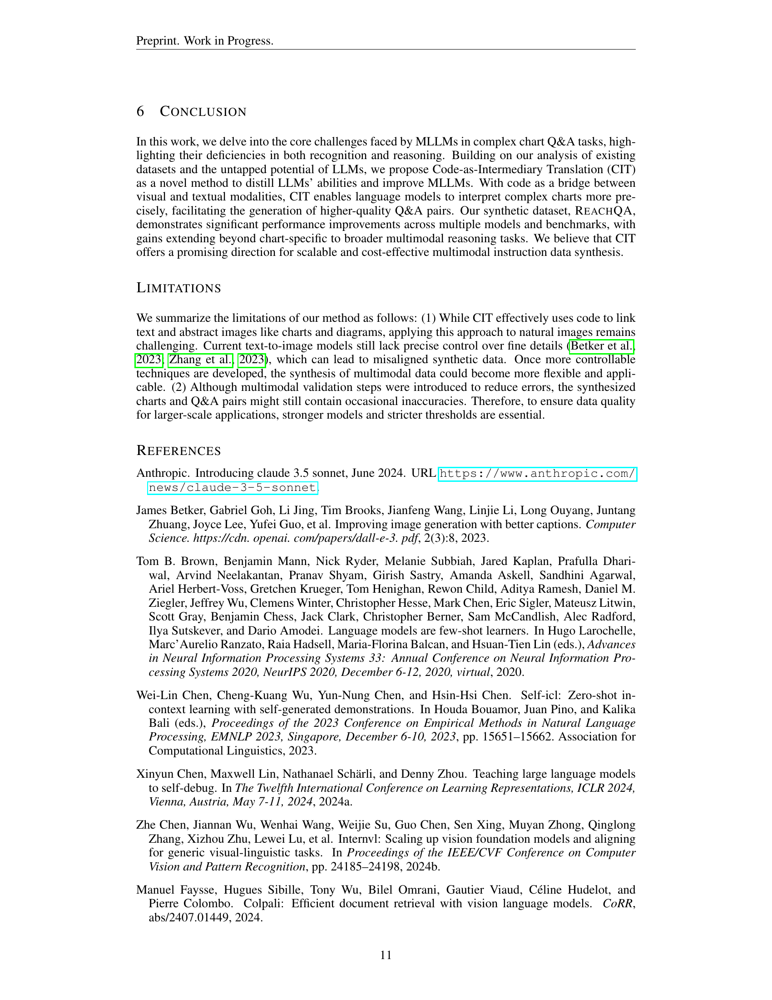
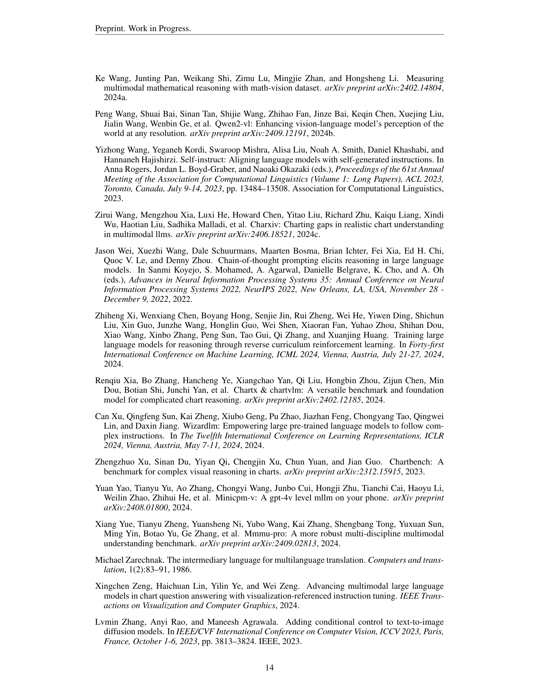
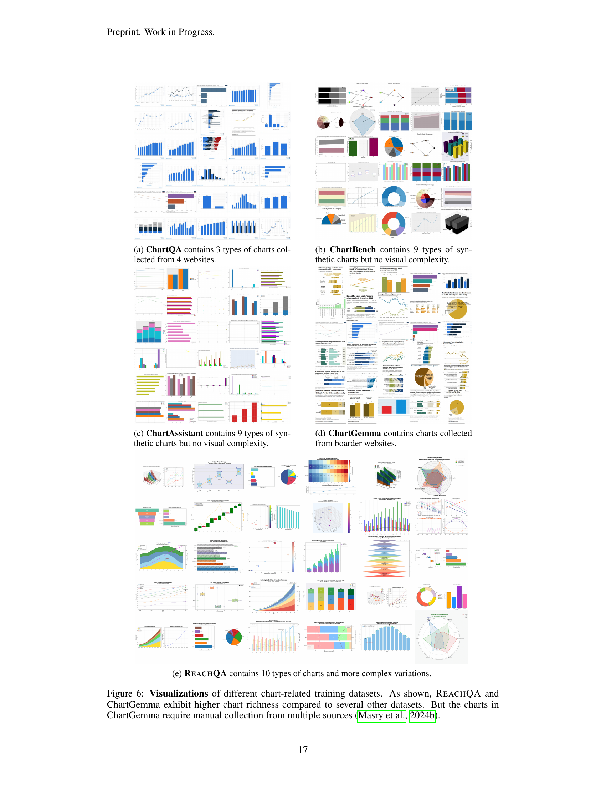
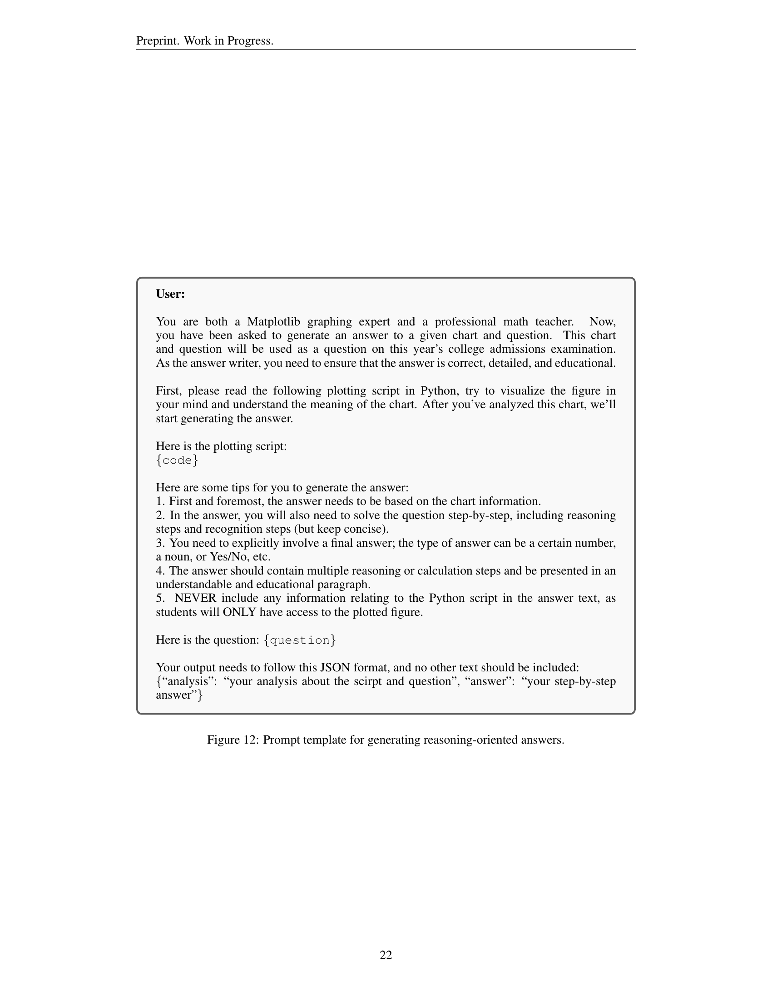

### TL;DR



This paper tackles the challenge of improving multimodal large language models' (MLLMs) ability to understand and reason using visual chart data.  Manually creating such datasets is expensive and time-consuming. The researchers introduce 'Code-as-Intermediary Translation' (CIT), a clever technique that uses code as a bridge between the visual chart and textual representation.  This allows them to leverage the power of LLMs to generate both the charts and questions efficiently. Using this method, they create REACHQA, a dataset containing 3,000 charts and 20,000 question-answer pairs.  Experiments show that models fine-tuned on this dataset perform much better on various chart-related benchmarks, demonstrating improved visual reasoning skills.  The improvement generalizes even to non-chart-related mathematical problems, highlighting the method's effectiveness.  The researchers also investigate the effect of combining general-purpose multimodal instruction data with their chart-focused data and find that this mixed approach yields even better results.




 &nbsp; read the paper on arXiv


#### Why does it matter?
The research paper introduces Code-as-Intermediary Translation (CIT), a novel method for efficiently creating training data for multimodal large language models (MLLMs) to improve their visual chart reasoning abilities.  The method uses code as an intermediary to translate visual chart representations into text, allowing LLMs to learn from the text and improve their ability to understand and reason about charts.
#### Key Takeaways


 Code-as-Intermediary Translation (CIT) is an efficient and scalable method for creating training data for MLLMs focused on chart understanding. 



 The REACHQA dataset (3k charts and 20k Q&A pairs) significantly enhances MLLM performance on chart-related and general mathematical reasoning benchmarks. 



 Findings suggest that mixing general-purpose multimodal instruction data with chart-specific data yields better performance than using chart-specific data alone. 


------
#### Visual Insights

 on ChartQA test set (Masry et al., 2022), as judged by GPT-40. We present an example chart from ChartQA along with two error cases: one for recognition and one for reasoning. The 'Other Errors' include question misunderstood errors, knowledge and hallucination errors, or refusal to answer.")

> The figure shows the error distribution of a language model on a chart question answering benchmark, highlighting the common error types of recognition and reasoning mistakes.

> The radar chart visualizes the performance comparison of three models (Base Model, ReachQA-20k, and ReachQA-LLaVA-Mix-40k) across ten different tasks, including six general-purpose and four specialized tasks.

{{< table-caption caption="🔽 Table 1: Comparison of existing chart-related datasets across three properties. Only the chart question-answering (CQA) task is considered, despite some datasets having multiple tasks. Abbreviations: Vis.=visual, Comp.=complexity, Temp.=template, Refer.=Reference, Reas.=reasoning, Rat. rationale, Annot.=annotation and Scal.=scalable. Cells marked with 'X' indicate mixed attributes (e.g., partially template-based; scalable Q&A but non-scalable chart data.). “*” indicates that while the chart-plotting codes are public, the Q&A generation still relies on data tables." >}}
<table id='2' style='font-size:14px'><tr><td rowspan="2">Datasets</td><td colspan="4">Chart Properties</td><td colspan="3">Q&A Properties</td><td colspan="3">Dataset Properties</td></tr><tr><td># Chart Type</td><td># Chart Topic</td><td>Textual Format</td><td>Vis. Comp.</td><td>Temp. Free</td><td>Vis. Refer.</td><td>Rat. Annot.</td><td>Train Set</td><td>Test Set</td><td>Scal.</td></tr><tr><td>PlotQA Methani et al. 2020</td><td>3</td><td>-</td><td>Table</td><td>X</td><td>X</td><td></td><td>X</td><td></td><td></td><td>X</td></tr><tr><td>ChartQA Masry et al. 2022</td><td>3</td><td>15</td><td>Table</td><td>X</td><td></td><td></td><td>X</td><td>V</td><td></td><td>X</td></tr><tr><td>OpenCQA Kanthara et al. 2022</td><td>5</td><td>10</td><td>Caption</td><td>X</td><td>V</td><td>X</td><td>V</td><td>X</td><td></td><td>X</td></tr><tr><td>MathVista Lu et al. 2024</td><td></td><td>-</td><td>-</td><td>X</td><td>V</td><td>X</td><td>X</td><td>X</td><td></td><td>X</td></tr><tr><td>CharXiv Wang et al 2024c</td><td></td><td>-</td><td>-</td><td>V</td><td>メ</td><td>V</td><td>X</td><td>X</td><td></td><td>X</td></tr><tr><td>ChartBench Xu et al 2023</td><td>9 / 42</td><td>-</td><td>Table</td><td>X</td><td>X</td><td>X</td><td>X</td><td>V</td><td></td><td>V</td></tr><tr><td>ChartX Xia et al. 2024</td><td>18</td><td>22</td><td>Code*</td><td>X</td><td>V</td><td>X</td><td>X</td><td>X</td><td></td><td>V</td></tr><tr><td>MMC Liu et al. 2024a</td><td>6</td><td>5</td><td>Caption</td><td>V</td><td></td><td>X</td><td></td><td></td><td></td><td>メ</td></tr><tr><td>ChartLlama Han et al. 2023</td><td>10</td><td>-</td><td>Table</td><td>X</td><td>V</td><td>X</td><td></td><td></td><td>V</td><td>V</td></tr><tr><td>ChartAst Meng et al. 2024</td><td>9</td><td>-</td><td>Table</td><td>X</td><td>X</td><td>X</td><td></td><td></td><td>X</td><td>メ</td></tr><tr><td>ChartInstruct Masry et al. 2024a</td><td>-</td><td>-</td><td>Table</td><td>X</td><td>V</td><td>X</td><td></td><td></td><td>X</td><td>メ</td></tr><tr><td>ChartGemma Masry et al. 2024b</td><td></td><td>-</td><td>-</td><td>X</td><td>V</td><td>V</td><td></td><td></td><td>X</td><td>メ</td></tr><tr><td>REACHQA (ours)</td><td>10 / 32</td><td>8</td><td>Code</td><td>V</td><td>V</td><td>V</td><td></td><td></td><td>V</td><td>V</td></tr></table>

> Table 1 compares existing chart-related datasets across three properties: chart properties, Q&A properties, and dataset properties, highlighting the differences in visual complexity, data generation methods, and scalability.

### More visual insights

More on figures

 method for synthesizing multimodal instruction data. The process begins with 33 seed codes and generates plot codes across various chart types, topics, and complexity levels through the Self-Instruct and Evol-Instruct stages. The chart set and instruction set are constructed bi-directionally, and the final filtered data yields REACHQA, a dataset for distilling visual chart reasoning abilities from LLMs to MLLMs.")

> The figure illustrates the Code-as-Intermediary Translation (CIT) method used to create the REACHQA dataset, showing how seed codes are expanded, charts are generated, and instructions are created and filtered.

 on ChartQA test set (Masry et al., 2022), as judged by GPT-40. We present an example chart from ChartQA along with two error cases: one for recognition and one for reasoning. The 'Other Errors' include question misunderstood errors, knowledge and hallucination errors, or refusal to answer.")

> The figure shows the error distribution of a language model on a chart question answering benchmark, highlighting the proportions of errors due to misrecognition and reasoning issues.

.")

> Figure 6 presents a visual comparison of chart visualizations from various datasets, highlighting the increased complexity and diversity of charts in REACHQA compared to other datasets.

.")

> Figure 6 shows visualizations of charts from various datasets, highlighting the increased visual complexity and diversity in REACHQA compared to other datasets.

.")

> Figure 6 shows visualizations of charts from various chart datasets, highlighting the increased visual complexity and diversity in REACHQA compared to other datasets.

.")

> Figure 6 presents visualizations of charts from various datasets, highlighting the increased visual complexity and diversity in REACHQA compared to others.

More on tables

{{< table-caption caption="🔽 Table 1: Comparison of existing chart-related datasets across three properties. Only the chart question-answering (CQA) task is considered, despite some datasets having multiple tasks. Abbreviations: Vis.=visual, Comp.=complexity, Temp.=template, Refer.=Reference, Reas.=reasoning, Rat. rationale, Annot.=annotation and Scal.=scalable. Cells marked with 'X' indicate mixed attributes (e.g., partially template-based; scalable Q&A but non-scalable chart data.). “*” indicates that while the chart-plotting codes are public, the Q&A generation still relies on data tables." >}}
<table id='5' style='font-size:14px'><tr><td>Input</td><td>Acc.</td><td>Reas. Comp.</td><td>Vis. Refer.</td><td>Cost ($)</td></tr><tr><td>Table</td><td>2.72</td><td>2.51</td><td>1.19</td><td>0.047</td></tr><tr><td>Code</td><td>2.60</td><td>2.56</td><td>2.15</td><td>0.092</td></tr><tr><td>Chart</td><td>1.91</td><td>1.53</td><td>2.36</td><td>0.107</td></tr></table>

> Table 1 compares existing chart-related datasets across three properties: Q&A properties, chart properties, and dataset properties, highlighting their differences in terms of visual format, complexity, and scalability.

{{< table-caption caption="🔽 Table 1: Comparison of existing chart-related datasets across three properties. Only the chart question-answering (CQA) task is considered, despite some datasets having multiple tasks. Abbreviations: Vis.=visual, Comp.=complexity, Temp.=template, Refer.=Reference, Reas.=reasoning, Rat. rationale, Annot.=annotation and Scal.=scalable. Cells marked with 'X' indicate mixed attributes (e.g., partially template-based; scalable Q&A but non-scalable chart data.). “*” indicates that while the chart-plotting codes are public, the Q&A generation still relies on data tables." >}}
<table id='8' style='font-size:14px'><tr><td>Statistics</td><td>Train Set</td><td>Test Set</td></tr><tr><td>Total charts</td><td>3,249</td><td>500</td></tr><tr><td>- # Chart types</td><td>10 / 32</td><td>10 / 32</td></tr><tr><td>- # Overlay plots</td><td>1,030</td><td>220</td></tr><tr><td>- # Multiple plots</td><td>593</td><td>251</td></tr><tr><td>- Average size (px)</td><td>2480x1571</td><td>2798 x 1601</td></tr><tr><td>Unique questions</td><td>19, 963</td><td>2,000</td></tr><tr><td>- # Reco. per chart</td><td>2.53</td><td>2</td></tr><tr><td>- # Reas. per chart</td><td>3.62</td><td>2</td></tr><tr><td>Avg. Reco. Q. length</td><td>22.1</td><td>21.0</td></tr><tr><td>Avg. Reco. A. length</td><td>38.3</td><td>7.0</td></tr><tr><td>Avg. Reas. Q. length</td><td>38.2</td><td>35.4</td></tr><tr><td>Avg. Reas. A. length</td><td>68.4</td><td>24.9</td></tr></table>

> Table 1 compares existing chart-related datasets across three properties: Q&A properties, chart properties, and dataset properties, highlighting their differences in terms of textual format, complexity, templates, visual features, topic diversity, scalability, and annotation methods.

{{< table-caption caption="🔽 Table 1: Comparison of existing chart-related datasets across three properties. Only the chart question-answering (CQA) task is considered, despite some datasets having multiple tasks. Abbreviations: Vis.=visual, Comp.=complexity, Temp.=template, Refer.=Reference, Reas.=reasoning, Rat. rationale, Annot.=annotation and Scal.=scalable. Cells marked with 'X' indicate mixed attributes (e.g., partially template-based; scalable Q&A but non-scalable chart data.). “*” indicates that while the chart-plotting codes are public, the Q&A generation still relies on data tables." >}}
<table id='2' style='font-size:14px'><tr><td rowspan="2">Models</td><td rowspan="2">Avg. (↑)</td><td>ChartQA</td><td colspan="2">ChartBench</td><td>ChartX</td><td colspan="2">REACHQA</td><td colspan="2">CharXiv</td><td colspan="2">Math Vista</td><td>MATH-V</td></tr><tr><td>QA</td><td>Binary</td><td>NQA</td><td>QA</td><td>Reas.</td><td>Reco.</td><td>Reas.</td><td>Desc.</td><td>Math</td><td>General</td><td>QA</td></tr><tr><td colspan="13">Baselines</td></tr><tr><td>Human</td><td>-</td><td>-</td><td>-</td><td>-</td><td>-</td><td>65.10</td><td>84.60</td><td>80.50</td><td>92.10</td><td colspan="2">60.30</td><td>75.66</td></tr><tr><td>Random (GPT-4o)</td><td>20.82</td><td>30.04</td><td>40.21</td><td>22.73</td><td>19.85</td><td>8.20</td><td>13.30</td><td>10.80</td><td>19.85</td><td colspan="2">17.90</td><td>25.36</td></tr><tr><td colspan="13">Proprietary Multimodal Large Language Models</td></tr><tr><td>GPT-4o mini</td><td>49.34</td><td>77.52</td><td>70.26</td><td>34.93</td><td>35.45</td><td>27.20</td><td>53.50</td><td>34.10</td><td>74.92</td><td colspan="2">56.70</td><td>28.85</td></tr><tr><td>GPT-4o</td><td>59.85</td><td>85.70</td><td>81.03</td><td>52.88</td><td>46.60</td><td>39.70</td><td>66.80</td><td>47.10</td><td>84.45</td><td colspan="2">63.80</td><td>30.39</td></tr><tr><td>Claude 3.5 Sonnet</td><td>64.50</td><td>90.80</td><td>76.72</td><td>48.29</td><td>58.24</td><td>51.70</td><td>74.30</td><td>60.20</td><td>84.30</td><td colspan="2">67.70</td><td>32.76</td></tr><tr><td colspan="13">Chart-augmented Multimodal Large Language Models</td></tr><tr><td>ChartInstruct-7B</td><td>25.93</td><td>66.64</td><td>61.40</td><td>26.95</td><td>26.62</td><td>6.00</td><td>10.50</td><td>8.80</td><td>21.40</td><td>15.37</td><td>31.52</td><td>10.07</td></tr><tr><td>ChartAssistant-13B</td><td>28.25</td><td>79.90</td><td>58.15</td><td>24.62</td><td>23.20</td><td>10.70</td><td>19.60</td><td>11.70</td><td>16.93</td><td>17.78</td><td>39.57</td><td>8.55</td></tr><tr><td>ChartGemma-3B</td><td>33.08</td><td>80.16</td><td>78.90</td><td>34.10</td><td>35.15</td><td>9.20</td><td>27.80</td><td>12.50</td><td>21.30</td><td>19.07</td><td>38.04</td><td>7.70</td></tr><tr><td colspan="13">Open-Source Multimodal Large Language Models</td></tr><tr><td>LLaVA-Next-Llama3-8B</td><td>24.46</td><td>45.80</td><td>42.90</td><td>15.86</td><td>15.45</td><td>6.50</td><td>17.90</td><td>17.20</td><td>31.45</td><td>22.41</td><td>44.13</td><td>9.44</td></tr><tr><td>+ REACHQA (Reco.)</td><td>32.88 (+34.4%)</td><td>66.96</td><td>56.95</td><td>29.52</td><td>27.25</td><td>8.80</td><td>29.00</td><td>22.20</td><td>32.58</td><td>27.40</td><td>49.78</td><td>11.25</td></tr><tr><td>+ REACHQA (Reas.)</td><td>32.39 (+32.4%)</td><td>64.48</td><td>56.80</td><td>25.14</td><td>25.90</td><td>8.40</td><td>26.30</td><td>22.70</td><td>35.67</td><td>28.89</td><td>50.65</td><td>11.38</td></tr><tr><td>+ REACHQA (All)</td><td>32.98 (+34.8%)</td><td>64.56</td><td>57.00</td><td>29.33</td><td>27.08</td><td>11.10</td><td>29.60</td><td>22.50</td><td>32.33</td><td>27.59</td><td>50.43</td><td>11.25</td></tr><tr><td>MiniCPM-V2.5-Llama3</td><td>33.39</td><td>66.92</td><td>48.90</td><td>22.29</td><td>- 23.72</td><td>10.30</td><td>25.30</td><td>22.00</td><td>46.20</td><td>37.22</td><td>53.04</td><td>11.45</td></tr><tr><td>+ REACHQA (Reco.)</td><td>38.62 (+15.7%)</td><td>71.12</td><td>56.65</td><td>33.29</td><td>29.53</td><td>10.60</td><td>34.10</td><td>25.60</td><td>48.75</td><td>41.48</td><td>60.43</td><td>13.22</td></tr><tr><td>+ REACHQA (Reas.)</td><td>38.52 (+15.4%)</td><td>71.72</td><td>56.65</td><td>29.62</td><td>28.23</td><td>11.00</td><td>33.00</td><td>27.50</td><td>48.70</td><td>43.52</td><td>60.22</td><td>13.52</td></tr><tr><td>+ REACHQA (All)</td><td>38.67 (+15.8%)</td><td>71.44</td><td>55.80</td><td>30.43</td><td>29.68</td><td>11.00</td><td>35.10</td><td>28.30</td><td>47.62</td><td>42.22</td><td>60.00</td><td>13.75</td></tr><tr><td>InternVL2-8B</td><td>40.03</td><td>73.80</td><td>52.05</td><td>32.86</td><td>35.10</td><td>16.20</td><td>33.70</td><td>26.30</td><td>46.10</td><td>46.11</td><td>61.74</td><td>16.38</td></tr><tr><td>+ REACHQA (Reco.)</td><td>48.21 (+20.4%)</td><td>82.92</td><td>66.35</td><td>46.14</td><td>46.62</td><td>19.90</td><td>49.50</td><td>32.20</td><td>54.38</td><td>47.96</td><td>67.61</td><td>16.78</td></tr><tr><td>+ REACHQA (Reas.)</td><td>47.87 (+19.6%)</td><td>82.84</td><td>64.05</td><td>46.52</td><td>44.88</td><td>20.10</td><td>49.40</td><td>32.80</td><td>52.40</td><td>49.44</td><td>66.52</td><td>17.66</td></tr><tr><td>+ REACHQA (All)</td><td>48.35 (+20.8%)</td><td>82.44</td><td>65.90</td><td>47.29</td><td>45.38</td><td>21.30</td><td>49.80</td><td>32.70</td><td>54.83</td><td>48.89</td><td>66.30</td><td>17.01</td></tr></table>

> Table 1 compares existing chart-related datasets across three properties: chart properties, Q&A properties, and dataset properties.

{{< table-caption caption="🔽 Table 1: Comparison of existing chart-related datasets across three properties. Only the chart question-answering (CQA) task is considered, despite some datasets having multiple tasks. Abbreviations: Vis.=visual, Comp.=complexity, Temp.=template, Refer.=Reference, Reas.=reasoning, Rat. rationale, Annot.=annotation and Scal.=scalable. Cells marked with 'X' indicate mixed attributes (e.g., partially template-based; scalable Q&A but non-scalable chart data.). “*” indicates that while the chart-plotting codes are public, the Q&A generation still relies on data tables." >}}
 <table id='9' style='font-size:16px'><tr><td>Base Model</td><td>16.39</td><td>6.50</td><td>17.20</td><td>32.40</td><td>9.44</td></tr><tr><td>+ ChartBench</td><td>17.06</td><td>7.30</td><td>17.00</td><td>33.60</td><td>10.33</td></tr><tr><td></td><td>17.67</td><td>7.10</td><td>20.40</td><td>32.10</td><td>11.08</td></tr><tr><td>ChartGemma</td><td>19.11</td><td>10.00</td><td>19.40</td><td>36.40</td><td>10.62</td></tr><tr><td></td><td>20.74</td><td>11.10</td><td>22.50</td><td>38.10</td><td>11.25</td></tr></table>

> Table 1 compares existing chart-related datasets across three properties: Q&A properties, chart properties, and dataset properties, highlighting their strengths and weaknesses.

{{< table-caption caption="🔽 Table 1: Comparison of existing chart-related datasets across three properties. Only the chart question-answering (CQA) task is considered, despite some datasets having multiple tasks. Abbreviations: Vis.=visual, Comp.=complexity, Temp.=template, Refer.=Reference, Reas.=reasoning, Rat. rationale, Annot.=annotation and Scal.=scalable. Cells marked with 'X' indicate mixed attributes (e.g., partially template-based; scalable Q&A but non-scalable chart data.). “*” indicates that while the chart-plotting codes are public, the Q&A generation still relies on data tables." >}}
<table id='8' style='font-size:14px'><tr><td>Art and Design</td><td>Futurism and Innovation</td><td>Agriculture and Food Production</td></tr><tr><td>Music and Performance</td><td>Astronomy and Space</td><td>Transportation and Logistics</td></tr><tr><td>Business and Finance</td><td>Social Media and the Web</td><td>Real Estate and Housing Market</td></tr><tr><td>Travel and Exploration</td><td>Society and Community</td><td>Government and Public Policy</td></tr><tr><td>Books and Publishing</td><td>Physics and Chemistry</td><td>Education and Academics</td></tr><tr><td>Literature and Writing</td><td>Energy and Utilities</td><td>Environment and Sustainability</td></tr><tr><td>History and Culture</td><td>Biology and Life Sciences</td><td>Language and Communication</td></tr><tr><td>Architecture and Building</td><td>Retail and E-commerce</td><td>Social Sciences and Humanities</td></tr><tr><td>Fashion and Style</td><td>Religion and Spirituality</td><td>Manufacturing and Production</td></tr><tr><td>Marketing and Advertising</td><td>Food and Beverage Industry</td><td>Artificial Intelligence and Robotics</td></tr><tr><td>Law and Legal Affairs</td><td>Healthcare and Health</td><td>Human Resources and Employee Management</td></tr><tr><td>Film and Cinema</td><td>Sports and Entertainment</td><td>Computer Science and Information Technology</td></tr><tr><td>Mathematics and Statistics</td><td>Science and Engineering</td><td></td></tr></table>

> Table 1 compares existing chart-related datasets across three properties: Q&A properties, chart properties, and dataset properties, highlighting their differences in terms of format, complexity, templates, visual aspects, scalability, and annotation.

{{< table-caption caption="🔽 Table 1: Comparison of existing chart-related datasets across three properties. Only the chart question-answering (CQA) task is considered, despite some datasets having multiple tasks. Abbreviations: Vis.=visual, Comp.=complexity, Temp.=template, Refer.=Reference, Reas.=reasoning, Rat. rationale, Annot.=annotation and Scal.=scalable. Cells marked with 'X' indicate mixed attributes (e.g., partially template-based; scalable Q&A but non-scalable chart data.). “*” indicates that while the chart-plotting codes are public, the Q&A generation still relies on data tables." >}}
<table id='2' style='font-size:14px'><tr><td>Step</td><td>Avg. #tokens of Input</td><td>Avg. #tokens of Output</td><td>Times</td><td>Cost ($)</td></tr><tr><td>Self-Instruct</td><td>1, 500 + 2, 000 = 3, 500</td><td>500 + 500 = 1, 000</td><td>3,000</td><td>~ 56.25</td></tr><tr><td>Evol-Instruct</td><td>700 + 1, 300 = 2, 000</td><td>300 + 700 = 1, 000</td><td>3,000</td><td>~ 45.00</td></tr><tr><td>Self-Repair</td><td>500</td><td>500</td><td>1,500</td><td>~ 9.38</td></tr><tr><td>Reas-QA-Gen.</td><td>1,000 + 1, 500 x 4 = 7, 000</td><td>500 + 300 x 4 = 1, 700</td><td>3,249</td><td>~ 112.09</td></tr><tr><td>Reco-QA-Gen.</td><td>800 + 1, 200 x 4= 5, 600</td><td>300 + 200 x4= 1, 100</td><td>3,249</td><td>~ 81.23</td></tr></table>

> Table 1 compares existing chart-related datasets across three properties: Q&A properties, chart properties, and dataset properties, highlighting their strengths and weaknesses for chart question answering tasks.

### Full paper



