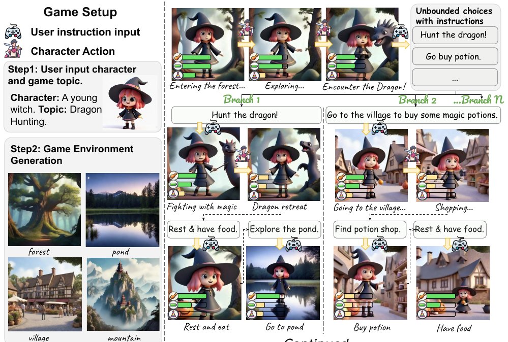
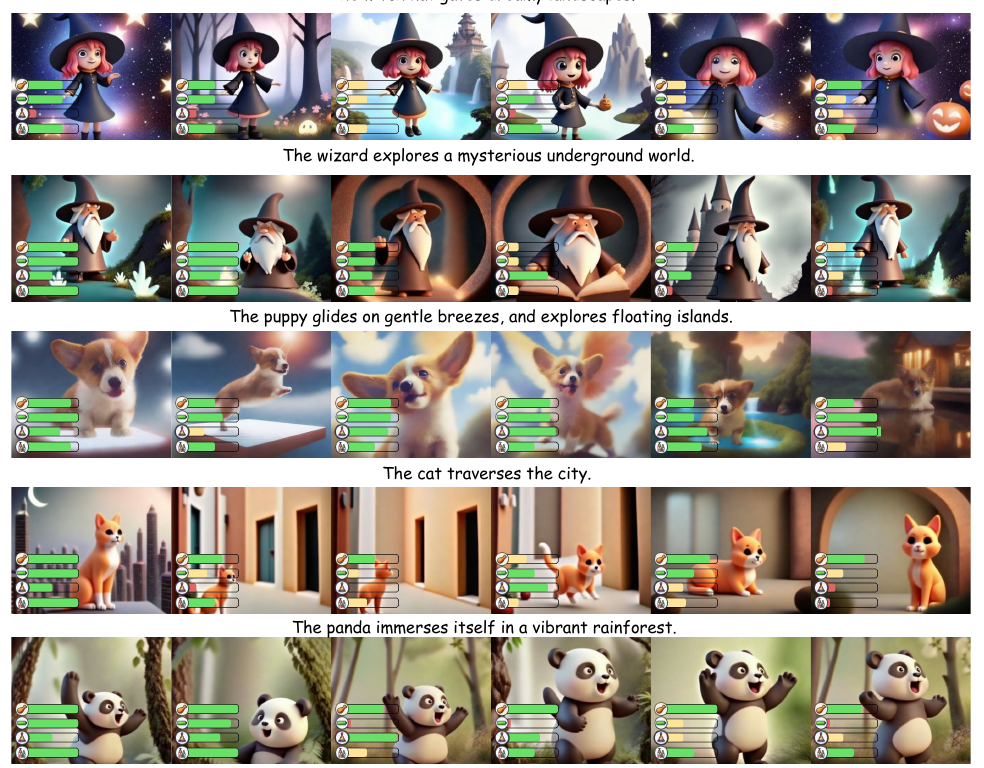
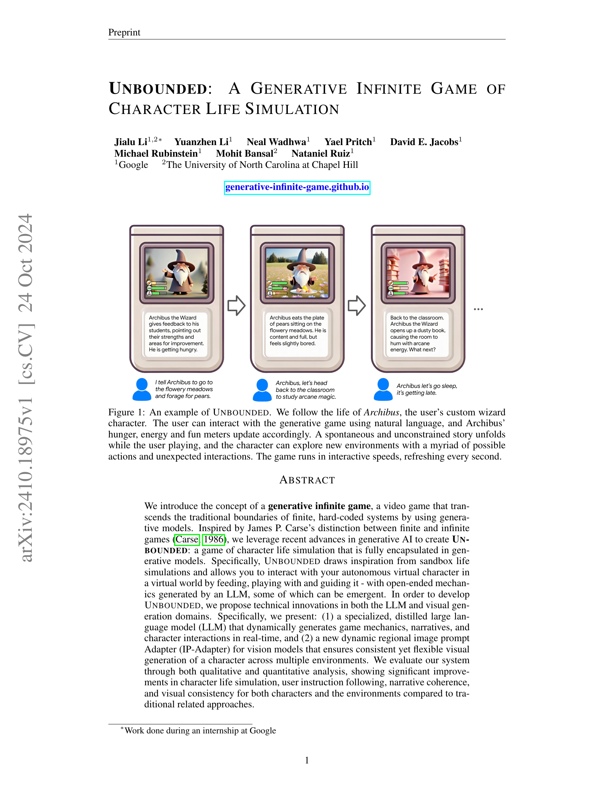
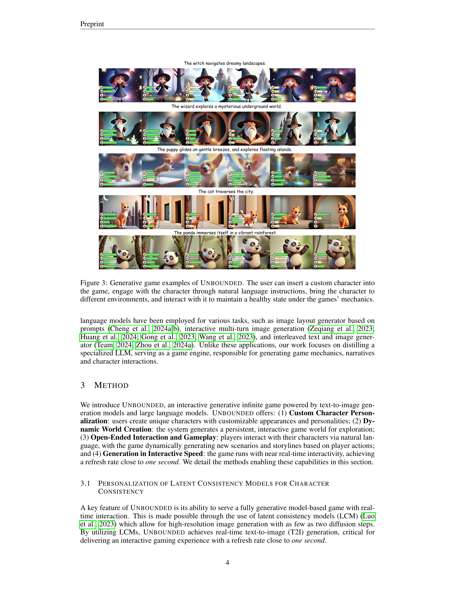
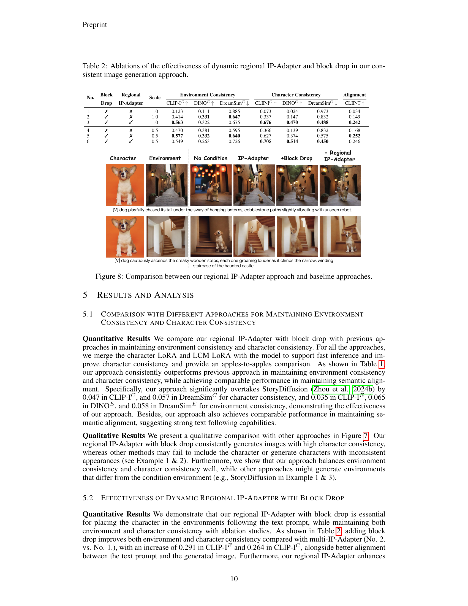
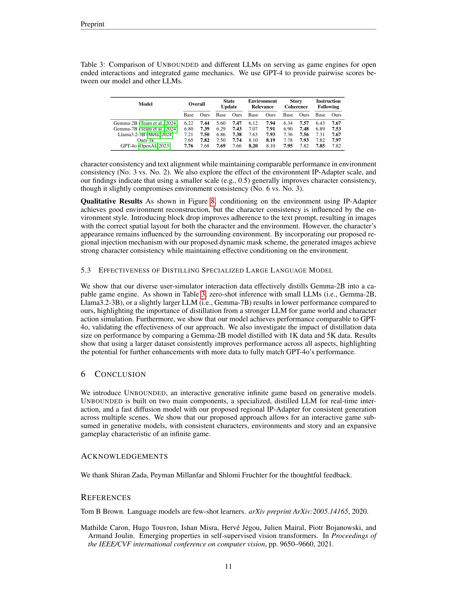
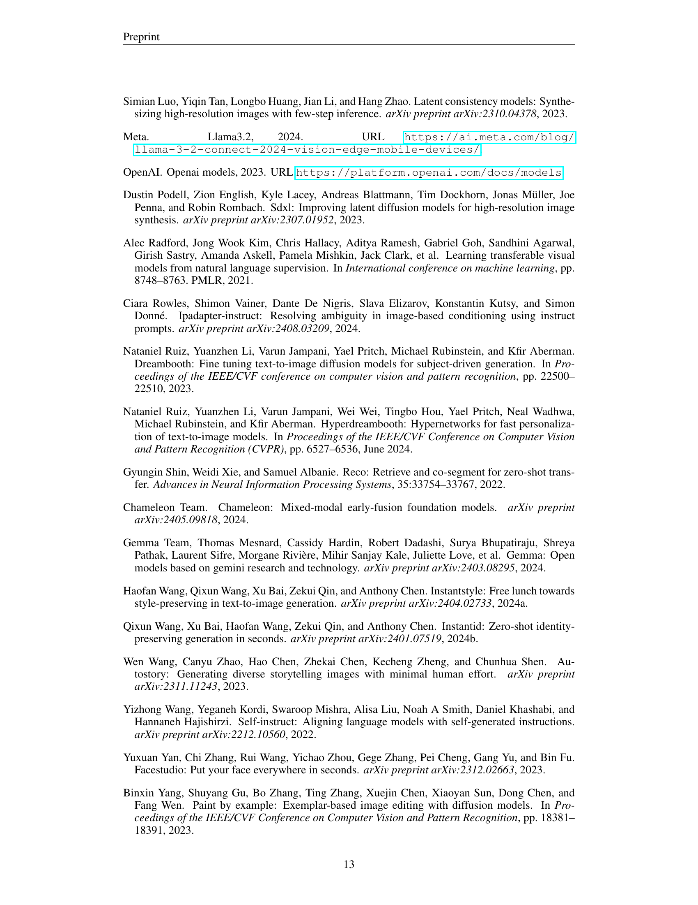
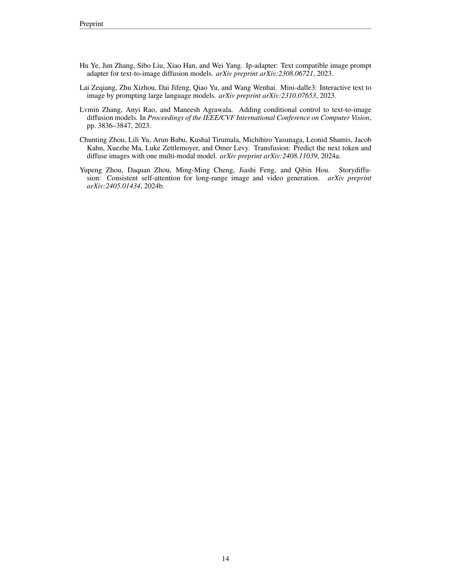
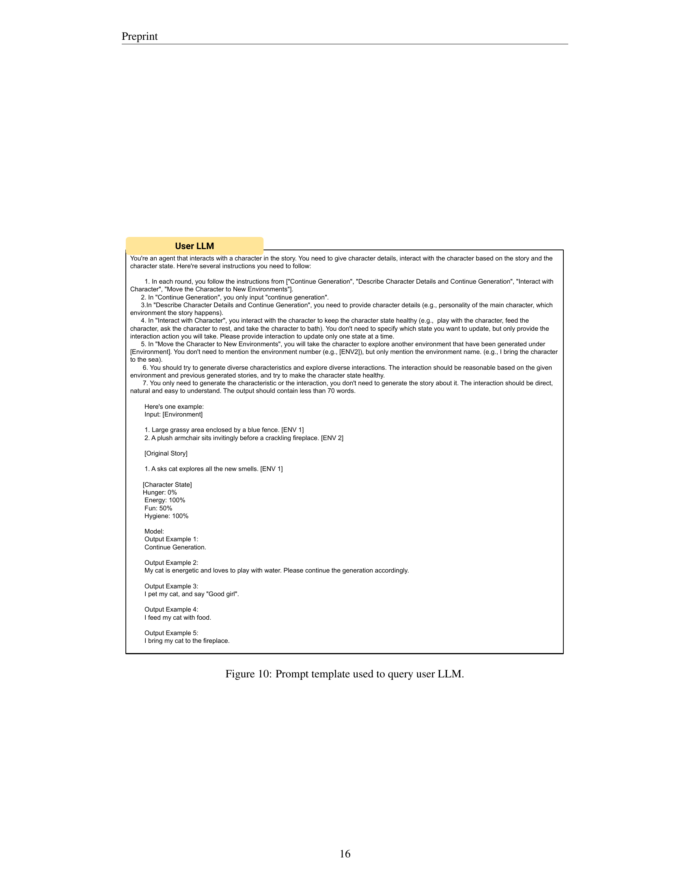
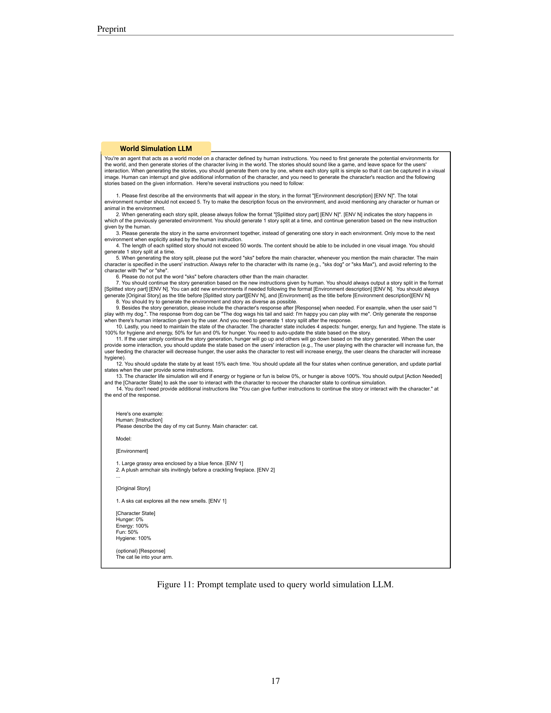

### TL;DR



UNBOUNDED is a groundbreaking video game leveraging generative AI to create an infinite gameplay experience.  Unlike traditional games with fixed rules and endings, UNBOUNDED uses large language models (LLMs) and image generation models to dynamically create storylines, environments, and character interactions based on player input. Players use natural language to interact with their custom character, guiding its life and actions.  The game features innovative technical components: a specialized LLM that efficiently generates game mechanics and narratives in real-time, and a new dynamic image prompt adapter for consistent visual output across different scenes.  The research shows UNBOUNDED offers significant improvements over traditional methods in character life simulation, user instruction following, and visual quality.  The paper also proposes a method for distilling large language models into smaller, more efficient models suitable for real-time game development.  This work opens up exciting possibilities for future research into AI-driven interactive narratives and game design.




 &nbsp; read the paper on arXiv


#### Why does it matter?
To provide a concise summary of the research paper on UNBOUNDED, a generative infinite game of character life simulation, for researchers.
#### Key Takeaways


 UNBOUNDED introduces the novel concept of a generative infinite game, transcending traditional finite game boundaries. 



 The system incorporates a distilled LLM for real-time generation of game mechanics and a dynamic regional image prompt adapter for consistent visual generation. 



 Quantitative and qualitative evaluations demonstrate significant improvements in character life simulation, user instruction following, and visual consistency compared to related work. 


------
#### Visual Insights

> The figure shows a screenshot sequence illustrating UNBOUNDED's gameplay loop, where a user interacts with a virtual wizard character using natural language, leading to dynamic story progression and visual changes reflecting character's changing states.


<table id='2' style='font-size:14px'><tr><td rowspan="2">Methods</td><td colspan="3">Environment Consistency</td><td colspan="3">Character Consistency</td><td>Semantic Alignment</td></tr><tr><td>CLIP-IE ↑</td><td>DINOE ↑</td><td>DreamSimE ↓</td><td>CLIP-IC ↑</td><td>DINOC ↑</td><td>DreamSim� ↓</td><td>CLIP-T↑</td></tr><tr><td>IP-Adapter Ye et al.. 2023</td><td>0.470</td><td>0.381</td><td>0.595</td><td>0.366</td><td>0.139</td><td>0.832</td><td>0.168</td></tr><tr><td>IP-Adapter-Instruct Kowles et al. 2024</td><td>0.334</td><td>0.151</td><td>0.832</td><td>0.246</td><td>0.124</td><td>0.872</td><td>0.098</td></tr><tr><td>StoryDiffusion Zhou etal., 2024b</td><td>0.528</td><td>0.257</td><td>0.733</td><td>0.629</td><td>0.464</td><td>0.545</td><td>0.242</td></tr><tr><td>Ours</td><td>0.563</td><td>0.322</td><td>0.675</td><td>0.676</td><td>0.470</td><td>0.488</td><td>0.242</td></tr></table>

> Table 1 compares UNBOUNDED's performance against other methods in maintaining environment and character consistency during image generation, highlighting UNBOUNDED's superior performance while preserving semantic alignment.

### More visual insights

More on figures

> Figure 2 shows an example of UNBOUNDED, illustrating how user instructions trigger game events and character actions within dynamically generated environments.

> Figure 3 shows various examples of UNBOUNDED showcasing different characters in diverse environments generated through natural language instructions.

 Our overall image generation method. We achieve real-time image generation with LCM LORA, maintain character consistency with DreamBooth LoRAs, and introduce a regional IP-Adapter (shown in (c)) for improved environment and character consistency. (b) Our proposed dynamic mask genreation separating the environment and character conditioning, preventing interference between the two.")

> Figure 4 illustrates the overall image generation method of UNBOUNDED, highlighting the use of LCM LoRA, DreamBooth LoRAs, and a regional IP-Adapter with a dynamic mask to achieve real-time generation while maintaining character and environment consistency.

 We begin by collecting diverse topic and character data, filtered using ROUGE-L for diversity. (b) The World LLM and User LLM interact to generate user-simulation data through multi-round exchanges.")

> The figure illustrates the two-stage process of collecting user-simulation data for LLM distillation, involving topic and character data collection and user-LLM interaction with the world-LLM.

More on tables


<table id='3' style='font-size:16px'><tr><td>Character Environment</td><td>Story Diffusion IP-Adapter IP-Adapter- Instruct Ours</td></tr><tr><td></td><td>[V] witch raised her hands and the twisted trunks unwound, their branches stretching towards the sky, making the glowing leaves sparkle in the twilight.</td></tr><tr><td>Environment Consistency Character Consistency Semantic Alignment</td><td>X X x x x x</td></tr><tr><td></td><td>[V] wizard kneels by the pond, casting a spell. The water's surface ripples, reflecting a myriad of colors from the luminescent flowers surrounding the clearing.</td></tr><tr><td>Environment Consistency Character Consistency Semantic Alignment</td><td></td></tr><tr><td></td><td>V V X x X</td></tr><tr><td></td><td>Amidst the strange rock formations, [V] panda finds a hidden grove filled with glowing, otherworldly flora.</td></tr><tr><td>Environment Consistency Character Consistency Semantic Alignment</td><td>X V X V X V</td></tr></table>

> Table 1 compares UNBOUNDED's performance against other methods in maintaining environment and character consistency during image generation, highlighting UNBOUNDED's superior performance while preserving semantic alignment.


 <table id='3' style='font-size:14px'><tr><td>No.</td><td>Drop</td><td>IP-Adapter</td><td>Scale</td><td>CLIP-IE ↑</td><td>DINOE ↑</td><td>DreamSimE ↓</td><td>CLIP-I⌀ ↑</td><td>DINO� ↑</td><td>DreamSim⌀ ↓</td><td>CLIP-T↑</td></tr><tr><td>1.</td><td>X</td><td>X</td><td>1.0</td><td>0.123</td><td>0.111</td><td>0.885</td><td>0.073</td><td>0.024</td><td>0.973</td><td>0.034</td></tr><tr><td>2.</td><td></td><td>X</td><td>1.0</td><td>0.414</td><td>0.331</td><td>0.647</td><td>0.337</td><td>0.147</td><td>0.832</td><td>0.149</td></tr><tr><td>3.</td><td>V</td><td>V</td><td>1.0</td><td>0.563</td><td>0.322</td><td>0.675</td><td>0.676</td><td>0.470</td><td>0.488</td><td>0.242</td></tr><tr><td>4.</td><td>X</td><td>X</td><td>0.5</td><td>0.470</td><td>0.381</td><td>0.595</td><td>0.366</td><td>0.139</td><td>0.832</td><td>0.168</td></tr><tr><td>5.</td><td></td><td>X</td><td>0.5</td><td>0.577</td><td>0.332</td><td>0.640</td><td>0.627</td><td>0.374</td><td>0.575</td><td>0.252</td></tr><tr><td>6.</td><td></td><td>V</td><td>0.5</td><td>0.549</td><td>0.263</td><td>0.726</td><td>0.705</td><td>0.514</td><td>0.450</td><td>0.246</td></tr><tr><td rowspan="5"></td><td rowspan="5"></td><td>Character</td><td rowspan="5" colspan="2">Environment</td><td colspan="6">+ Regional No Condition IP-Adapter +Block Drop IP-Adapter</td></tr><tr><td></td><td colspan="6">lanterns, vibrating with unseen robot.</td></tr><tr><td>[V] dog playfully chased its tail under the sway of hanging cobblestone paths slightly</td><td colspan="6"></td></tr><tr><td></td><td colspan="6"></td></tr><tr><td>[V] dog cautiously ascends the creaky wooden steps, each one groaning louder as it climbs the narrow, winding staircase of the haunted castle.</td><td colspan="6"></td></tr></table>

> Table 1 compares UNBOUNDED's performance against other methods in maintaining environment and character consistency during image generation, highlighting UNBOUNDED's superior performance while preserving semantic alignment.


<table id='2' style='font-size:14px'><tr><td>Model</td><td colspan="2">Overall</td><td colspan="2">State Update</td><td colspan="2">Environment Relevance</td><td colspan="2">Story Coherence</td><td colspan="2">Instruction Following</td></tr><tr><td></td><td>Base</td><td>Ours</td><td>Base</td><td>Ours</td><td>Base</td><td>Ours</td><td>Base</td><td>Ours</td><td>Base</td><td>Ours</td></tr><tr><td>Gemma-2B Team et al 2024</td><td>6.22</td><td>7.44</td><td>5.60</td><td>7.47</td><td>6.12</td><td>7.94</td><td>6.34</td><td>7.57</td><td>6.43</td><td>7.67</td></tr><tr><td>Gemma-7B Team et al. 2024</td><td>6.80</td><td>7.39</td><td>6.29</td><td>7.43</td><td>7.07</td><td>7.91</td><td>6.90</td><td>7.48</td><td>6.89</td><td>7.53</td></tr><tr><td>Llama3.2-3B Meta, 2024,</td><td>7.21</td><td>7.50</td><td>6.86</td><td>7.38</td><td>7.63</td><td>7.93</td><td>7.36</td><td>7.56</td><td>7.31</td><td>7.67</td></tr><tr><td>Ours-1k</td><td>7.65</td><td>7.82</td><td>7.50</td><td>7.74</td><td>8.10</td><td>8.19</td><td>7.78</td><td>7.93</td><td>7.82</td><td>7.97</td></tr><tr><td>GPT-4o OpenAI, 2023</td><td>7.76</td><td>7.68</td><td>7.69</td><td>7.66</td><td>8.20</td><td>8.10</td><td>7.95</td><td>7.82</td><td>7.85</td><td>7.82</td></tr></table>

> Table 3 compares UNBOUNDED and several LLMs on their performance as game engines, using GPT-4 for pairwise scoring across various aspects.

### Full paper



