### TL;DR



Researchers have developed CAMEL-Bench, a new benchmark for assessing the capabilities of large multimodal models (LMMs) that understand and reason using Arabic language.  Existing benchmarks mostly focus on English, leaving a gap for Arabic, a widely spoken language.  CAMEL-Bench includes eight diverse domains (like multimodal understanding, OCR, video analysis, medical imaging) and 38 sub-domains, with over 29,000 questions created and verified by native Arabic speakers to ensure high quality.  They tested several models, both open-source and closed-source (like GPT-4), and found that even top models still have significant room for improvement in accurately understanding Arabic in various contexts. This highlights the challenges in developing effective Arabic LMMs and underscores the value of CAMEL-Bench in guiding future research in this area.  The benchmark is open-source, promoting further development and advancements in Arabic language processing.




 &nbsp; read the paper on arXiv


#### Why does it matter?
CAMEL-Bench is a new, comprehensive benchmark for evaluating large multimodal models (LMMs) in Arabic, addressing the scarcity of such resources for this language.
#### Key Takeaways


 CAMEL-Bench provides a much-needed comprehensive benchmark for evaluating large multimodal models in Arabic. 



 Evaluation of both open-source and closed-source models on CAMEL-Bench reveals substantial room for improvement in Arabic LMM performance. 



 CAMEL-Bench's diverse tasks and sub-domains offer a valuable resource for future research into developing more robust and capable Arabic LMMs. 


------
#### Visual Insights

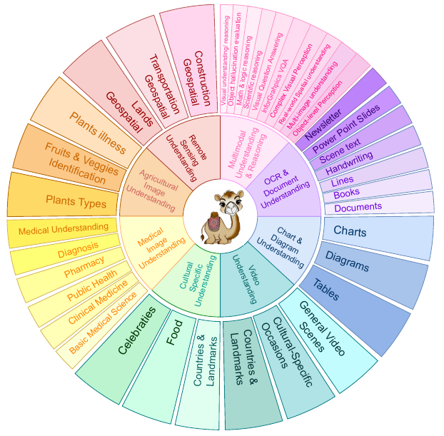

> Figure 1 is a visual representation of the CAMEL-Bench benchmark, illustrating its eight diverse domains and 38 sub-domains, along with the number of questions in each.


 <table id='4' style='font-size:14px'><tr><td>Domain/Characteristics</td><td>Exams-V*</td><td>CVQA*</td><td>Henna</td><td>KHATT</td><td>CAMEL-Bench (ours)</td></tr><tr><td>Multimodal Und. & Reasoning</td><td>V</td><td>X</td><td></td><td>X</td><td></td></tr><tr><td>OCR & Docs Und.</td><td>X</td><td>X</td><td>X</td><td>V</td><td></td></tr><tr><td>Charts & Diagrams Und.</td><td>V</td><td>X</td><td>X</td><td>X</td><td></td></tr><tr><td>Video Und.</td><td>X</td><td>X</td><td>X</td><td>X</td><td></td></tr><tr><td>Medical Image Und.</td><td>X</td><td>X</td><td>X</td><td>X</td><td></td></tr><tr><td>Agricultural Image Und.</td><td>X</td><td>X</td><td>X</td><td>X</td><td></td></tr><tr><td>Remote-Sensing Und.</td><td>X</td><td>X</td><td>X</td><td>X</td><td></td></tr><tr><td>Cultural-Specific Und.</td><td>X</td><td></td><td>V</td><td>X</td><td></td></tr><tr><td>Open Source Question Numbers</td><td>823</td><td>V 200</td><td>X 1.1K</td><td>V 5K</td><td>29K</td></tr></table>

> Table 1 compares the CAMEL-Bench with other existing Arabic LMM benchmarks, highlighting its comprehensiveness and the number of questions.

### More visual insights

More on figures

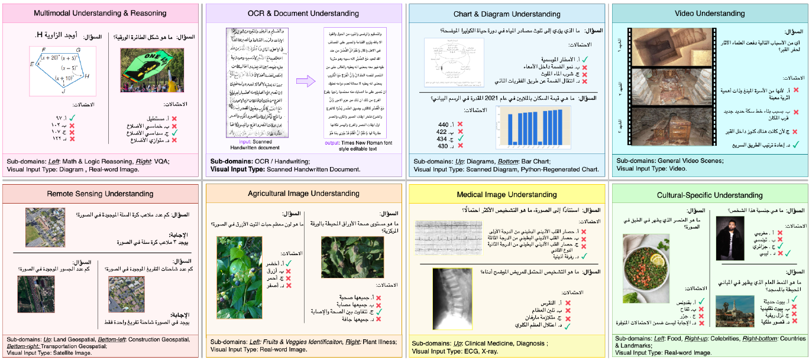

> Figure 1 is a diagram showing the eight diverse domains and 38 sub-domains of the CAMEL-Bench, a comprehensive Arabic LMM benchmark.

, a 20% random sample undergoes manual verification; if errors are below 40%, the data passes; otherwise, the entire sub-category is reviewed. For Translated Arabic (bottom row), We employ Qwen7B model [8] to assess semantic similarity between the original and translated question-answer pairs on fuzzy-basis evaluation. Pairs passing the evaluation proceed, while those that fail undergo manual review. Based on this, data may require Manual Handling for manual re-translation, Refine & Verify for refinement through the model, or Non-Translated Review where the data is re-sent for translation due to the absence of an Arabic version.")

> This figure illustrates the two-path pipeline for filtering and verifying data in the CAMEL-Bench, including manual verification for original Arabic data and automated verification with the Qwen7B model for translated Arabic data.

> Figure 4 presents qualitative examples illustrating challenges faced by different closed-weight models across various tasks within the CAMEL-Bench benchmark.

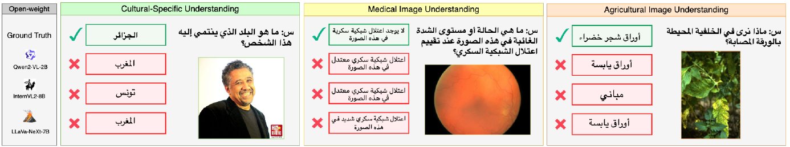

> Figure 5 shows examples of open-source LLMs failing to correctly answer questions about cultural identity, medical images, and agricultural images in Arabic.

More on tables

{{< table-caption caption="🔽 Table 2. Different data sources used for 38 sub-domains corresponding to eight domains, with around 29k questions in total. The different data sources include: MME [15], MMBench [30], MMT-Bench-MI [56], SEED [23], MMMU [58], MMMU-Pro [60], CountBench [39], POPE [26], MathVista [33], Exams-V (Arabic portion) [13], ScienceQA-IMG [32], GQA [20], VizWiz [10], VQAv2 [17], BLINK [16], MuirBench [50], COCO [27], Imagenet [14], Mocheg [55], Snli-Ve [54], Pinterest [42], RealWorldQA [53], PATS-01 [3], KHATT [34], PATD [40], Historical Arabic Handwritten Text Recognition Dataset [37], ISI-PPT-Dataset [52], EvArEST [18], MTVQA [49], ChartQA [35], IconQA [31], BEC-Arabic [47], Claude-3.5 [5], arab-celeb-dataset [36], arabic-food-101 [6], Countries and landmarks [41, 51, 57], Pexel [41], AgroGPT [7], GeoChat [22]. These data sources are carefully translated and verified to ensure quality and relevance." >}}
<table id='0' style='font-size:14px'><tr><td>Domains</td><td>Sub-Domains</td><td>Source</td><td>Number of Questions</td></tr><tr><td rowspan="10">Multimodal Understanding and Reasoning</td><td>Visual Understanding/ Reasoning</td><td>MME, MMBench, MMT-Bench-MI, SEED, MMMU</td><td>3,971</td></tr><tr><td>Object Hallucination Evaluation</td><td>CountBench, MMT-Bench-MI, POPE</td><td>997</td></tr><tr><td>Math and Logic Reasoning</td><td>MathVista</td><td>531</td></tr><tr><td>Scientific Reasoning</td><td>ScienceQA-IMG, Exams-V</td><td>1,624</td></tr><tr><td>Visual Question Answering</td><td>GQA, VizWiz, VQAv2</td><td>3,840</td></tr><tr><td>InforGrahpics VQA</td><td>AI-Generated (GPT-4o), Pinterest</td><td>120</td></tr><tr><td>Complex Visual Perception</td><td>BLINK</td><td>1,422</td></tr><tr><td>Real-world Spatial Understanding</td><td>RealWorldQA</td><td>624</td></tr><tr><td>Multi-image Understanding</td><td>MMT-Bench-MI, MuirBench</td><td>1,062</td></tr><tr><td>Object-level Perception</td><td>COCO, ImageNet, Mocheg, Snli-Ve</td><td>60</td></tr><tr><td rowspan="9">OCR and Document Understanding</td><td>Scanned Documents (OCR)</td><td>ArabicDatasetOCR</td><td>480</td></tr><tr><td>Scanned Documents (VQA)</td><td>MTVQA</td><td>703</td></tr><tr><td>Scene Text (OCR)</td><td>EvArEST</td><td>1,217</td></tr><tr><td>Books (OCR)</td><td>Historical Arabic Handwritten Text Recognition Dataset</td><td>40</td></tr><tr><td>PowerPoint Slides (OCR)</td><td>ISI-PPT-Dataset</td><td>2,354</td></tr><tr><td>PowerPoint Slides (VQA)</td><td>ISI-PPT-Dataset</td><td>711</td></tr><tr><td>Handwriting (OCR)</td><td>KHATT Line</td><td>1,400</td></tr><tr><td>Newsletters (OCR)</td><td>PATD</td><td>506</td></tr><tr><td>Lines (OCR)</td><td>PATS-01</td><td>520</td></tr><tr><td rowspan="3">Chart and Diagram Understanding</td><td>Charts</td><td>ChartQA</td><td>745</td></tr><tr><td>Diagrams Understanding</td><td>MMMU (diagrams), ICON-QA, AI-Generated, Pinterest, BCE-Arabic</td><td>1,994</td></tr><tr><td>Tables</td><td>BCE-Arabic, Excel</td><td>81</td></tr><tr><td rowspan="3">Video Understanding</td><td>Countries/ Landmarks</td><td>Pexel</td><td>87</td></tr><tr><td>Cultural-Specific Occasions</td><td>Pexel</td><td>24</td></tr><tr><td>General Video Scenes</td><td>Video-MME</td><td>654</td></tr><tr><td rowspan="3">Cultural Specific Understanding</td><td>Celebrities</td><td>arab-celeb-dataset</td><td>444</td></tr><tr><td>Food</td><td>arabic-food-101, Pexel</td><td>347</td></tr><tr><td>Countries/ Landmarks</td><td>Pexel</td><td>494</td></tr><tr><td rowspan="7">Medical Imaging Understanding</td><td>Basic Medical Science</td><td>MMMU, MMMU Pro</td><td>89</td></tr><tr><td>Clinical Medicine</td><td>MMMU, MMMU Pro</td><td>83</td></tr><tr><td>Public Health</td><td>MMMU, MMMU Pro</td><td>87</td></tr><tr><td>Pharmacy</td><td>MMMU, MMMU Pro</td><td>82</td></tr><tr><td>Diagnosis</td><td>MMMU, MMMU Pro</td><td>87</td></tr><tr><td></td><td>MMT-MI-Bench</td><td>78</td></tr><tr><td>Medical Understanding</td><td></td><td>769</td></tr><tr><td>Agricultural Image Understanding</td><td>Agriculture Image Understanding Remote Sensing Understanding</td><td>AgroGPT GeoChat</td><td>709</td></tr><tr><td colspan="3">Remote Sensing Understanding Total</td><td>29,036</td></tr></table>

> Table 2 details the different data sources and the number of questions used for each of the 38 sub-domains across eight domains in the CAMEL-Bench benchmark.

{{< table-caption caption="🔽 Table 3. Performance comparison of different closed-and open-source LMMs on CAMEL-Bench. We present per-domain results of seven LMMs: GPT-40 [38], GPT-40-mini [38], Gemini-1.5-Pro [2], Gemini-1.5-Flash [2], Pangea-7B [59], Qwen2-VL [9], InternVL2-8B [11], and LLaVaNeXt-7B [29]. GPT-40 excels in most domains, while GPT-40-mini offers an impressive balance of performance and model size. All models struggle with remote sensing, medical imaging, OCR & document understanding, and general multimodal understanding and reasoning domains. Open-source models like InternVL2-8B and LLaVaNeXt-7B show a decline in performance across domains, with their best results in video understanding." >}}
<table id='0' style='font-size:16px'><tr><td>Method</td><td>MM Understanding & Reasoning</td><td>OCR & Document Understanding</td><td>Charts & Diagram Understanding</td><td>Video Understanding</td><td>Cultural Specific Understanding</td><td>Medical Imaging</td><td>Agro Specific</td><td>Remote Sensing Understanding</td></tr><tr><td>GPT-4o</td><td>57.90</td><td>59.11</td><td>73.57</td><td>74.27</td><td>80.86</td><td>49.90</td><td>80.75</td><td>22.85</td></tr><tr><td>GPT-4o-mini</td><td>48.82</td><td>42.89</td><td>64.98</td><td>68.11</td><td>65.92</td><td>47.37</td><td>79.58</td><td>16.93</td></tr><tr><td>Gemini-1.5-Pro</td><td>46.67</td><td>36.59</td><td>47.06</td><td>42.94</td><td>56.24</td><td>33.77</td><td>72.12</td><td>17.07</td></tr><tr><td>Gemini-1.5-Flash</td><td>45.58</td><td>33.59</td><td>48.25</td><td>53.31</td><td>46.54</td><td>42.86</td><td>76.06</td><td>14.95</td></tr><tr><td>Pangea-7B</td><td>40.09</td><td>26.47</td><td>38.87</td><td>49.01</td><td>20.34</td><td>31.99</td><td>74.51</td><td>6.67</td></tr><tr><td>Qwen2-VL-2B</td><td>40.59</td><td>25.68</td><td>27.83</td><td>38.90</td><td>34.27</td><td>29.12</td><td>52.02</td><td>12.56</td></tr><tr><td>Intern VL2-8B</td><td>30.41</td><td>15.91</td><td>30.27</td><td>51.42</td><td>20.88</td><td>29.48</td><td>44.47</td><td>5.36</td></tr><tr><td>LLaVa-NeXt-7B</td><td>26.33</td><td>19.12</td><td>27.56</td><td>44.90</td><td>28.30</td><td>22.54</td><td>42.00</td><td>8.33</td></tr></table>

> Table 3 compares the performance of seven different large multimodal models (LLMs) across eight diverse domains in the CAMEL-Bench benchmark, highlighting strengths and weaknesses of both closed-source and open-source models.

### Full paper


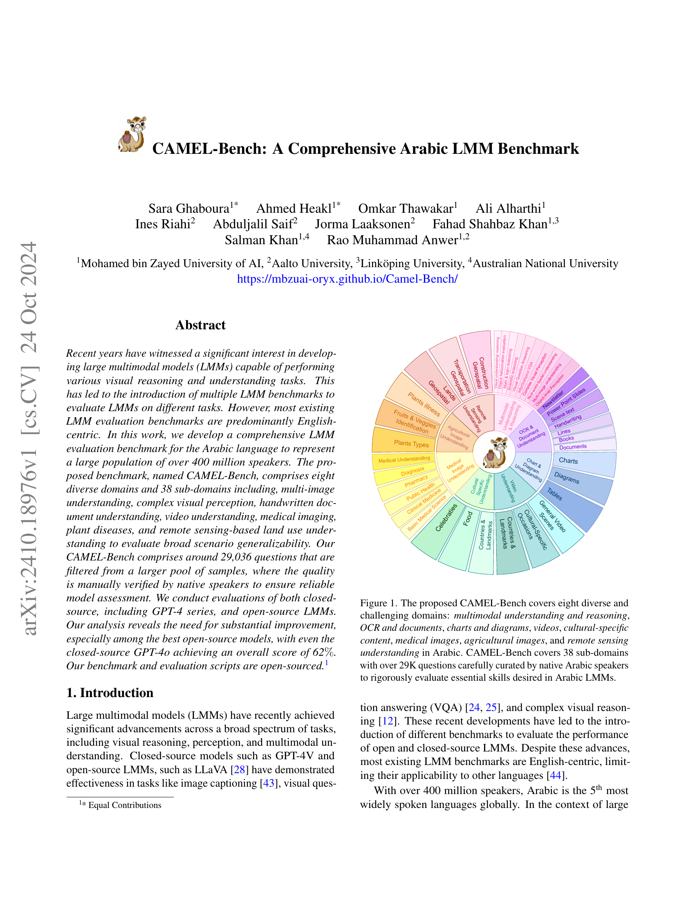
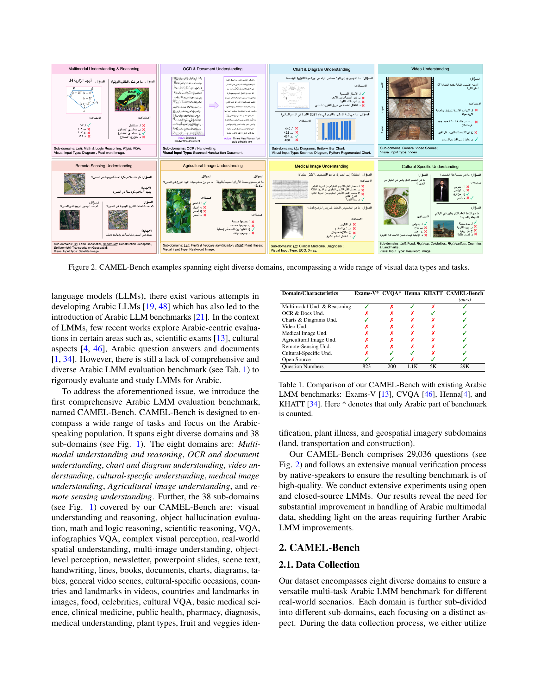
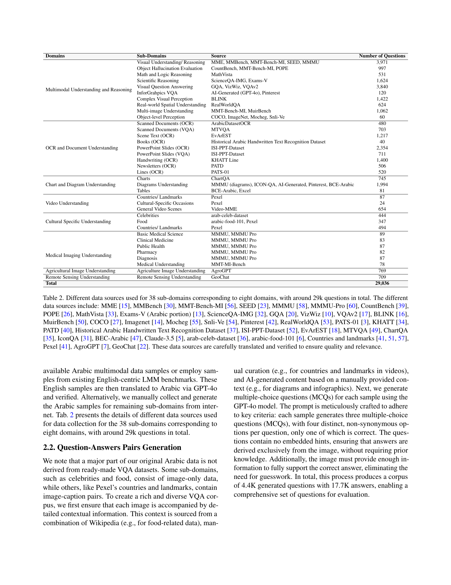
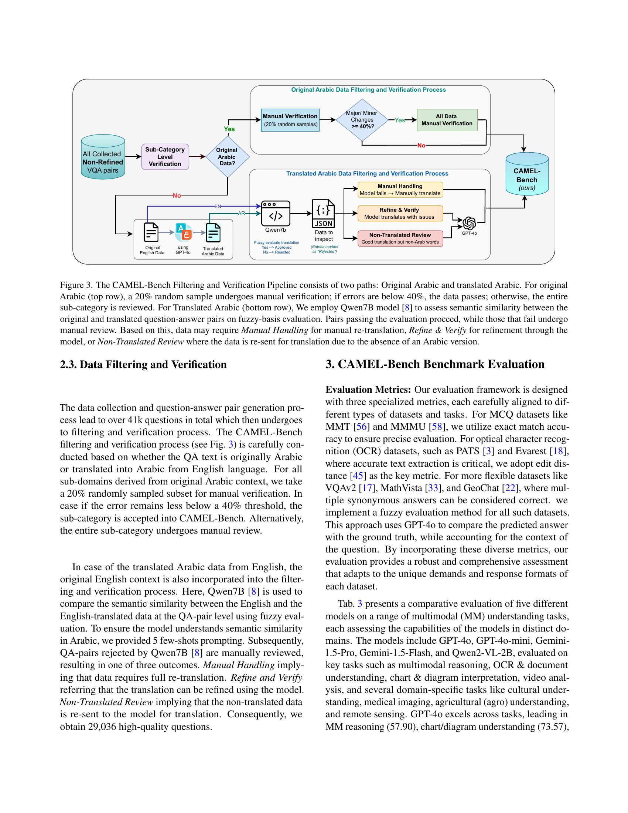

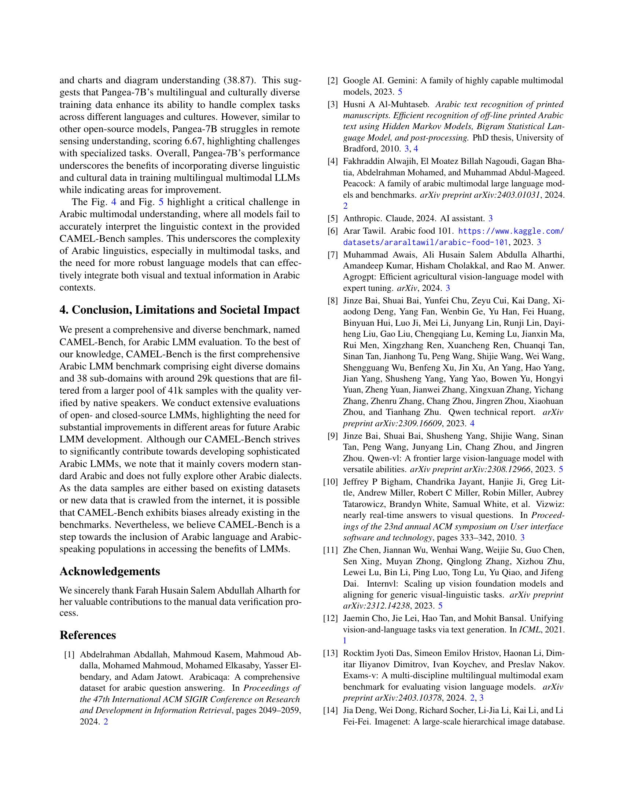

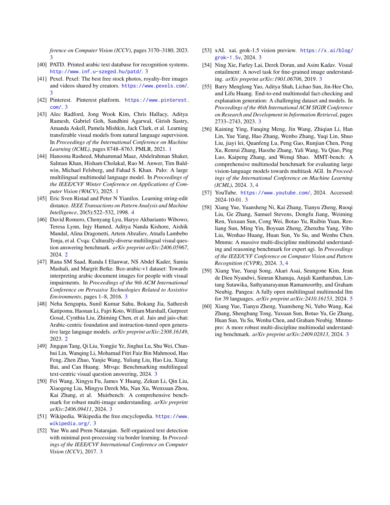
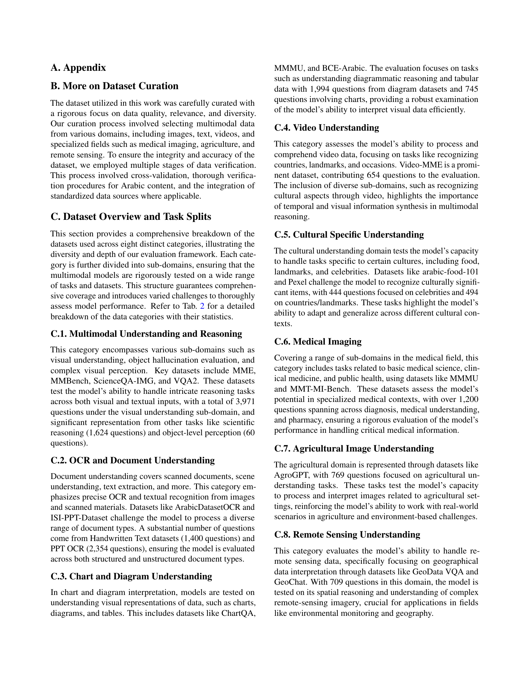
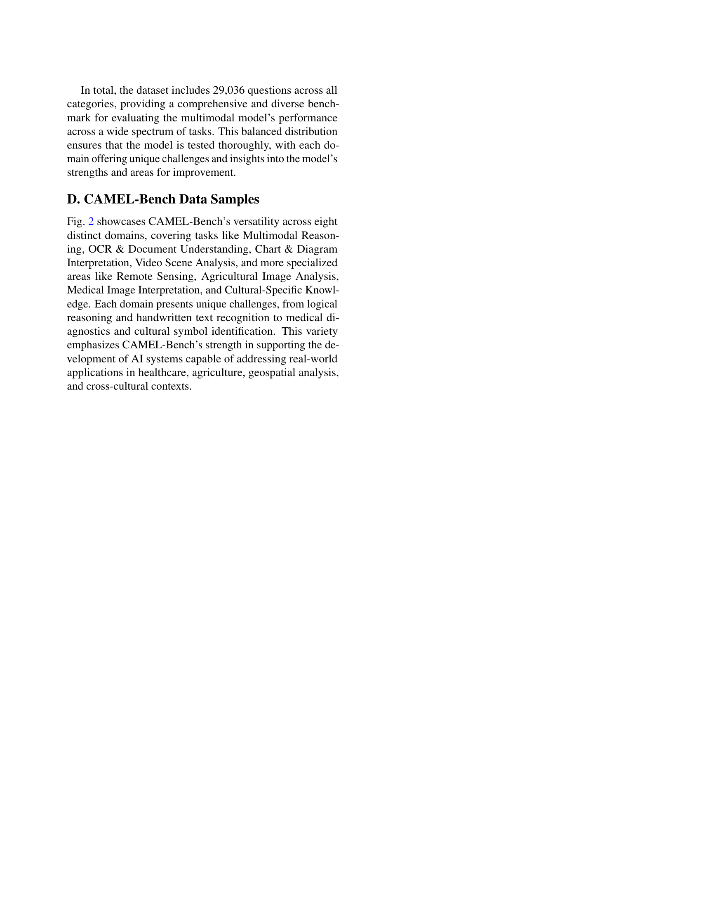
