### TL;DR



Framer is a novel interactive frame interpolation method that enhances user control over video transitions.  Unlike traditional methods that deterministically generate frames based on input images, Framer lets users influence the transition by manipulating keypoints. This is achieved using a pre-trained video diffusion model which is fine-tuned using both the input images and user defined keypoint trajectories to produce the final interpolation.  The system offers both an interactive mode where users directly manipulate keypoints and an "autopilot" mode where the system automatically estimates keypoints and trajectories.  Extensive experiments show Framer surpasses existing techniques across applications like image morphing, time-lapse video generation, and cartoon interpolation, producing smoother and more realistic transitions.




 &nbsp; read the paper on arXiv


#### Why does it matter?
The paper introduces Framer, an interactive frame interpolation framework that allows users to customize video transitions by manipulating keypoints, resulting in more natural and creative interpolations.
#### Key Takeaways


 Framer allows users to interactively customize video transitions by adjusting keypoints. 



 The model uses a combination of a pre-trained video diffusion model and a trajectory control branch. 



 Experiments demonstrate Framer's superior performance in producing natural and visually appealing transitions compared to existing methods. 


------
#### Visual Insights

. Moreover, Framer handles challenging cases and can realize smooth image morphing (last 2 rows). The input trajectories are overlayed on the frames.")

> Figure 1 showcases examples of interactive frame interpolation results generated by Framer, highlighting its ability to handle various levels of motion and image changes.

 and UCF101-7 (right).")

> The chart displays the FID and FVD scores on DAVIS-7 dataset for different 3D-UNet decoder feature indices used for point tracking.


<table id='1' style='font-size:14px'><tr><td></td><td colspan="4">DAVIS-7</td><td colspan="6">UCF101-7</td></tr><tr><td></td><td>PSNR↑</td><td>SSIM↑</td><td>LPIPS↓</td><td>FID↓</td><td>FVD↓</td><td>PSNR↑</td><td>SSIM↑</td><td>LPIPS↓</td><td>FID↓</td><td>FVD↓</td></tr><tr><td>AMT (Li et al., 2023)</td><td>21.66</td><td>0.7229</td><td>0.2860</td><td>39.17</td><td>245.25</td><td>26.64</td><td>0.9000</td><td>0.1878</td><td>37.80</td><td>270.98</td></tr><tr><td>RIFE (Huang et al., 2020)</td><td>22.00</td><td>0.7216</td><td>0.2663</td><td>39.16</td><td>319.79</td><td>27.04</td><td>0.9020</td><td>0.1575</td><td>27.96</td><td>300.40</td></tr><tr><td>FLAVR Kalluri et al. (2023)</td><td>20.94</td><td>0.6880</td><td>0.3305</td><td>52.23</td><td>296.37</td><td>26.50</td><td>0.8982</td><td>0.1836</td><td>37.79</td><td>279.58</td></tr><tr><td>FILM (Reda et al., 2022)</td><td>21.67</td><td>0.7121</td><td>0.2191</td><td>17.20</td><td>162.86</td><td>26.74</td><td>0.8983</td><td>0.1378</td><td>16.22</td><td>239.48</td></tr><tr><td>LDMVFI (Danier et al., 2024)</td><td>21.11</td><td>0.6900</td><td>0.2535</td><td>21.96</td><td>269.72</td><td>26.68</td><td>0.8955</td><td>0.1446</td><td>17.55</td><td>270.33</td></tr><tr><td>DynamicCrafter (Xing et al., 2023)</td><td>15.48</td><td>0.4668</td><td>0.4628</td><td>35.95</td><td>468.78</td><td>17.62</td><td>0.7082</td><td>0.3361</td><td>61.71</td><td>646.91</td></tr><tr><td>SVDKFI (Wang et al., 2024a)</td><td>16.71</td><td>0.5274</td><td>0.3440</td><td>26.59</td><td>382.19</td><td>21.04</td><td>0.7991</td><td>0.2146</td><td>44.81</td><td>301.33</td></tr><tr><td>Framer (Ours)</td><td>21.23</td><td>0.7218</td><td>0.2525</td><td>27.13</td><td>115.65</td><td>25.04</td><td>0.8806</td><td>0.1714</td><td>31.69</td><td>181.55</td></tr><tr><td>Framer with Co-Tracker (Ours)</td><td>22.75</td><td>0.7931</td><td>0.2199</td><td>27.43</td><td>102.31</td><td>27.08</td><td>0.9024</td><td>0.1714</td><td>32.37</td><td>159.87</td></tr></table>

> Table 1 quantitatively compares Framer with other video interpolation methods using reconstruction and generative metrics across 7 generated frames.

### More visual insights

More on figures

 a user-interactive mode for customized point trajectories and (b) an 'autopilot' mode for video frame interpolation without trajectory inputs. During training, (d) we fine-tune the 3D-UNet of a pre-trained video diffusion model for video frame interpolation. Afterward, (c) we introduce point trajectory control by freezing the 3D-UNet and fine-tuning the controlling branch.")

> Figure 2 illustrates the overall architecture of Framer, detailing its interactive mode, autopilot mode, trajectory controlling branch, and video frame interpolation fine-tuning process.

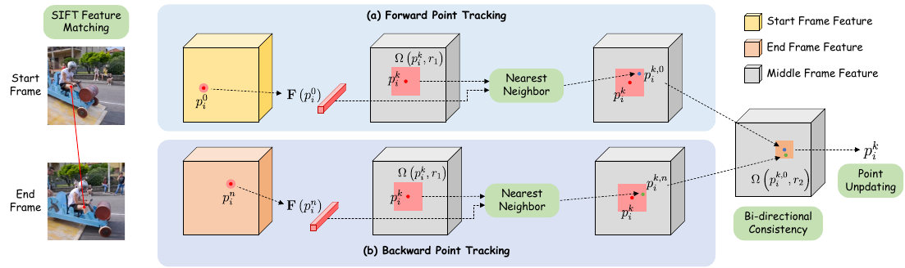

> Figure 3 illustrates the bi-directional point tracking method used in Framer's 'autopilot' mode to estimate point trajectories for video frame interpolation.

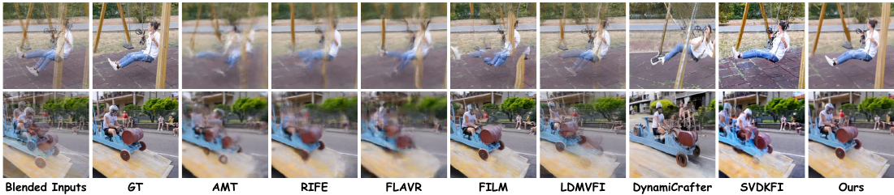

> Figure 4 shows a qualitative comparison of the proposed Framer method with other state-of-the-art video frame interpolation methods on various video clips.

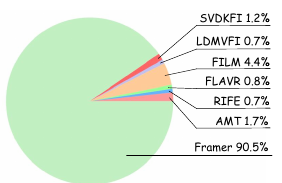

> The figure is a pie chart showing the percentage of human preference for Framer compared to other video interpolation methods.

> The figure showcases the results of user interaction in the Framer model, demonstrating how different drag controls affect the generated frames and their trajectories.

. Moreover, Framer handles challenging cases and can realize smooth image morphing (last 2 rows). The input trajectories are overlayed on the frames.")

> The figure showcases examples of frame interpolation results generated by the proposed Framer model, highlighting its ability to customize local motions and handle challenging cases.

. Moreover, Framer handles challenging cases and can realize smooth image morphing (last 2 rows). The input trajectories are overlayed on the frames.")

> Figure 1 shows example results of the Framer model performing interactive frame interpolation, demonstrating fine-grained control over local motions and the ability to handle challenging cases.

. Moreover, Framer handles challenging cases and can realize smooth image morphing (last 2 rows). The input trajectories are overlayed on the frames.")

> Figure 1 shows example results generated by the Framer model, highlighting its ability to customize local motions and produce smooth interpolation results even in challenging cases.

. Moreover, Framer handles challenging cases and can realize smooth image morphing (last 2 rows). The input trajectories are overlayed on the frames.")

> The figure showcases examples of frame interpolation results generated by the Framer model, demonstrating its ability to customize local motions and handle challenging cases.

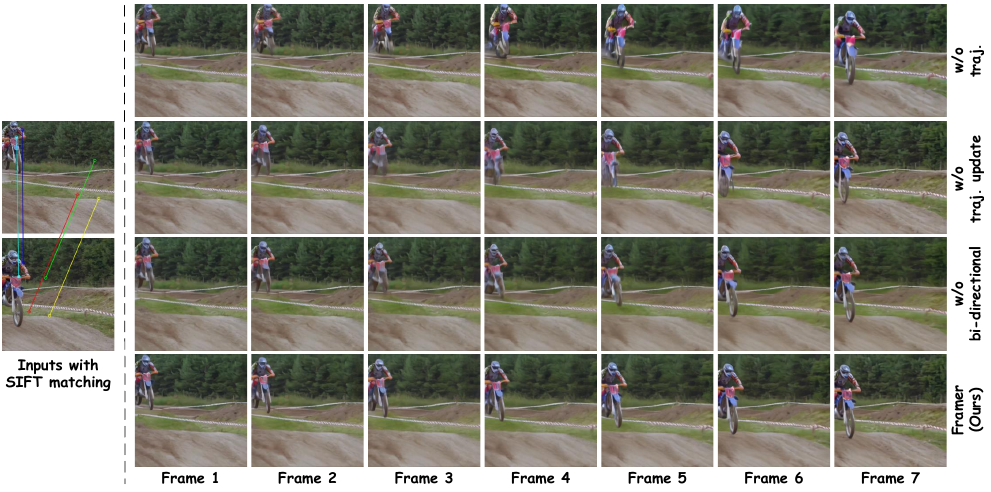

> The figure shows ablation studies on the individual components of Framer to validate their effectiveness.

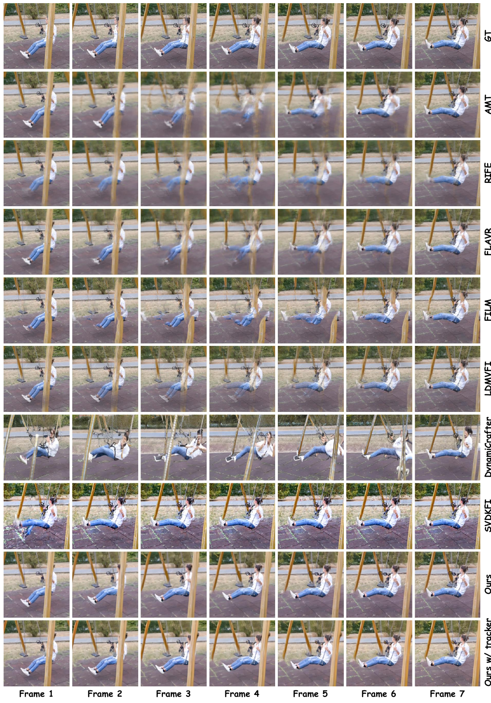

> Figure 4 shows a qualitative comparison of the middle frame of 7 interpolated frames generated by different video frame interpolation methods, including the ground truth.

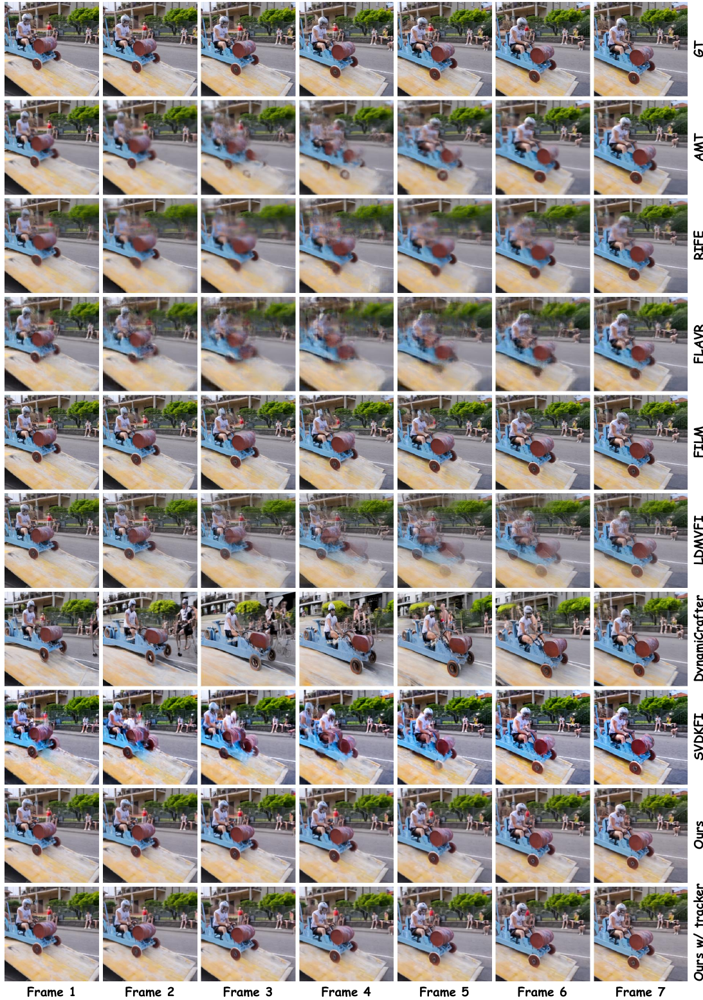

> Figure 4 shows a qualitative comparison of the proposed Framer model with other state-of-the-art video frame interpolation methods, illustrating the superior performance of Framer in generating visually appealing and temporally coherent frames.

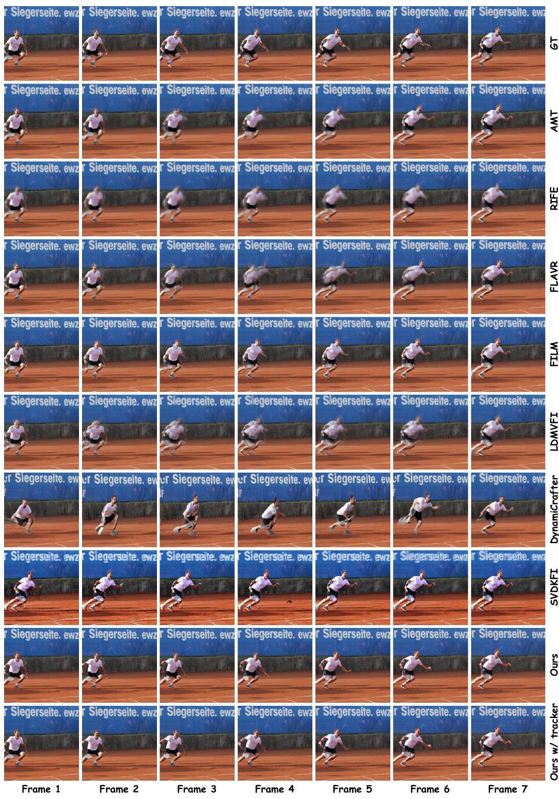

> Figure 4 presents a qualitative comparison of the proposed Framer model against several state-of-the-art video interpolation methods, showcasing the middle frame of seven interpolated frames for each approach.

> Figure 4 shows a qualitative comparison of the proposed Framer model with other state-of-the-art video frame interpolation methods on various video sequences.

. Moreover, Framer handles challenging cases and can realize smooth image morphing (last 2 rows). The input trajectories are overlayed on the frames.")

> The figure showcases the results of the Framer model for interactive frame interpolation, demonstrating its ability to customize local motions and handle challenging cases.

 cartoon and (b) sketch interpolation.")

> Figure S10 presents more examples of cartoon and sketch interpolation results generated using the proposed Framer method.

. Moreover, Framer handles challenging cases and can realize smooth image morphing (last 2 rows). The input trajectories are overlayed on the frames.")

> Figure 1 showcases examples of interactive frame interpolation results generated by the proposed Framer model, highlighting its ability to handle various scenarios and user inputs.

. Moreover, Framer handles challenging cases and can realize smooth image morphing (last 2 rows). The input trajectories are overlayed on the frames.")

> Figure 1 showcases the results of interactive frame interpolation using Framer, demonstrating fine-grained control over local motions and the handling of challenging interpolation scenarios.

. Moreover, Framer handles challenging cases and can realize smooth image morphing (last 2 rows). The input trajectories are overlayed on the frames.")

> Figure 1 showcases examples of frame interpolation results generated by the Framer model, highlighting its ability to customize local motions and handle challenging cases with smooth transitions.

More on charts

 and UCF101-7 (right).")

> The chart displays the FID and FVD scores on DAVIS-7 and UCF101-7 datasets for different feature indices used in point tracking within the 3D-UNet decoder.

 and UCF101-7 (right). We use a total sampling step of 30.")

> The chart shows the FID and FVD scores on DAVIS-7 dataset for different ranges of diffusion steps used for correspondence guidance during video frame interpolation.

 and UCF101-7 (right). We use a total sampling step of 30.")

> The chart displays the FID and FVD scores on DAVIS-7 and UCF101-7 datasets for different start and end diffusion steps used for correspondence guidance during video frame interpolation.

 and UCF101-7 (right).")

> The chart displays the FID and FVD scores on DAVIS-7 dataset for different numbers of trajectories used for guidance during sampling.

 and UCF101-7 (right).")

> The chart displays the impact of varying the number of trajectories used for guidance on FID and FVD scores for DAVIS-7 and UCF101-7 datasets.

More on tables


<table id='6' style='font-size:14px'><tr><td>Strat Frame</td><td colspan="3">Generated Frames</td><td>End Frame</td></tr></table>

> Table 1 quantitatively compares Framer with other video interpolation methods across several reconstruction and generative metrics, using all seven generated frames.


<table id='1' style='font-size:16px'><tr><td>Tianyu Ding, Luming Liang, Zhihui Zhu, and Ilya Zharkov. CDFI: compression-driven network design for frame interpolation. In IEEE Conf. Comput. Vis. Pattern Recog., 2021.</td></tr><tr><td>Jiong Dong, Kaoru Ota, and Mianxiong Dong. Video frame interpolation: A comprehensive survey. ACM Trans. Multim. Comput. Commun. Appl., 2023.</td></tr><tr><td>Haiwen Feng, Zheng Ding, Zhihao Xia, Simon Niklaus, Victoria Fernandez Abrevaya, Michael J. Black, and Xuaner Zhang. Explorative inbetweening of time and space. arXiv: Computing Research Repo., abs/2403.14611, 2024.</td></tr><tr><td>Songwei Ge, Seungjun Nah, Guilin Liu, Tyler Poon, Andrew Tao, Bryan Catanzaro, David Jacobs, Jia-Bin Huang, Ming-Yu Liu, and Yogesh Balaji. Preserve your own correlation: A noise prior for video diffusion models. In Int. Conf. Comput. Vis., 2023.</td></tr><tr><td>Shurui Gui, Chaoyue Wang, Qihua Chen, and Dacheng Tao. Featureflow: Robust video interpolation via structure-to-texture generation. In IEEE Conf. Comput. Vis. Pattern Recog., 2020.</td></tr><tr><td>Yuwei Guo, Ceyuan Yang, Anyi Rao, Maneesh Agrawala, Dahua Lin, and Bo Dai. Sparsectrl: Adding sparse controls to text-to-video diffusion models. arXiv: Computing Research Repo., abs/2311.16933, 2023.</td></tr><tr><td>Hao He, Yinghao Xu, Yuwei Guo, Gordon Wetzstein, Bo Dai, Hongsheng Li, and Ceyuan Yang. Cameractrl: Enabling camera control for text-to-video generation. arXiv: Computing Research Repo., abs/2404.02101, 2024.</td></tr><tr><td>Zhewei Huang, Tianyuan Zhang, Wen Heng, Boxin Shi, and Shuchang Zhou. RIFE: real-time intermediate flow estimation for video frame interpolation. arXiv: Computing Research Repo., abs/2011.06294, 2020.</td></tr><tr><td>Siddhant Jain, Daniel Watson, Eric Tabellion, Aleksander Holynski, Ben Poole, and Janne Kontkanen. Video interpolation with diffusion models. arXiv: Computing Research Repo., abs/2404.01203, 2024.</td></tr><tr><td>Huaizu Jiang, Deqing Sun, Varun Jampani, Ming-Hsuan Yang, Erik G. Learned-Miller, and Jan Kautz. Super slomo: High quality estimation of multiple intermediate frames for video interpolation. In IEEE Conf. Comput. Vis. Pattern Recog., 2018.</td></tr><tr><td>Xin Jin, Longhai Wu, Guotao Shen, Youxin Chen, Jie Chen, Jayoon Koo, and Cheul-Hee Hahm. Enhanced bi-directional motion estimation for video frame interpolation. In IEEE Winter Conf. Appl. Comput. Vis., 2023.</td></tr><tr><td>Tarun Kalluri, Deepak Pathak, Manmohan Chandraker, and Du Tran. FLAVR: flow-agnostic video representations for fast frame interpolation. In IEEE Winter Conf. Appl. Comput. Vis., 2023.</td></tr><tr><td>Nikita Karaev, Ignacio Rocco, Benjamin Graham, Natalia Neverova, Andrea Vedaldi, and Christian Rupprecht. Cotracker: It is better to track together. arXiv: Computing Research Repo., abs/2307.07635, 2023.</td></tr><tr><td>Lingtong Kong, Boyuan Jiang, Donghao Luo, Wenqing Chu, Xiaoming Huang, Ying Tai, Chengjie Wang, and Jie Yang. Ifrnet: Intermediate feature refine network for efficient frame interpolation. In IEEE Conf. Comput. Vis. Pattern Recog., 2022.</td></tr><tr><td>Hyeongmin Lee, Taeoh Kim, Tae-Young Chung, Daehyun Pak, Yuseok Ban, and Sangyoun Lee. Adacof: Adaptive collaboration of flows for video frame interpolation. In IEEE Conf. Comput. Vis. Pattern Recog., 2020.</td></tr><tr><td>Changlin Li, Guangyang Wu, Yanan Sun, Xin Tao, Chi-Keung Tang, and Yu- Wing Tai. H-VFI: hierarchical frame interpolation for videos with large motions. arXiv: Computing Research Repo., abs/2211.11309, 2022.</td></tr><tr><td>Zhen Li, Zuo-Liang Zhu, Linghao Han, Qibin Hou, Chun-Le Guo, and Ming-Ming Cheng. AMT: all-pairs multi-field transforms for efficient frame interpolation. In IEEE Conf. Comput. Vis. Pattern Recog., 2023.</td></tr></table>

> Table 1 quantitatively compares Framer's performance against other video interpolation methods using reconstruction and generative metrics across 7 generated frames.


<table id='6' style='font-size:14px'><tr><td></td><td colspan="5">DAVIS-7</td><td colspan="5">UCF101-7</td></tr><tr><td></td><td>PSNR↑</td><td>SSIM↑</td><td>LPIPS↓</td><td>FID↓</td><td>FVD↓</td><td>PSNR↑</td><td>SSIM↑</td><td>LPIPS↓</td><td>FID↓</td><td>FVD↓</td></tr><tr><td>w/o trajectory</td><td>20.19</td><td>0.6831</td><td>0.2787</td><td>28.25</td><td>128.71</td><td>24.16</td><td>0.8677</td><td>0.1798</td><td>32.64</td><td>195.54</td></tr><tr><td>w/o traj. updating</td><td>20.82</td><td>0.7054</td><td>0.2621</td><td>27.33</td><td>120.73</td><td>24.69</td><td>0.8748</td><td>0.1842</td><td>31.95</td><td>187.37</td></tr><tr><td>w/o bi-directional</td><td>20.94</td><td>0.7102</td><td>0.2602</td><td>27.23</td><td>116.81</td><td>24.73</td><td>0.8746</td><td>0.1845</td><td>31.66</td><td>183.74</td></tr><tr><td>Framer (Ours)</td><td>21.23</td><td>0.7218</td><td>0.2525</td><td>27.13</td><td>115.65</td><td>25.04</td><td>0.8806</td><td>0.1714</td><td>31.69</td><td>181.55</td></tr></table>

> Table 1 quantitatively compares Framer with other video interpolation methods using reconstruction and generative metrics across 7 generated frames.


<table id='8' style='font-size:18px'><tr><td rowspan="2"></td><td colspan="4">DAVIS-7 (mid-frame)</td><td colspan="4">UCF101-7 (mid-frame)</td></tr><tr><td>PSNR↑</td><td>SSIM↑</td><td>LPIPS↓</td><td>FID↓</td><td>PSNR↑</td><td>SSIM↑</td><td>LPIPS↓</td><td>FID↓</td></tr><tr><td>w/o trajectory</td><td>19.30</td><td>0.6504</td><td>0.3093</td><td>57.10</td><td>23.14</td><td>0.8523</td><td>0.1967</td><td>54.98</td></tr><tr><td>w/o traj. updating</td><td>19.84</td><td>0.6700</td><td>0.2935</td><td>55.37</td><td>23.60</td><td>0.8590</td><td>0.2009</td><td>53.83</td></tr><tr><td>w/o bi-directional</td><td>19.95</td><td>0.6739</td><td>0.2919</td><td>54.75</td><td>23.65</td><td>0.8586</td><td>0.2016</td><td>53.54</td></tr><tr><td>Framer (Ours)</td><td>20.18</td><td>0.6850</td><td>0.2845</td><td>55.13</td><td>23.92</td><td>0.8646</td><td>0.1889</td><td>53.33</td></tr></table>

> Table S2 presents ablation study results on different components of the proposed Framer model, focusing on the middle frame of the generated video sequence.


<table id='4' style='font-size:16px'><tr><td></td><td colspan="4">DAVIS-7 (mid-frame)</td><td colspan="4">UCF101-7 (mid-frame)</td></tr><tr><td></td><td>PSNR↑</td><td>SSIM↑</td><td>LPIPS↓</td><td>FID↓</td><td>PSNR↑</td><td>SSIM↑</td><td>LPIPS↓</td><td>FID↓</td></tr><tr><td>AMT (Li et al⌀, 2023)</td><td>20.59</td><td>0.6834</td><td>0.3564</td><td>100.36</td><td>25.24</td><td>0.8837</td><td>0.2237</td><td>75.97</td></tr><tr><td>RIFE (Huang et al., 2020)</td><td>20.74</td><td>0.6813</td><td>0.3102</td><td>80.78</td><td>25.68</td><td>0.8842</td><td>0.1835</td><td>59.33</td></tr><tr><td>FLAVR Kalluri et al. (2023)</td><td>19.93</td><td>0.6514</td><td>0.4074</td><td>118.45</td><td>24.93</td><td>0.8796</td><td>0.2164</td><td>79.86</td></tr><tr><td>FILM (Reda et al., 2022)</td><td>20.28</td><td>0.6671</td><td>0.2620</td><td>48.70</td><td>25.31</td><td>0.8818</td><td>0.1623</td><td>41.23</td></tr><tr><td>LDMVFI (Danier et al., 2024)</td><td>19.87</td><td>0.6435</td><td>0.2985</td><td>56.46</td><td>25.16</td><td>0.8789</td><td>0.1695</td><td>43.01</td></tr><tr><td>DynamicCrafter (Xing et al., 2023)</td><td>14.61</td><td>0.4280</td><td>0.5082</td><td>77.65</td><td>17.05</td><td>0.6935</td><td>0.3502</td><td>97.01</td></tr><tr><td>SVDKFI (Wang et al., 2024a)</td><td>16.06</td><td>0.4974</td><td>0.3719</td><td>53.49</td><td>20.03</td><td>0.7775</td><td>0.2326</td><td>69.26</td></tr><tr><td>Framer (Ours)</td><td>20.18</td><td>0.6850</td><td>0.2845</td><td>55.13</td><td>23.92</td><td>0.8646</td><td>0.1889</td><td>53.33</td></tr><tr><td>Framer with Co-Tracker (Ours)</td><td>21.94</td><td>0.7693</td><td>0.2437</td><td>55.77</td><td>25.86</td><td>0.8868</td><td>0.1873</td><td>54.64</td></tr></table>

> Table 1 quantitatively compares Framer with other video interpolation methods using reconstruction and generative metrics, evaluated across all 7 generated frames.

### Full paper


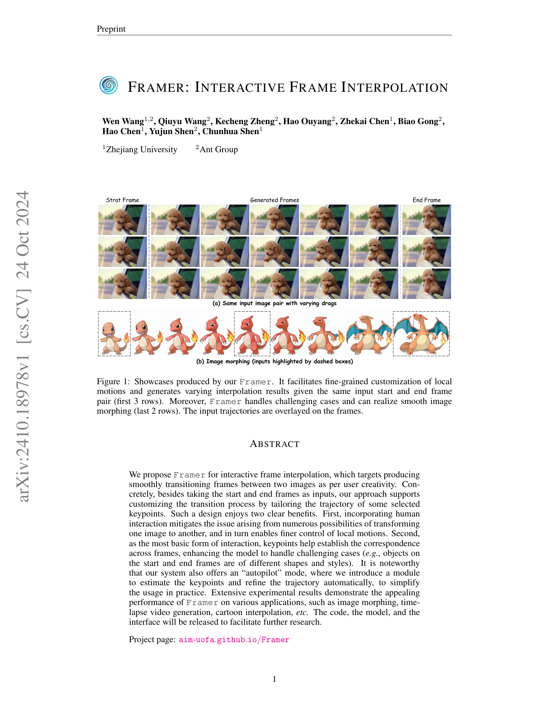

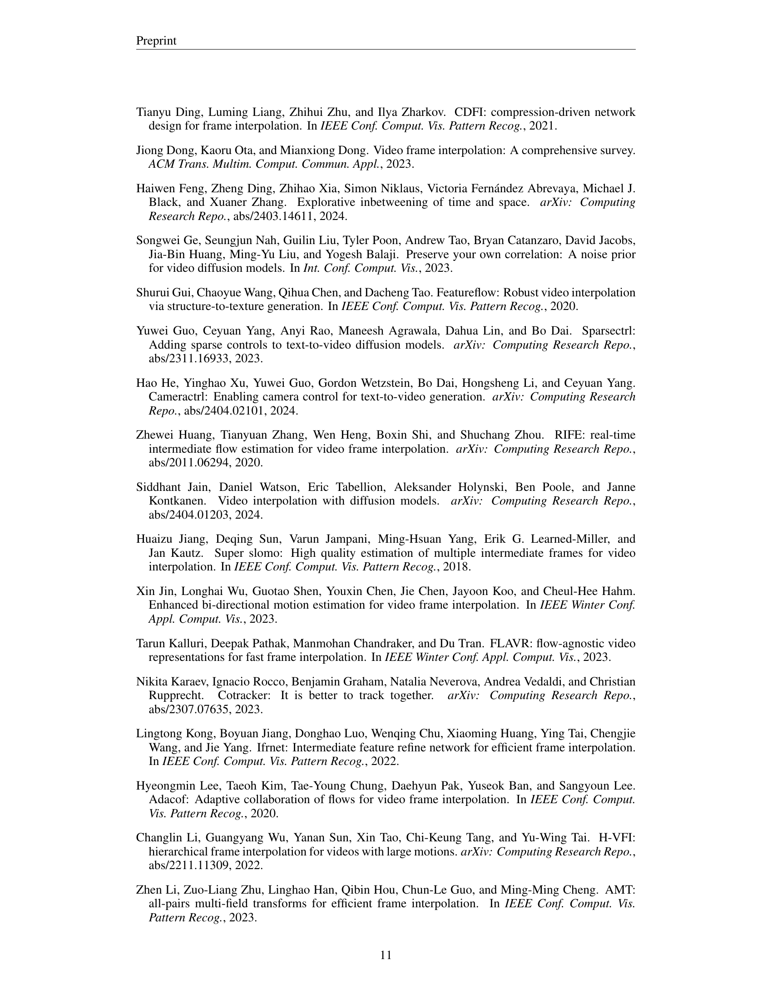
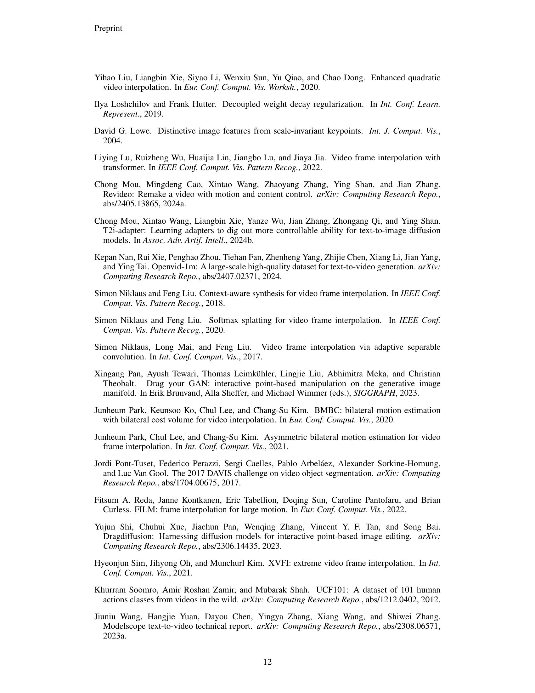
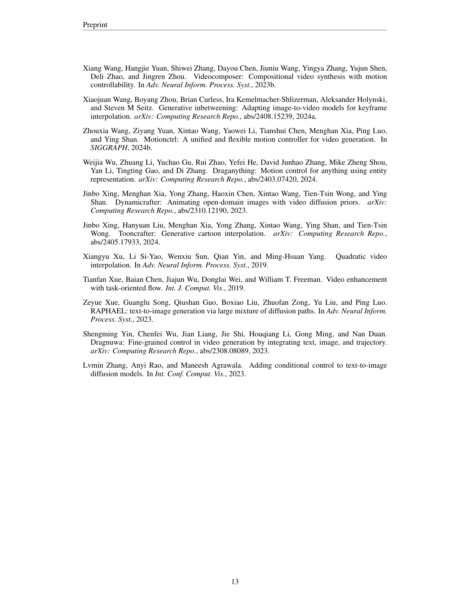
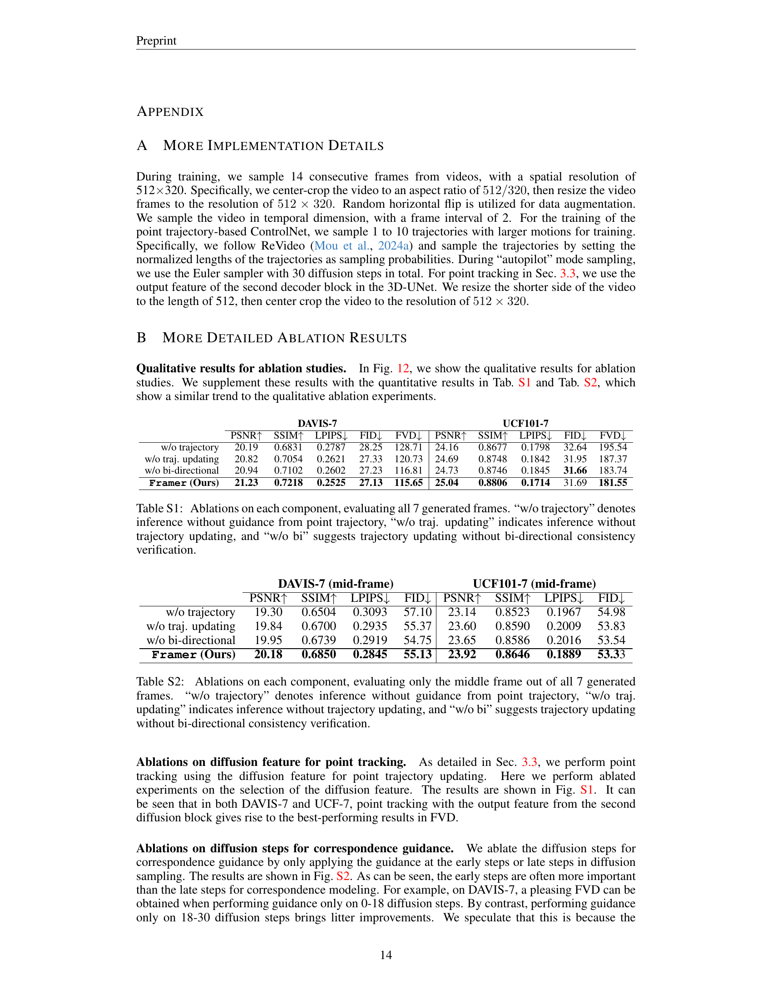
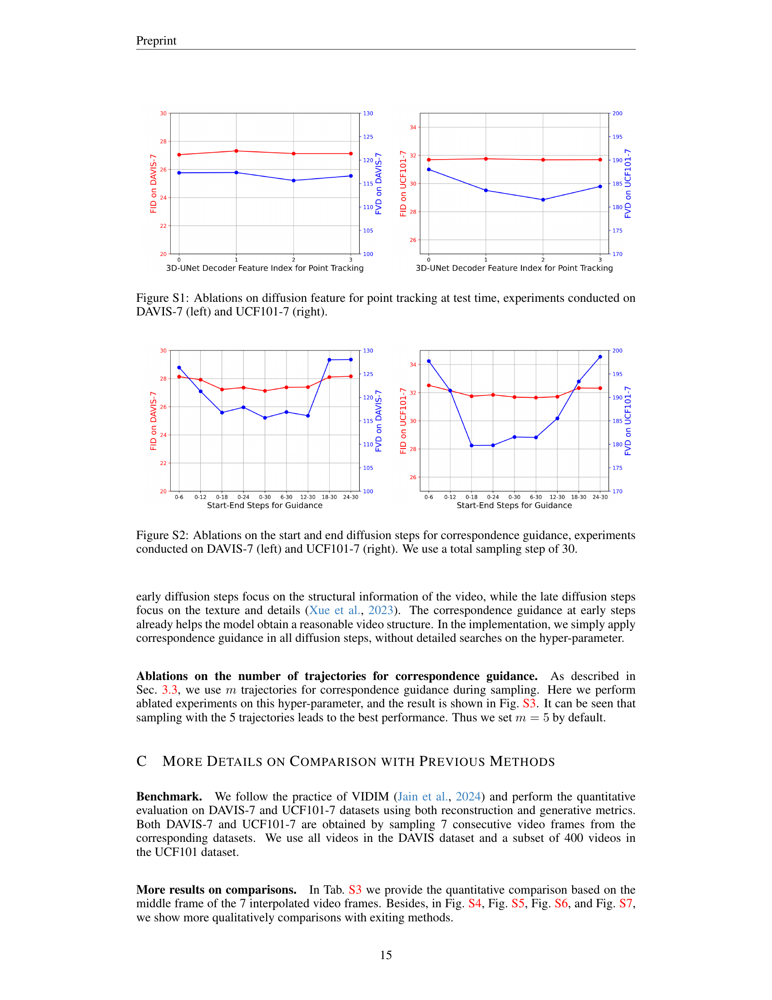

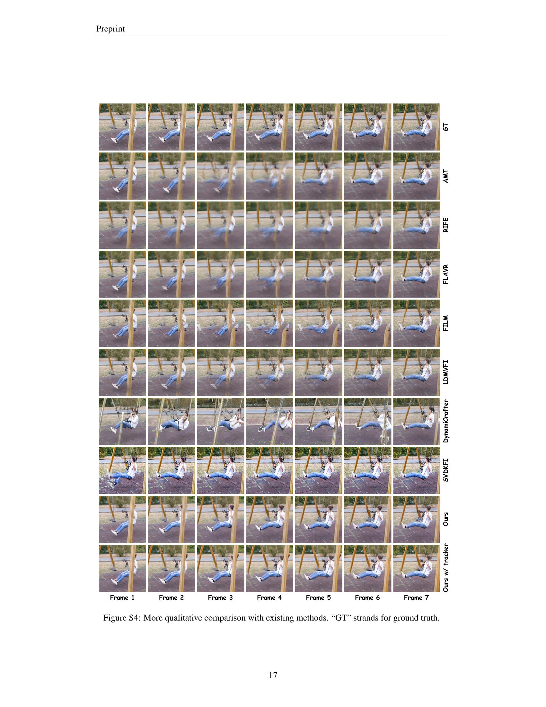
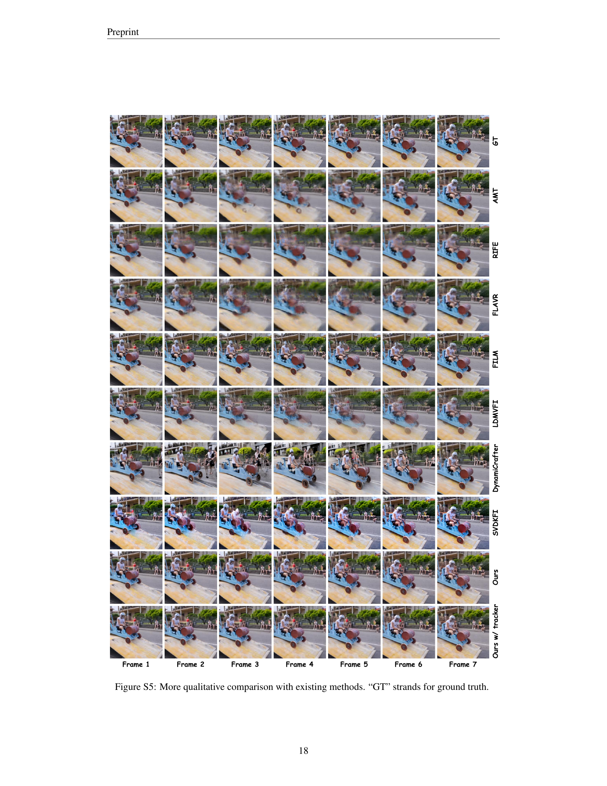

